# Virtual Threads

## Project Setup

Creamos el proyecto para el estudio de `Virtual Threads` en IntelliJ con la siguiente configuración:

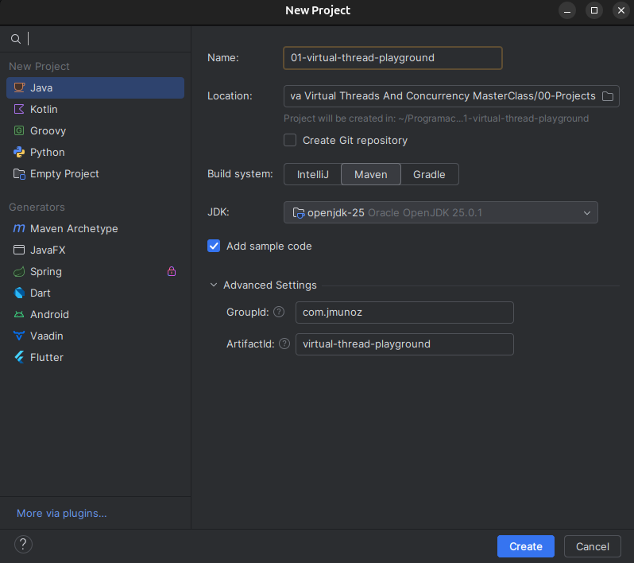

## Deep Dive Into Virtual Threads

### Need For Virtual Threads

Necesitamos comprender como funciona el Sistema Operativo a alto nivel. Esto es muy importante para comprender el comportamiento de los virtual threads.

Ver: https://github.com/JoseManuelMunozManzano/Mastering-Java-Reactive-Programming?tab=readme-ov-file#process--thread--ram--cpu--scheduler

El problema que tratamos de resolver es el siguiente:

- Creamos threads, que son caros de crear, pero los mantenemos ociosos durante mucho tiempo.

Pero los `Virtual Threads` no son `OS Threads`, asi que, ¿cómo podemos hacerlos ejecutar? Vamos a verlos internamente, como funcionan bajo el capó, en esta sección.

### Platform Thread Creation Limit - Demo

Ya hemos visto que en una arquitectura de microservicios tenemos muchas llamadas de red. A menudo, un thread se bloqueará si incrementamos el número de threads. Tenemos que asignar un tamaño de stack para el thread. Y es caro.

Vamos a probar si realmente es caro crear threads. Una vez conozcamos el problema, podremos entender mejor la solución.

Para evitar confusiones, vamos a llamar a los threads originales `platform threads` y luego tenemos los `virtual threads`.

Para simular llamadas de red lentas, usaremos `Thread.sleep()` en las primeras secciones, para comprender mejor los problemas. Más tarde desarrollaremos una aplicación usando el módulo `Spring Boot web`.

En `src/java/com/jmunoz/sec01` creamos las clases siguientes:

- `Task`: Creamos un método que simula una llamada de red lenta.
- `InboundOutboundTaskDemo`: Creamos un bucle de Threads originales de Java (Platform Threads) que llaman a `Task`, para ver como de costoso es crear Threads.
  - Si indicamos que queremos crear 50_000 platform threads, dará un error `out of memory` o `process/resource limits reached`. Esto indica que hay restricciones a la cantidad de platform threads que se pueden crear.

### Thread Builder - Factory Method

En la clase anterior vimos la forma en la que se creaban anteriormente los threads.

Ahora, Java provee varios `Factory methods` para crear threads.

Vemos como crear `platform threads` non-daemon, donde el hilo principal de ejecución espera a que se terminen de ejecutar todos los hilos.

También vemos como crear `platform threads` daemon, donde el programa termina y los threads seguirán ejecutándose.

**How To Make Our Application Wait?**

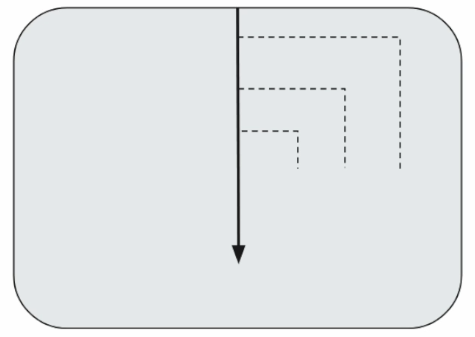

En nuestra demo de un `daemon thread`, nuestro `main thread` crea 10 threads en segundo plano y finaliza inmediatamente, sin esperar a que los `daemon threads` completen su tarea.

¿Cómo podemos hacer que nuestra aplicación espere en este caso? Si tenemos que esperar a que la aplicación haga el trabajo, ¿para qué creamos `daemon threads`?

De todas formas, si queremos que nuestra aplicación espere, se puede hacer.

**CountDownLatch**

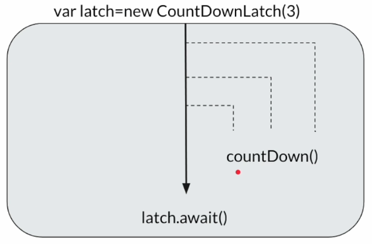

Podemos usar `CountDownLatch` para esperar hasta que los threads en segundo plano completen su tarea. Se le pasa el número de tareas a completar, por ejemplo, en la imagen son 3 threads.

Tenemos que indicar `latch.await()` también, para que realmente espere a que esos 3 threads se completen.

¿Cómo sé que la tarea de un thread en segundo plano se ha completado? Cada uno de los threads tiene que indicar que ha terminado. De ahí el método `countDown()` de la imagen. Cuando llegue a 0 entonces la aplicación termina.

En `src/java/com/jmunoz/sec01` modificamos las clases siguientes:

- `InboundOutboundTaskDemo`
  - Añadimos un método para mostrar como se crean threads actualmente, usando `factory methods`. Siguen siendo platform threads, no virtual threads, y el hilo principal de la app espera a que se completen los threads para terminar el programa.
  - Añadimos otro método cuyos threads se ejecutan en segundo plano, de forma que la app termina aunque el thread siga ejecutándose.
  - Añadimos otro método usando `CountDownLatch` para que, aunque sean `daemon threads` la aplicación espere a que todos los threads hayan hecho su trabajo para terminar.

### Virtual Thread Scaling - Demo

Ya hemos visto el problema de los `platform threads`, que existe un límite de threads que se pueden crear debido a los recursos del sistema.

Ahora podemos empezar a hablar de los `virtual threads`.

Java ha introducido una nueva clase llamada `VirtualThread` que extiende el `Thread` original (Platform Thread). Al hacerlo así, el `virtual thread` se ve exactamente igual que el thread original, pero es virtual.

- Thread (Platform Thread)
  - abstract BaseVirtualThread
    - VirtualThread

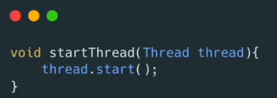

Usando el método que puede verse en la imagen, podemos pasar tanto un platform thread como un virtual thread.

Pero, ¿Qué es un virtual thread? ¿Cómo funciona?

- public Thread (Platform Thread)
  - abstract BaseVirtualThread
    - (package private) Virtual Thread

`Platform Thread` es una clase pública, por eso podemos crearlos usando el operador `new`.

`Virtual Thread` es package private, así que no podemos crearlo usando el operador `new`. Es por esto que Java introdujo los builder de thread que ya hemos usado para crear platform threads.

- Thread.Builder
  - Thread.ofPlatform()
  - Thread.ofVirtual()

`Thread.Builder` es una nueva interface y tenemos dos implementaciones diferentes, una para crear `Platform Threads` y la otra para crear `Virtual Threads`.

- Los virtual threads son daemon threads por defecto. No se pueden crear como non-daemon threads.
- Los virtual threads no tiene nombre por defecto.

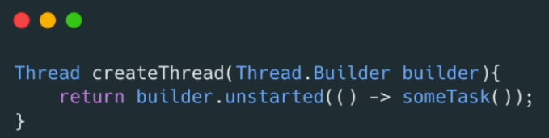

Si tenemos un método como el de la imagen, que acepta un builder, podemos crear un `unstarted thread` que sea un platform thread o un virtual thread.

En `src/java/com/jmunoz/sec01` modificamos las clases siguientes:

- `InboundOutboundTaskDemo`
  - Añadimos un método donde creamos `virtual threads` usando el builder (no se puede con new).

### How Virtual Thread Works

¿Cómo es posible crear un millón de virtual threads sin que ocurra el error `out of memory error`?

- Los Virtual Threads son sencillamente una ilusión creada por Java.
  - Parece un thread
  - Acepta un runnable
  - Podemos ejecutar thread.start() / thread.join()
  - Pero... **El sistema operativo no puede verlos / planificarlos (schedule)**

Si el Sistema Operativo ni siquiera los ve, ¿cómo funcionan?

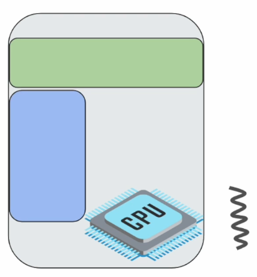

Para comprender los virtual threads, consideremos la imagen como si fuera nuestra máquina.

Tenemos un único procesador (CPU), por lo tanto, podemos planificar (schedule) un único thread a la vez (el muelle en el dibujo representa el thread).

En azul vemos lo que sería nuestro código Java, y en verde sería la memoria.

Los lenguajes de programación son la forma a través de la cual interaccionamos con el sistema operativo para que este pase instrucciones que se consiguen ejecutar.

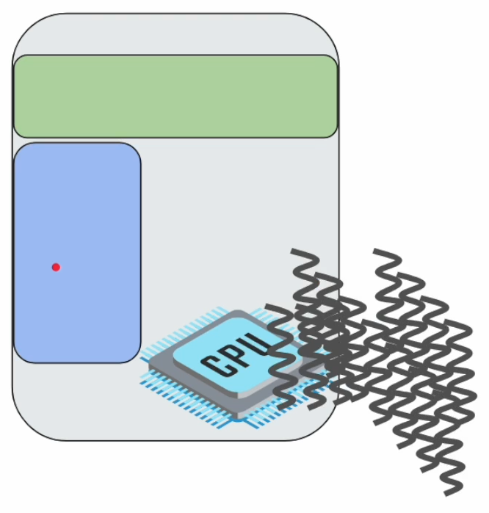

En los ejemplos con Platform Threads, intentamos crear miles de threads Java. Debido a esto, se intentaban crear demasiados OS threads y daba el error de que no se podían crear más threads.

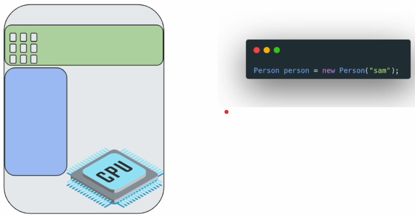

Pero cuando creamos Virtual Threads, lo que creamos son **objetos**. En la parte derecha de la imagen vemos como se crea un objeto person.

Los virtual threads son lo mismo, pero en vez de crear uno, podemos crear millones de objetos usando un bucle (por ejemplo).

Como vemos en la parte izquierda de la imagen, no se crea nada a nivel de sistema operativo. Los objetos se crean en el heap (la memoria en verde)

Para comprender los virtual threads, debemos dejar de verlos como threads.

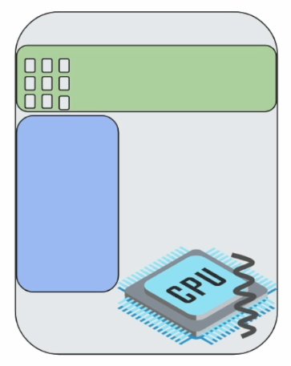

Tenemos que ver los virtual threads como **tareas**.

Los `virtual threads` aceptan `runnable`, así que todos tienen algún tipo de acciones para ser ejecutadas. Por tanto, parece como si usáramos threads, los arrancamos, y parece que hacemos algo con ellos como haríamos con los threads.

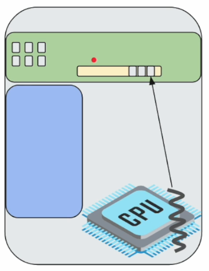

Sin embargo, cuando ejecutamos `thread.start()`, lo que realmente ocurre es que todas estas tareas (los virtual threads) se añaden a una cola interna.

Recordar que el procesador no puede ejecutar por si solo los virtual threads porque el sistema operativo ni siquiera los ve. Lo que tenemos es un `fork-join pool`. Es un `fork-join pool` separado, no es el `pool` común.

El número de threads en el `fork-join pool` depende del número de procesadores que tenemos en nuestra máquina.

En nuestra imagen de ejemplo, tenemos un solo procesador, así que imaginemos que tenemos un único thread en el `fork-join pool`. Ese thread si es un platform thread (el muelle en la imagen).

Este platform thread lo que hace es coger la tarea de la cola y la comienza a ejecutar.

Es decir, por detrás, todos los virtual threads acaban siendo ejecutados en un platform thread.

De nuevo, depende del número de procesadores. Si tenemos 10, tendremos 10 threads en el `fork-join pool`.

Podemos ahora preguntar, como parte del runnable, hemos dado `thread.sleep()`. Si lo que ejecuta la tarea es un platform thread, ¿debería bloquearse, no?

¿Cómo es posible ejecutar millones de `thread.sleep()` en paralelo? Aquí es donde Java hace la magia.

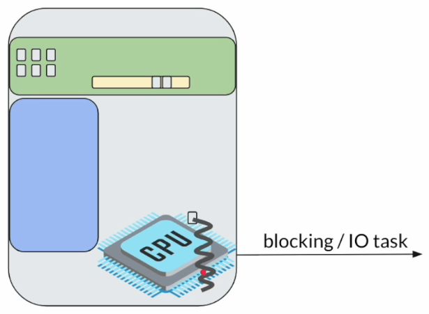

Entonces, el platform thread coge la tarea y comienza a ejecutarla.

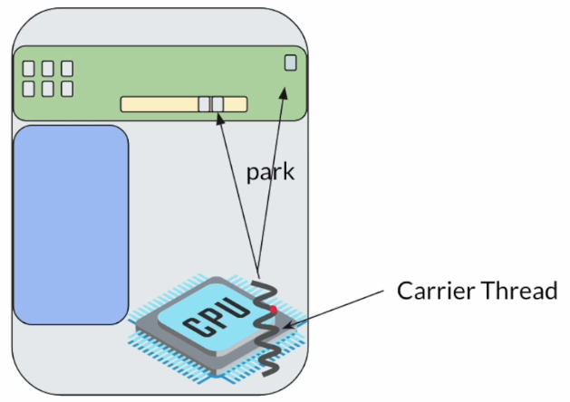

Cuando ve `thread.sleep()` o algún tipo de llamada de red, coge la tarea y la lleva de nuevo a la memoria. A esto se le llama `action parking`.

Es decir, el objetivo final es que el platform thread **no se bloquee**. Mientras haya tareas, ejecutará. Cuando ve algo bloqueante, hasta que no obtenga la respuesta, la tarea se aparca en memoria y cojo otra tarea.

Al platform thread se le llama `Carrier Thread`.

Como los virtual threads son objeto pequeños en el heap, y no pueden ejecutarse directamente por sí mismos, los virtual threads tienen que montarse en un `Carrier Thread` para poder ejecutar la tarea (task). A esta acción se le llama `action mounting`.

Luego, se ejecuta la tarea como parte del runnable. Cuando tiene que ejecutar una acción bloqueante, como una llamada de red a un microservicio, el virtual thread se desmonta (`unmounted`) y se aparca en el heap. El siguiente virtual thread se monta y se ejecuta su tarea.

Como se ha dicho, el `Carrier Thread` no debe quedar ocioso.

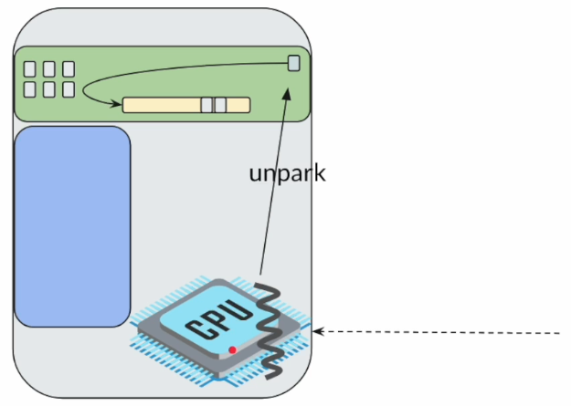

¿Qué ocurre cuando obtenemos la respuesta del microservicio? El virtual thread está desmontado y aparcado en el heap, y el `carrier thread` ya está ejecutando otra tarea.

Lo que se hace es el proceso de `unpark`, añadiendo de nuevo el virtual thread a la cola, para que pueda volver a montarse en el `carrier thread` y pueda seguir ejecutándose desde el sitio donde paró.

Así es como, desde un punto de vista de alto nivel, los virtual threads se planifican para su ejecución.

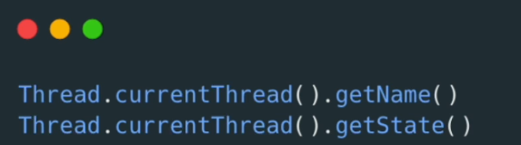

Estos métodos, si los ejecuto, ¿qué nombre / estado obtengo? ¿El nombre/estado del virtual thread o el de carrier thread?

Nosotros, los programadores, tenemos al ejecutar, dos threads, el virtual y el platform. Cuando ejecutamos un virtual thread, deberíamos obtener el nombre / estado del virtual thread.

¿Cómo funciona?

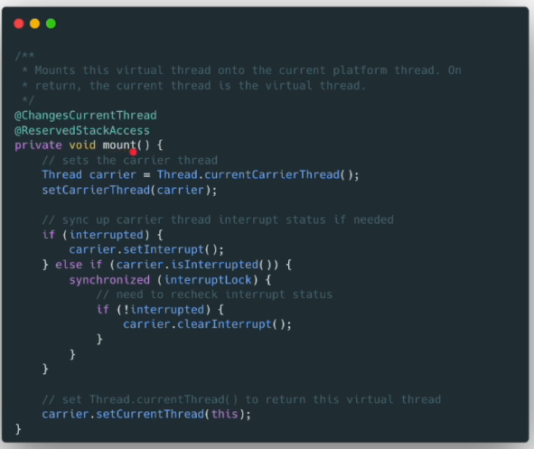

Si miramos el código fuente de Java, el método `mount()`, lo que hace es que, tras montar el virtual thread en el carrier thread, también modifica el carrier thread de esta forma:

`carrier.setCurrentThread(this);`

Asi se provee la información del virtual thread durante su ejecución.

Durante el proceso de desmontado, se limpia esta información.

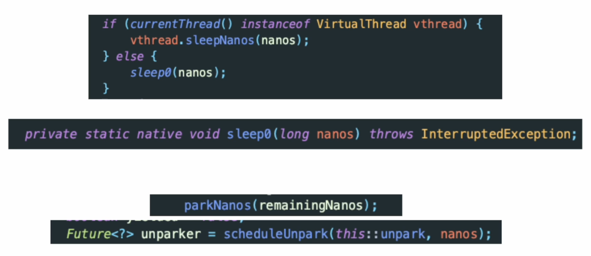

Si tomamos `Thread.sleep()` y vemos el código fuente de Java, veremos que, para un virtual thread, lo que ejecuta es `vthread.sleepNanos(nanos)`, que realiza la acción `parking` y planifica la acción de `unparking` para que vuelva a la cola. Así parece que se hace el `sleep` durante esos nanosegundos.

Si es un platform thread lo que ejecuta es `sleep0(nanos)`, que es bloqueante.

¿Y qué pasa con el `stack memory`? Esto lo iremos viendo en las siguientes clases.

### Carrier Threads Demo

En la clase anterior indicamos que los virtual threads se ejecutaban a través de `carrier threads`.

Ejecutar la siguiente prueba (aquí no hay desarrollos):

- `InboundOutboundTaskDemo`: Ejecutar `platformThreadDemo1()` y notar los nombres de los threads. 
- `InboundOutboundTaskDemo`: Ejecutar `virtualThreadDemo()` y notar que aparecen logs del tipo `VirtualThread[#46,virtual-5]/runnable@ForkJoinPool-1-worker-5`
  - Vemos que los virtual threads se ejecutan por `forkjoinpool worker threads`.
  - Vemos que el mismo `forkjoinpool worker threads` se ejecuta para varias tareas (park y unpark).
  - Pero no está garantizado que el mismo worker que trabaja en una tarea, tras hacer park, vaya a hacer el unpark. Lo normal es que sea otro worker thread (carrier thread), para que siempre estén ocupados.
  - Esto prueba que los virtual threads son una ilusión y que por debajo no deja de ejecutarse un thread.

### Virtual Thread & Stack

Vamos a ver cómo trabaja la `stack memory` con los virtual threads, porque ya sabemos que los platform threads tendrán algo llamado `stack memory` para almacenar los métodos locales, variables, información de métodos llamados, etc.

**Stack Size**

- Platform Threads tienen un tamaño de stack fijo (1Mb / 2Mb...)
  - Aunque el tamaño se puede ajustar, hay que darlo por adelantado, antes de crear los threads. Después no puede ajustarse.
- Virtual Threads NO tienen un stack fijo. Tienen un stack redimensionable.
  - Se le llama: Objeto de fragmento de pila (`stack chunk object`)

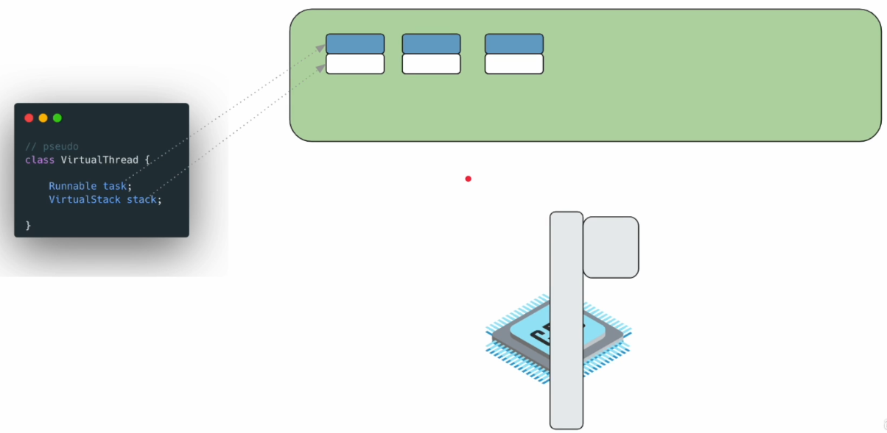

Imaginemos que la clase de Virtual Thread está implementada (es pseudocódigo) como muestra la parte izquierda de la imagen.

En la parte derecha y arriba de la imagen vemos que hemos creado tres virtual threads (o tres tareas) en el heap.

La parte azul es el runnable task y, en blanco están los virtual stack, inicialmente en null, límpios, porque no se han ejecutado.

En la parte de abajo de la imagen tenemos un único procesador. El palo vertical es el carrier thread, y el cuadrado a su lado es su correspondiente stack memory. Este es el stack memory fijo de 1Mb o 2Mb (da igual).

Cuando ejecutamos `thread.start()` estos tres virtual threads se añaden a la cola, listos para ser recogidos por el carrier thread para ejecutarse.

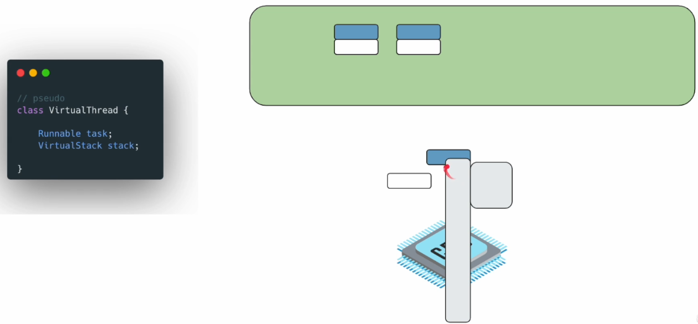

Imaginemos que el carrier thread coge la primera tarea y comienza a ejecutarla. Cargará el runnable o comenzará a ejecutar el virtual thread task.

Como parte del runnable, dentro, puede que estemos creando muchos objetos y que tengamos muchos métodos a los que llamar de uno en uno, así que, en nombre del virtual thread, el carrier thread lo hará todo.

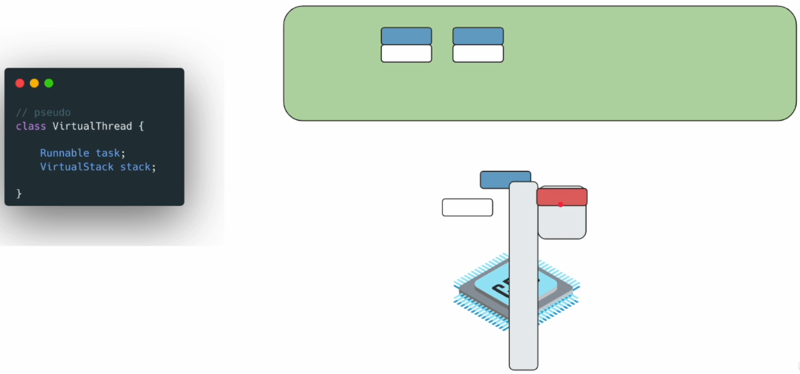

Durante la ejecución, el carrier thread usará el stack memory para guardar la información al método llamado, referencias de objetos, la traza, todo se almacenará en el stack memory.

Imaginemos ahora que, a mitad del runnable, tenemos que llamar al product service para obtener información de un producto.

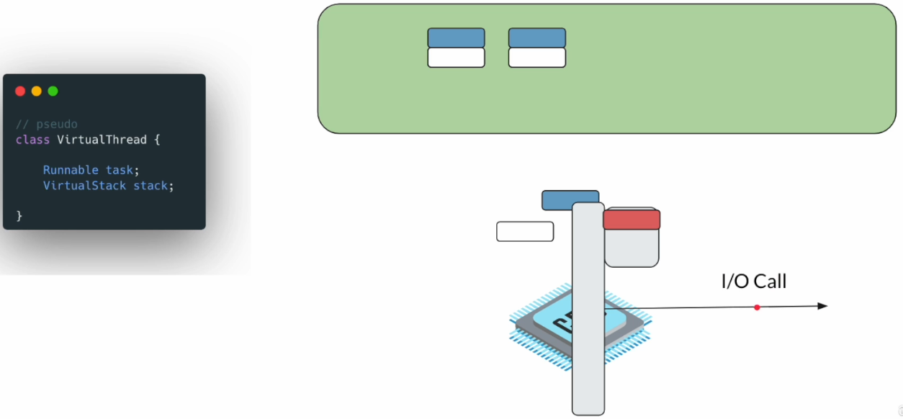

De parte del virtual thread, el carrier thread hace la llamada de red, haciendo la petición a product service.

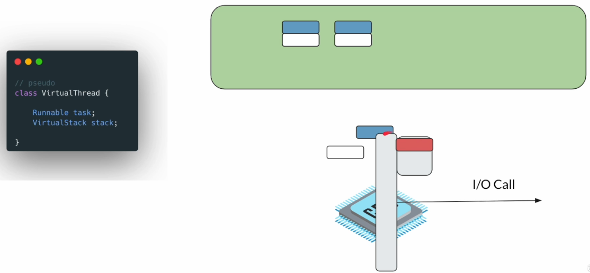

El carrier thread se da cuenta rápidamente que es una llamada bloqueante, y, como no quiere estar bloqueada, lo que hace es que, la información que haya en el stack memory, la coge y la almacena. 

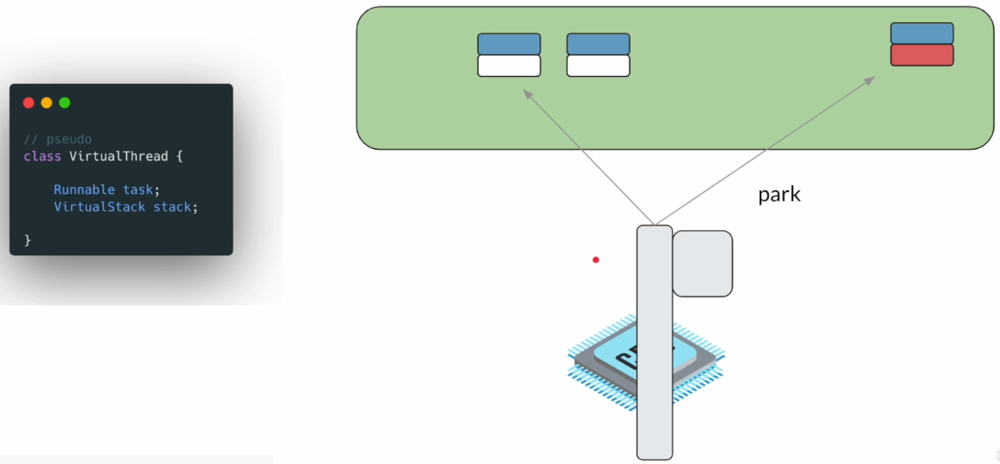

Y la aparca en el heap. El stack memory queda limpio.

Luego, el carrier thread coge la siguiente tarea para ejecutarse. Y así una y otra vez.

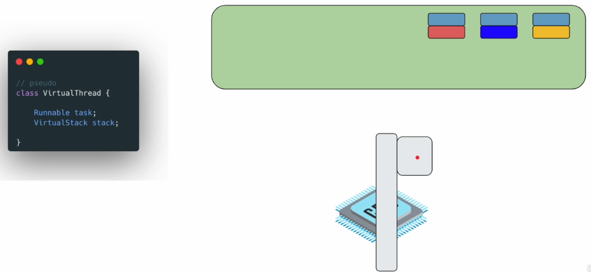

Eventualmente, cada virtual thread, su correspondiente información del stack acabará en el heap.

Es por esto que decimos que un virtual thread tiene un stack redimensionable (una tarea pueden ser 10Kb, la otra 100Kb...)

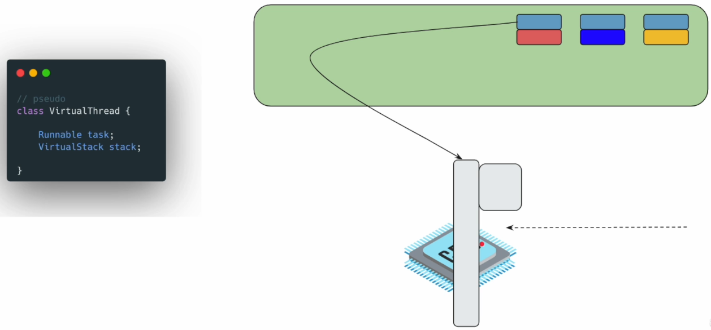

Ahora obtenemos la respuesta de product service. Se hace el unpark y se añade la tarea (task) de nuevo a la cola para ejecutarse.

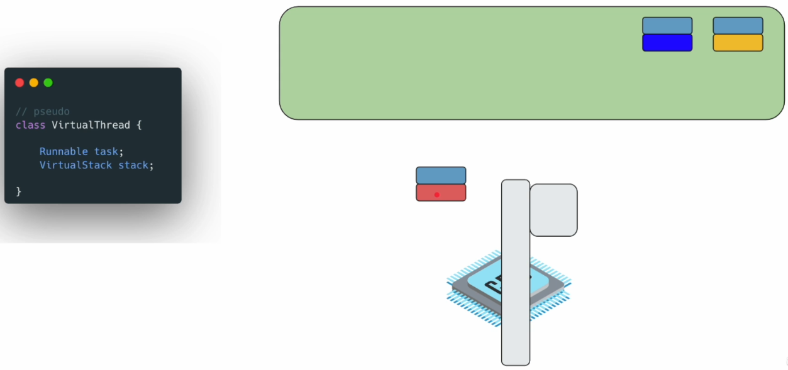

El carrier thread cogerá la tarea y comenzará de nuevo la ejecución, desde el sitio donde se paró.

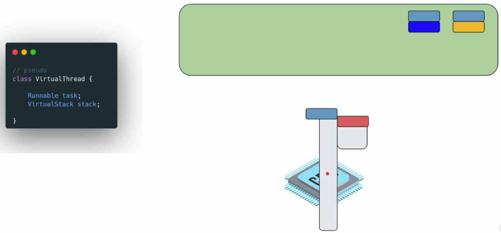

Vemos que no perdemos el contexto, porque la información, objetos, variables, referencias, todo estaba guardado en el heap. Ahora lo volvemos a cargar en el stack memory y continuamos la ejecución.

Y así es como funciona todo esto.

Este funcionamiento tiene un coste, pero es mejor que gestionar miles de platform threads.

### Getting Stack Trace

En esta demo, vamos a tener una task que tiene varios métodos con llamadas encadenadas.

Es decir, habrá un método 1, que llamará al método 2, y este método 2 llamará a un método 3...

Tendremos también algunas excepciones y veremos el stack trace y si podemos hacer debug.

Todo esto, usando virtual threads.

En `src/java/com/jmunoz` creamos los paquetes/clases siguientes:

- `sec02`
  - `Task`: Creamos métodos que llaman a otros métodos de forma encadenada, y que pueden lanzar excepciones.
    - Vemos que, tanto usando Platform Threads como Virtual Threads, vemos la stack trace, para propósitos de debug, sin problemas.
  - `StackTraceDemo`: Clase main.
- `util`
  - `CommonUtils`: 
    - Método `sleep()`: Vamos a usar mucho Thread.sleep() y no quiero tener que hacer el catch de InterruptedException cada vez.

### CPU Intensive Task

Platform Threads vs Virtual Threads. ¿Cómo se comportarán en tareas de CPU intensivas? Es decir, tareas que no tienen IO, sino muchísima computación.

Vamos a hacer algunas pruebas para poder comparar como trabajan ambos tipos de hilo cuando hay tareas de CPU intensivas.

Vamos a considerar la secuencia de Fibonacci, donde cada número es la suma de los dos números anteriores:

`0, 1, 1, 2, 3, 5, 8, 13, 21, 34, 55, 89, 144, 233, 377, 610, 987 ...`

En las pruebas, pasaremos la posición, por ejemplo 5, para saber cuál es el quinto número en la secuencia de Fibonacci. Asumiendo un array que comienza en 0, el quinto número en la secuencia de Fibonacci es el valor 5. El octavo número sería 21...

El código que vamos a hacer es malo y lento a propósito, un algoritmo 2 ^ N, con muchas llamadas recursivas, para que haga mucho cálculo de CPU.

En la vida real, un cálculo intensivo de CPU se puede lograr haciendo serializaciones / deserializaciones, procesamiento de imágenes, procesamiento de video, etc.

En `src/java/com/jmunoz` creamos los paquetes/clases siguientes:

- `sec03`
  - `Task`: Demo con tarea de CPU intensiva para ver como se comportan los Platform Threads vs VirtualThreads.
  - `CPUTaskDemo`: Clase main.
- `util`
  - `CommonUtils`:
    - Método `timer()`: Cuando tarda en ejecutarse un runnable.

El comportamiento observado es el siguiente:

- Platform Threads: Con 1 task o 5 task, el tiempo es más o menos el mismo, unos 3sg.
  - Con el número de procesadores que tiene la máquina, cada tarea tarda en completarse unos 5sg.
  - Si multiplicamos el número de procesadores por 2, vemos que el tiempo que tarda en completar cada tarea es de unos 7.5sg.
  - Si multiplicamos el número de procesadores por 3, vemos que el tiempo que tarda en completar cada tarea es de unos 11.3sg.
  - Esto es porque el scheduler, cada poco, va cambiando de tarea entre los distintos threads creados. Por ejemplo, cuando multiplico por 3, cada procesador alterna entre tres hilos, ejecutándolos poco a poco.
- Virtual Threads: Con 1 task o 5 task, el tiempo es más o menos el mismo, unos 3sg.
  - Con el número de procesadores que tiene la máquina, cada tarea tarda en completarse unos 5sg.
  - Pero, si multiplicamos el número de procesadores por 2 o por 3, vemos que el tiempo no se duplica ni triplica. Sigue siendo de unos 5sg.
  - Esto es porque no crea todos los threads desde el principio. Crea 16 threads (los procesadores que tiene mi máquina) y el Carrier Thread ejecuta las tareas. Conforme va completando una tarea, otra nueva tarea (están en el heap) es recogida por ese Carrier Thread.
  - Como no hay llamadas de red (operaciones IO) no se hace park ni unpark.
  - No es que sea más rápido, es que su comportamiento es más inteligente. No crea hilos que no va a usar, sino que espera que el máximo de hilos de mi máquina (los Carrier Threads) esté siempre trabajando.

Visualmente:


Esto es como se comportan dos Platform Threads, donde se va cambiando entre los dos threads hasta terminar su ejecución.


Y así se comportan dos Virtual Threads, donde un Carrier Thread ejecuta una tarea y luego la otra.

Al final, una forma de comportamiento de ejecución distinta, pero que tarda lo mismo.

Los virtual threads NO SON MAS RÁPIDOS que los platform threads.

Si tenemos tareas de CPU intensivas, no tiene sentido cambiar de platform threads a virtual threads. No va a mejorar el rendimiento en nada.

Más adelante veremos que, en operaciones con muchas operaciones IO, como llamadas a microservicios, si que tiene sentido usar virtual threads.

### Virtual Thread - Scheduler Config

- Los Platform Threads son planificados por el OS Scheduler.
- Los Virtual Threads son planificados por la JVM
  - Hay un `ForkJoinPool` dedicado para planificar Virtual Threads.
  - Este `ForkJoinPool` tiene threads para igualar el número de procesadores disponible.
    - core pool size = available processor
    - Los Carrier Threads NO se bloquean durante operaciones I/O

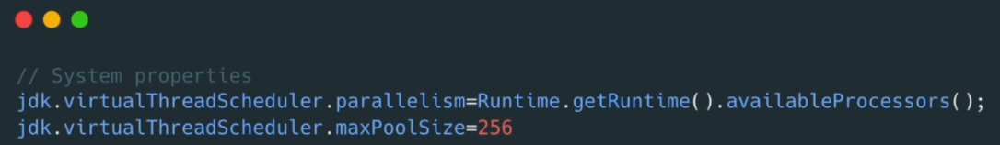

El máximo número de threads que se pueden tener en el pool de una aplicación son 256. Aunque más adelante jugaremos con este valor, no tenemos que modificarlo en aplicaciones de producción.

### Preemptive vs Cooperative Scheduling

Cuando tenemos varios threads y un procesador limitado, todos los threads competirán por CPU. Sin embargo, solo un thread puede ejecutarse a la vez.

Tenemos varias políticas de planificación para decidir que thread ejecutar.

Hay dos tipos de planificación (scheduling):

- Preemptive
  - Esto es lo que hace el planificador del SO, y lo que normalmente vemos para platform threads, ya que estos son OS threads.
- Cooperative
  - Es difícil de conseguir con platform threads, pero es usada por virtual threads.

**Scheduling:Preemptive**

- Preemptive - Política OS Scheduling
  - La CPU está asignada por un tiempo limitado a un thread.
  - El OS puede pausar por la fuerza un thread en ejecución dando CPU a otro thread.
  - Esto basado en thread-priority, time-slice, availability of ready-to-run threads, etc.
  - Platform threads pueden tener prioridades (`thread.setPriority(6)`).
    - 1 es baja prioridad
    - 10 es alta prioridad
    - 5 es el valor por defecto
    - Esto no lo hacemos nosotros, lo suele hacer el framework por debajo.
  - Nota:
    - El comportamiento de planificación Preemptive es dependiente de la plataforma.
    - Los Virtual Threads tienen la prioridad por defecto (valor 5). NO PUEDE MODIFICARSE.

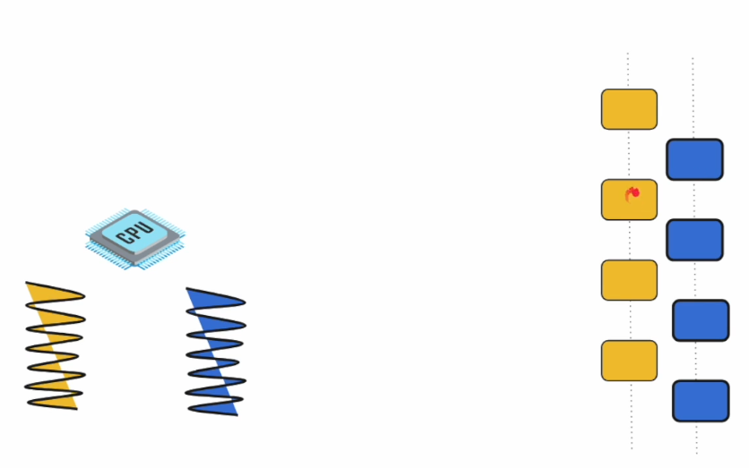

La ventaja de este planificador es que da oportunidades a todos los threads.

La desventaja es que tenemos muchos cambios de contexto.

**Scheduling:Cooperative**

- La CPU está asignada hasta que la ejecución se completa.
  - O el thread está dispuesto a dar CPU a otro thread (`Thread.yield()`).
    - A este comportamiento se le llama `behaviour yielding`.
- La ejecución no se interrumpe ni se pausa de forma forzada.
- Si hay un thread/task de larga ejecución, otros threads tienen que esperar.

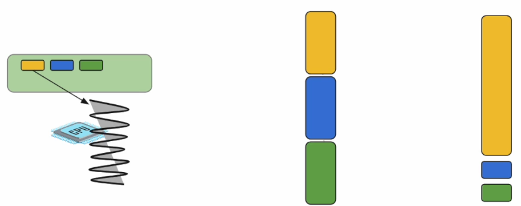

Es por este comportamiento de que los threads tienen que esperar a que termine el que se está ejecutando, que es mejor usar platform threads cuando la tarea es de uso intensivo de CPU.

De nuevo, los virtual threads son mejores para I/O, no para uso intensivo de CPU.

**Cooperative - Yield**

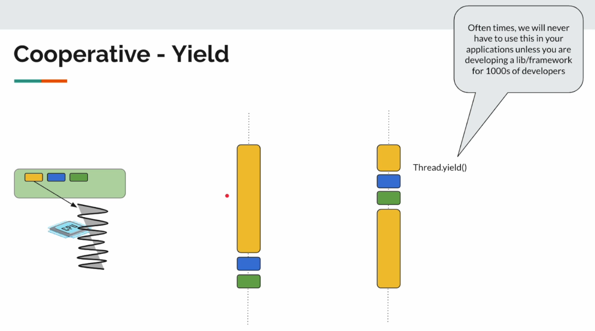

Si tenemos un virtual thread que se está ejecutando en una CPU, dicho thread puede indicar al scheduler que ya llevo bastante tiempo ejecutándose y que necesita más tiempo. Si hay más threads esperando, dales una oportunidad y yo continuo más tarde.

Esta comunicación se consigue usando el método `Thread.yield()`.

Este método es muy antiguo y también se puede usar en platform threads, aunque el OS scheduler lo va a ignorar. Por eso, este comportamiento no lo vemos en platform threads. Este método es más una sugerencia que una orden.

Pero para virtual threads el scheduler es la JVM, no el SO, así que la JVM comprende y acepta `Thread.yield()` como una orden. El carrier thread cogerá esa tarea y la llevará de vuelta a la cola y cogerá la siguiente tarea para ejecutarla.

Lo normal es no tener que usar `Thread.yield()` en aplicaciones reales.

### Cooperative Scheduling Demo

En `src/java/com/jmunoz` creamos los paquetes/clases siguientes:

- `sec04`
  - `CooperativeSchedulingDemo`: Una demo para comprender la planificación cooperative. NO tendremos que usarlo en aplicaciones reales. 

### How Virtual Threads Can Help?

Después de todo lo que hemos visto, ¿cómo pueden ayudarme los virtual threads?

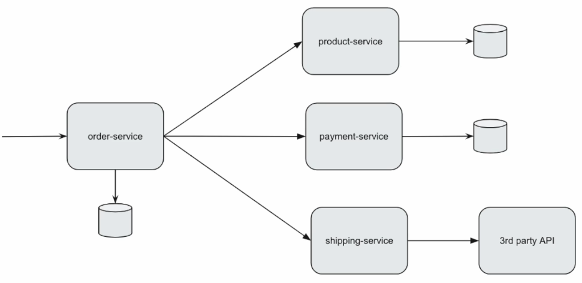

Ya hemos visto antes este ejemplo. Imaginemos que recibimos una petición para procesar una orden.

Tenemos que llamar a `product-service`, `payment-service` y `shipping-service`.

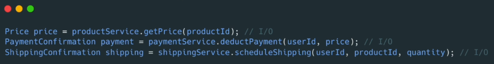

Así es como normalmente escribiríamos código, es un estilo síncrono bloqueante. El comentario I/O hace referencia a que son llamadas de red.

En este código, los threads tradicionales, los platform threads, quedan bloqueados.

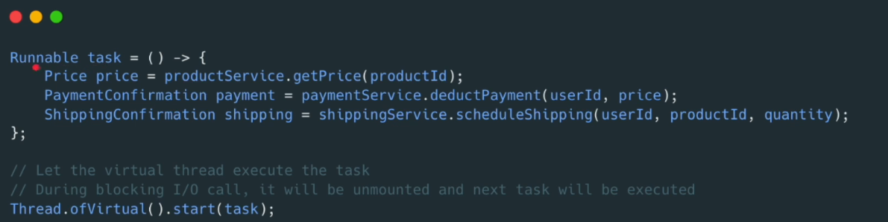

El código usando un virtual thread queda así. Lo que hay dentro del `Runnable` es una tarea (task) que es ejecutada por el virtual thread.

En cada llamada I/O, el virtual thread se desmonta (unmounted) y la siguiente tarea se ejecuta.

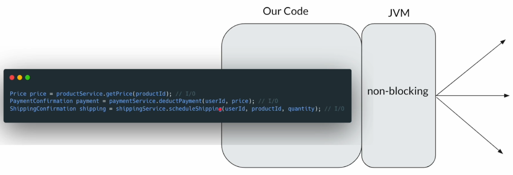

Para el código usando virtual threads, escribimos el código como normalmente lo haríamos en estilo bloqueante. Por detrás, la JVM lo hará no bloqueante por nosotros.

Por tanto, nosotros seguimos escribiendo código bloqueante, pero obtenemos gratis los beneficios de un código no bloqueante.

### Concurrency - Synchronization Basics

En este punto, conocemos lo básico de los virtual threads, como funcionan por detrás, etc. Hablemos de la sincronización, muy importante en los virtual threads porque tiene varios retos que tenemos que tener en cuenta.

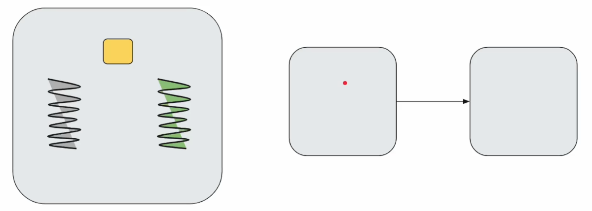

En la parte izquierda de la imagen vemos un proceso. Sabemos que un proceso puede tener uno o más threads. Estos threads pueden hablar entre ellos usando un objeto compartido (el cuadrado amarillo).

Esta comunicación será mucho más eficiente que tener dos procesos (parte derecha de la imagen) que usen protocolos como HTTP, etc. para hablar entre ellos.

Sin embargo, el problema de usar un objeto compartido con varios threads con las condiciones de carrera y la corrupción de la data.

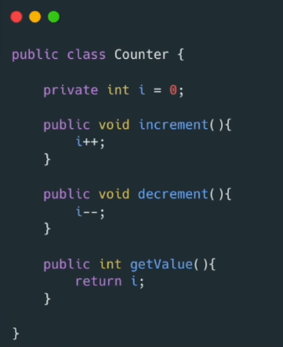

Tomemos este ejemplo de la documentación de Java. Es una clase Counter con una variable miembro `i` inicializada a `0`.

Tenemos dos métodos, uno incrementa la variable en `1` y el otro la decrementa en `1`.

Vamos a crear dos threads. Uno va a invocar el método `increment()` y el otro va a invocar el método `decrement()`.

Podemos pensar que, si invocamos los dos threads, la variable quedará con valor `0`. Sin embargo, el resultado será impredecible, `-1`, `0` o `1`.

¿Por qué? Porque un thread NO SABE lo que está haciendo el otro thread, así que la información puede sobreescribirse.

Para evitar este problema en Java existe un mecanismo llamado `sincronización`.

- Es un mecanismo para proveer acceso controlado a recursos compartidos / secciones críticas de código en un entorno multi-threaded.
- Evita las condiciones de carrera / corrupción de data.
  - Se asegura que solo un thread puede acceder a un bloque de código o a un método a la vez.
- **Nota:**
  - **Todos los retos relacionados con multi-thread como condiciones de carrera (race conditions), puntos muertos (dead-locks), etc. son aplicables a los Virtual Threads.**

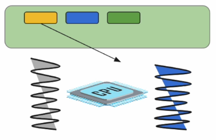

Aunque hemos dicho que los Virtual Threads son solo tareas, no podemos olvidarnos que al final del día son ejecutadas por Carrier Threads.

Por tanto, tienen los mismos problemas de condiciones de carrera y corrupción de data que cualquier otro thread.

### Synchronization in Compute Tasks

En `src/java/com/jmunoz` creamos los paquetes/clases siguientes:

- `sec05`
  - `Lec01RaceCondition`: Una demo de condiciones de carrera que provocan corrupción de la data.
  - `Lec02Synchronization`: Una demo usando sincronización para evitar la condición de carrera que hemos visto en`Lec01RaceCondition`.

### Thread Pinning: Demo

- Existía en Java 21, 22 y 23 un problema de rendimiento.
- Ha sido parcialmente resuelto en Java 24.
- Muchos desarrolladores no lo notaron, pero afectaba fuertemente a la escalabilidad.

Este problema se llama `Thread Pinning`. En vez de explicar el problema de forma teórica, va a ser más fácil comprenderlo viendo un ejemplo.

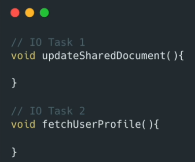

Imaginemos que tenemos una aplicación que realiza dos tareas I/O independientes.

La **primera tarea** actualiza un documento compartido. Esta tarea implica un estado compartido, así que requiere cuidado en la actualización.

En una aplicación real, esto implica alguna forma de sincronización o bloqueo para asegurar la corrección.

La **segunda tarea** obtiene el perfil del usuario. Es solo una operación de lectura y no necesita sincronización.

Por tanto, tenemos dos tareas, donde una necesita sincronización y la otra no.


Ahora vemos como muchos threads intentan ejecutar estas tareas.

Veamos que ocurre cuando usamos platform threads y cuando usamos virtual threads.

En `src/java/com/jmunoz` creamos los paquetes/clases siguientes:

- `sec05`
  - `Lec03SynchronizationWithIO`: Una demo del problema de escalabilidad que se daba en Java 21, 22 y 23, llamado Thread Pinning. Compilar usando Java 21, 22 o 23.

**Java 21**

Cambiar el POM para que use Java 21.

Para cambiar el SDK del proyecto para que use Java 21:


Para que el bytecode generado sea para Java 21.

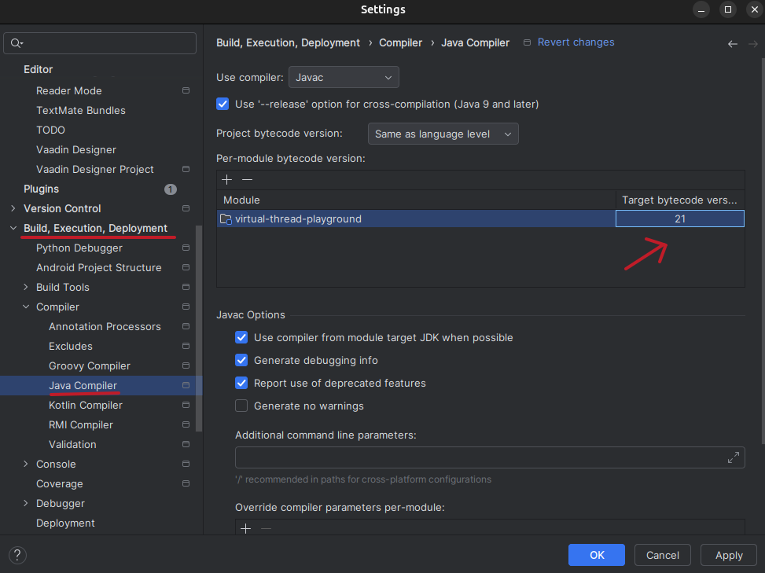

El resultado al ejecutar es:

**Platform Threads**

Se lanzan los 50 threads que llaman a `updateSharedDocument()` y también se lanzan los 3 threads que llaman a `fetchUserProfile()`. 

Como las tareas de `fetchUserProfile()` llevan solo un segundo, se completan.

Sin embargo, las tareas que llaman a `updateSharedDocument()`, como tienen la palabra clave `synchronized` se ejecutan una a una. Por eso, cada diez segundos vemos un log con texto `Update ended. Thread ...`.

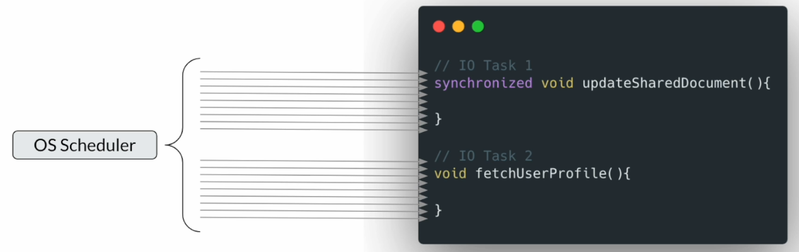

Como vimos, cuando usamos un platform thread, el planificador del S.O. puede ver todos los platform threads creados.

Si un thread se bloquea debido a I/O o por la sincronización, el planificador puede ejecutar otro platform thread.

En nuestro código, la tarea 1 usa la palabra clave `synchronized`, así que se ejecutan secuencialmente de una en una.

La tarea 2 no necesita sincronización, así que el S.O. es libre de ejecutar esos threads concurrentemente.

Con platform threads, tanto la tarea 1 como la 2 pueden hacer progresos.

**Virtual Threads**

Se lanzan tantos threads como números de CPU tiene mi ordenador, en mi caso 16 tareas solo para la tarea 1 `updateSharedDocument()`.

No aparece ningún thread para la tarea 2 `fetchUserProfile()`.

Cuando pasan 10 segundos y termina una tarea 2, comienza a ejecutarse otra tarea 2.

Pero, ¿por qué solo se crean 16 threads? ¿Y los otros 34 que mando crear?

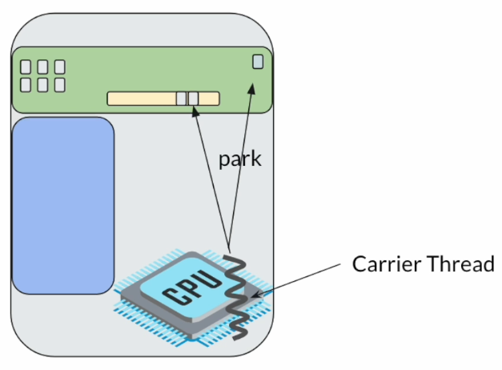

Sabemos que Java nos permite crear millones de virtual threads (lo vimos en uno de los primeros ejemplos de este curso).

Son planificados por la JVM, no por el sistema operativo.

Por debajo, un pequeño conjunto de carrier threads, cuyo número está basado en el número de procesadores que tenemos, ejecutan esos virtual threads (las tareas).

El virtual thread se monta sobre el carrier thread. Si es una operación I/O bloqueante, una llamada de red o `Thead.sleep()`, se desmonta (park), y el carrier thread coge el siguiente virtual thread. Este es el comportamiento normal esperado.

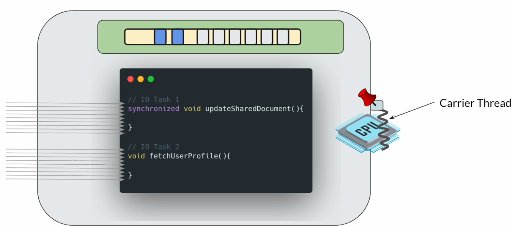

El problema es el siguiente. Si el virtual thread entra en un método sincronizado, NO PUEDE DESMONTARSE.

La JVM mantiene montado al virtual thread en su carrier thread hasta que termina toda la parte que está sincronizada.

A este comportamiento se le llama `pinning`.

Es por esto que, cuando lanzamos 50 virtual threads para la tarea 1 (en blanco) y 3 virtual threads para la tarea 2 (en azul), si tenemos, digamos 10 carrier threads (10 CPUs), estos carrier threads cogen las 10 primeras tareas correspondientes a la tarea 1. Como son `synchronized`, se bloquean y no pueden desmontarse.

Es decir, tenemos 10 carrier threads, todos bloqueados, y ningún virtual thread de la tarea 2 puede ejecutarse.

**Java 25**

**Virtual Threads**

Si volvemos a dejar el POM para que se compile todo con Java 25 y volvemos a ejecutar, veremos que ya no ocurre el problema de `pinning`.

Se lanzan a la vez 50 virtual threads para la tarea 1 y los 3 virtual threads para la tarea 2.

Es decir, a partir de Java 24, el comportamiento es el mismo que hemos visto en Java 21 para los platform threads.

### Thread Pinning: When & Why it Matters

- `Pinning` es una situación donde un virtual thread debe permanecer en su carrier thread y **NO PUEDE DESMONTARSE** mientras ejecuta código **`synchronized` o `native`**.
  - Es una limitación conocida de Java 21, 22 y 23. 
- Esto evita que la JVM pueda cambiar a otro virtual thread y reduce la escalabilidad.

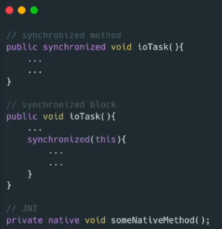

Con Java 24 o superior, el problema de `pinning` al usar `synchronized` está solucionado.

Pero el problema de `pinning` continua para llamadas a métodos nativos usando `native`. Por suerte, no es muy común usar JNI, pero si estamos en esta situación, es mejor no usar virtual threads hasta que este problema se solucione. Usar platform threads.

- ¡**synchronized** NO es malo!
  - Collections.synchronizedList(new ArrayList<>());
- **synchronized + Virtual Thread => Pinned**
  - **I/O tasks ->** Los Virtual Thread no pueden desmontarse. Afecta a la escalabilidad.
  - Esto en Java 21-23.
  - Solucionado en Java 24 y posteriores.

### Diagnosing Pinning: How to Trace

Estoy usando Java 21-23 y quiero usar virtual threads. Estoy usando librerías de terceros. ¿Cómo sé que no están usando `synchronized` o `JNI`, etc.?

La JVM nos da una opción para rastrear eventos `pinning`.

Para esta demo, tenemos que cambiar el POM a Java 21. Ver las imágenes de [Thread Pinning Demo](#thread-pinning-demo).

En `src/java/com/jmunoz` modificamos los paquetes/clases siguientes:

- `sec05`
    - `Lec03SynchronizationWithIO`:
      - Se añade una traza para saber si tenemos problemas de `pinning`.

Al ejecutar, si la JVM detecta `pinning` y usamos `System.setProperty("jdk.tracePinnedThreads", "full");`, la traza se verá así:

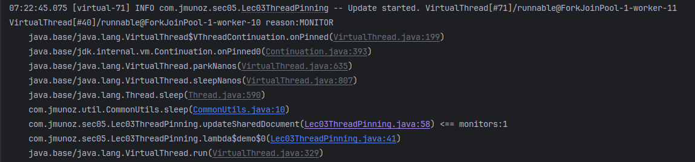

Y, si usamos `System.setProperty("jdk.tracePinnedThreads", "short");`, la traza se verá así:

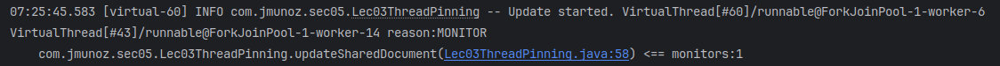

En ambos casos, si pulsamos sobre el link, accederemos al método donde se produce `pinning`.

### Fixing Pinning: The ReentrantLock Solution

Estoy usando Java 21-23 y no puedo actualizar a Java 24+. Tengo un método con una tarea I/O que requiere sincronización. ¿NO PUEDO usar virtual threads?

Sí, existe una solución alternativa si usamos `ReentrantLock`, y es lo que el equipo de Java nos recomienda usar en vez de `synchronized` para evitar el problema `pinning`.

- `ReentrantLock` se introdujo en Java 1.5
- Funciona como `synchronized`, pero provee más flexibilidad y control.
  - Ver en la imagen como explícitamente bloqueamos con `lock()` y desbloqueamos con `unlock()`.
  - Parece más complicado que la versión con `synchronized`, pero obtenemos los dos puntos siguientes.
- Política de equidad (fairness policy)
  - El primer thread que viene es el primero que obtiene el bloqueo (esto no pasa con `synchronized` donde es aleatorio)
  - El thread que ha estado esperando más tiempo tendrá la oportunidad de adquirir el bloqueo (el lock).
  - En la segunda imagen, vemos que habilitamos esta `fairness policy` indicando `true` en la instrucción `private Lock lock = new ReentrantLock(true);`.
- **tryLock** con timeout
  - Hay un máximo de tiempo de espera para que el thread adquiera el bloqueo.

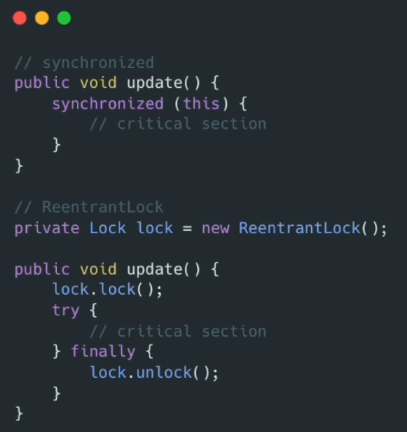

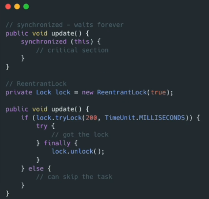

Compilar esta demo usando Java 21 (cambiar POM, etc.)

En `src/java/com/jmunoz` creamos los paquetes/clases siguientes:

- `sec05`
  - `Lec04ReentrantLock`: Es la demo `Lec02Synchronization` pero hecha usando `ReentrantLock`.
  - `Lec05ReentrantLockWithIO`: Es la demo `Lec03SynchronizationWithIO` pero hecha usando `ReentrantLock`.
    - Vemos en el resultado que no obtenemos la traza de que haya `pinning`.

### Advanced Creation: Virtual Thread Factory

Volvemos a Java 24+.

En esta clase vamos a hablar de `ThreadFactory`.

- `Thread.Builder` - Lo hemos estado usando hasta ahora. No es thread safe.
  - Tampoco pasa nada, no entremos en pánico.
- main - `thread.builder`
  - t1, t2, t3 ...
  - Crear threads de esta forma es correcto, sin problemas.
- main - `thread.builder` 
  - t1
    - t11, t12, t13 ...
  - t2
    - t21, t22, t23 ...
  - t3
    - t31, t32, t33 ...
  - A veces, nuestra aplicación es de esta otra forma. Tenemos una gran tarea y creamos un `thread.builder` y dividimos la tarea grande en tres tareas más pequeñas t1, t2 y t3.
  - Cada hilo podría dividirse a su vez en tareas mucho más pequeñas, creando sus propios threads, para hacer cosas en paralelo. Tendremos t1 y sus hijos t11, t12, t13, etc. Podemos ver una especie de jerarquía.
  - Es en estos casos donde `thread.builder` no es thread safe y la indicación es usar `ThreadFactory`.

Ese caso queda:

- `Thread.Builder` - No es thread safe.   (1)
  - main - `thread.builder`               (2)
      - t1, t2, t3 ...
- main - `thread.builder` -> `factory`    (3)
  - t1
      - t11, t12, t13 ...
  - t2
      - t21, t22, t23 ...
  - t3
      - t31, t32, t33 ...
  - Seguimos creando la configuración en el builder, y a partir de él, creamos un factory.
  - Al usar el factory, podemos crear el número de threads que queramos.
  - No es que solo en este caso (3) se deba usar el factory, también podríamos haberlo usado directamente en (2) 

Por tanto, `ThreadFactory` es thread safe, podemos usarlo donde queramos, pero en (3) no podemos usar `thread.builder`.

¿Cuál es el propósito de crear tantos hilos en un proyecto real? Imaginemos que estamos creando una aplicación web, por ejemplo, la vista de productos de Amazon.

La información es una vista agregada de data de varias fuentes. Hay varios microservicios involucrados de los que tenemos que recoger data y devolverla.

Imaginemos ahora que tenemos 100 vistas de productos. Cada petición tiene que manejarse por varios threads hijos, luego construir la vista de producto y devolver la respuesta.

Es en casos como este donde crear muchos hilos tiene sentido.

Más tarde usaremos algo llamado `high level concurrency`. Por debajo, esto usa `Thread Factory` y por eso lo estamos aprendiendo ahora.

En `src/java/com/jmunoz` creamos los paquetes/clases siguientes:

- `sec06`
  - `Lec01ThreadFactory`: Ejemplo de uso de `ThreadFactory`.

### Key Thread Methods Review

En esta clase veremos algunos métodos útiles cuando trabajamos con virtual threads. Probablemente, no los usemos mucho en nuestro trabajo diario, pero es bueno conocerlos.

Son los mismos métodos que ya usábamos para platform threads.

En `src/java/com/jmunoz` creamos los paquetes/clases siguientes:

- `sec06`
  - `Lec02ThreadMethodsDemo`: Ejemplos mostrando algunos métodos útiles de thread.

## Executors and Virtual Threads

Hasta ahora hemos estado jugando directamente con threads, con la intención de saber como funcionan las cosas a bajo nivel, pero en aplicaciones reales no se trabaja así.

Necesitamos un framework de concurrencia de alto nivel. Esto es `ExecutorService`.

### ExecutorService: Introduction

`ExecutorService` se añadió en Java 1.5.

- Framework de concurrencia de alto nivel.
  - Abstrae la gestión de Threads.
    - Hace Thread pooling: Como los platform threads son caros de crear, intenta reusar los threads existentes.
  - Provee una interface sencilla para que los desarrolladores puedan manejar Tasks.
    - Si tenemos que ejecutar una cierta tarea en un thread separado, se lo entregamos al `ExecutorService`, que lo hará por nosotros y nos devolverá el resultado.

**Task => SubTasks**

- ¡Virtual Thread es barato!
- Una tarea puede dividirse en muchas subtareas más pequeñas.

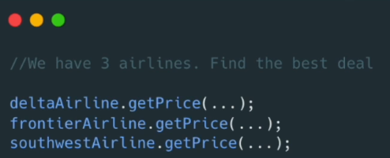

Imaginemos este caso. Tenemos tres servicios de aerolíneas y queremos encontrar la mejor oferta.

Para ello, tenemos que ejecutar cada uno de esos servicios (llamadas I/O) para obtener su precio y luego los compararemos.

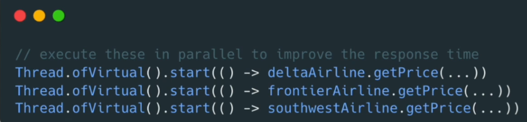

En vez de hacer las llamadas a los servicios secuencialmente, de uno en uno, como parte de una tarea, podemos dividirlas en varias subtareas más pequeñas, ya que son completamente independientes.

Como crear virtual threads es muy barato, en la imagen vemos que se crean 3 virtual threads que se van a ejecutar en paralelo.

Con esto mejoramos el tiempo de respuesta general.

Es en escenarios como este donde `ExecutorService` es de gran ayuda.

Como hay muchas palabras similares, vamos a discutir que significa cada una:

- **Executor** es una Functional Interface.
  - **ExecutorService** es una interface que extiende de **Executor**.
- **Executors** es una utility class con factory methods para crear una instancia de implementación de ExecutorService.
  - Por ejemplo, ForkJoinPool es una implementación.

Para los virtual threads, esto es importante:

- **¡Se supone que los Virtual Threads NO DEBEN agruparse (pooled)!**
  - Tasks
  - Los Virtual Threads están destinados a ser creados bajo demanda, y desechados una vez la tarea está hecha.
- Entonces, ¿cuál es el uso de **ExecutorService** con Virtual Threads?
  - Gestión de creación de Thread Per Task.
  - Alguien tiene que crear los virtual threads y comenzarlo por nosotros (start()). Eso lo hace **ExecutorService**

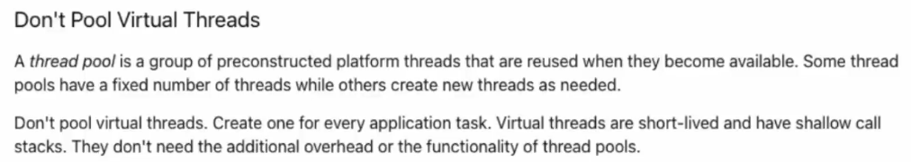

### ExecutorService: The Different Types

Estos son los tipos más comunes de ExecutorService. Hay alguno más, como `Work Stealing Pool` que sirve para crear `ForkJoinPool`.

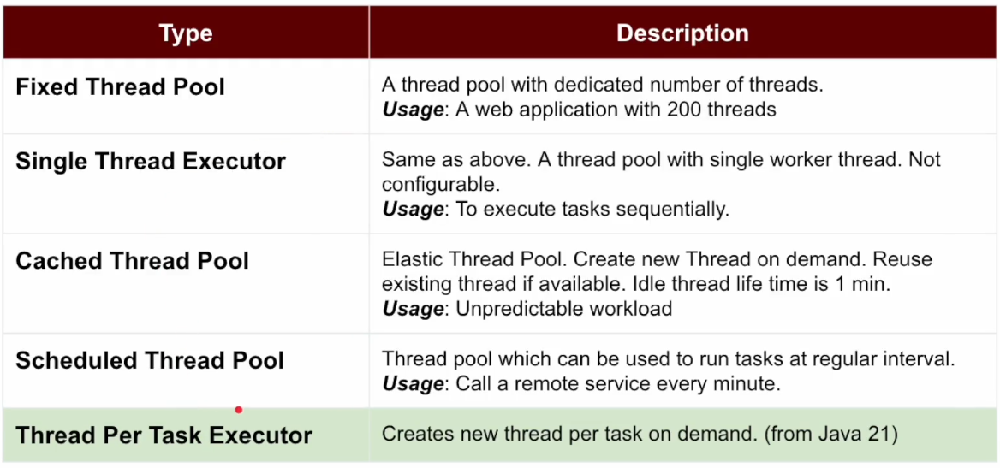

El tipo sombreado de verde, `Thread Per Task Executor`, usa por debajo el virtual thread builder factory, asi que, usándolo, podemos crear virtual threads.

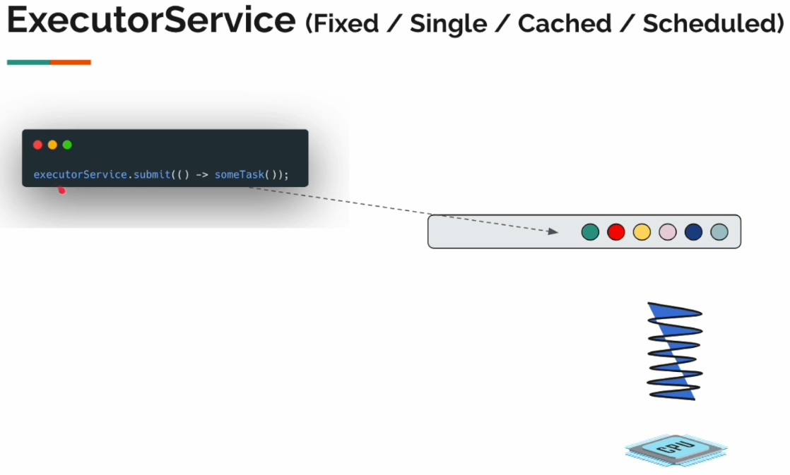

El método `executorService.submit()` acepta un tipo de objeto `Runnable` o `Callable`.

La implementación de `executorService` es thread safe, así que muchos threads pueden usar este método pra someter la tarea.

Todas las implementaciones de `executorService`, como `Fixed / Single / Cached / Scheduled`, incluso `ForkJoinPool` poseen una cola interna como la de la imagen.

Cuando se someten tareas, todas se añaden a esta cola. Dependiendo de la implementacion, tendremos más threads que pueden estar ociosos si no hay tareas.

Cuando hay tareas en la cola, estos threads las cogen y las comienzan a ejecutar, devolviéndonos luego el resultado.

Así es como han funcionado históricamente.

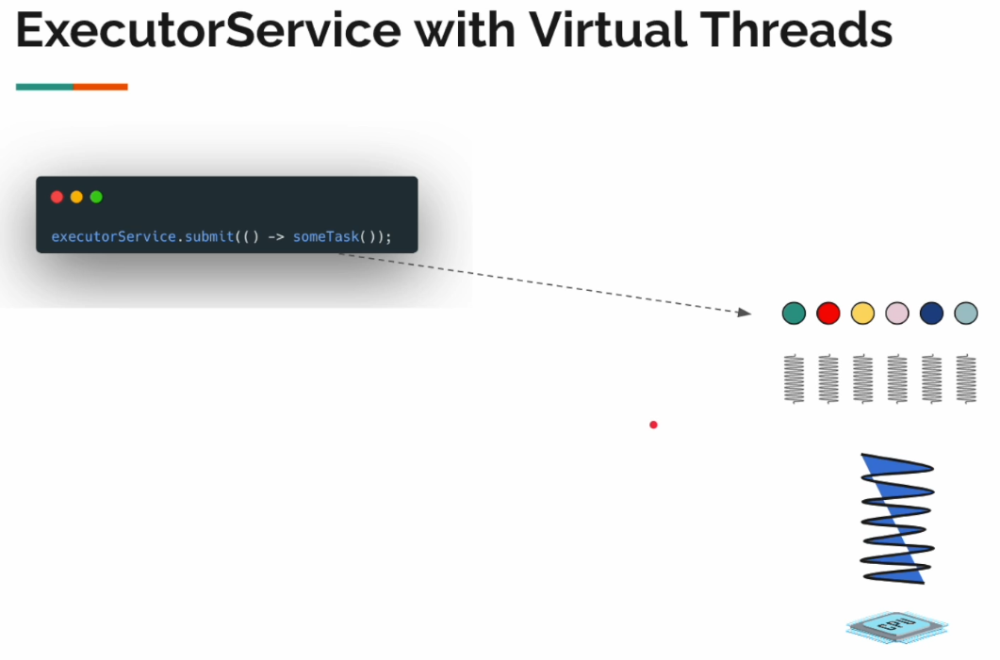

Con el nuevo `Thread Per Task Executor` el uso del método `submit()` sigue igual, pero por debajo, vemos en la imagen que no hay cola.

Lo que ocurre es que el método `submit()` obtiene la tarea y se la dará al virtual thread y lo comenzará (método `start()`).

Ya sabemos qué ocurre cuando comienza un virtual thread. El carrier thread lo coge y lo ejecuta.

Como estamos usando la interface `ExecutorService`, nuestro código es el mismo que hubiéramos escrito antes de que existieran los virtual threads.

Pero, por debajo, obtendremos los beneficios de una ejecución no bloqueantes, gracias a los virtual threads.

### Executors and AutoCloseable

`ExecutorService` ahora extiende la interface `AutoCloseable` (¡desde Java 21, antes no!).

- ¿Se supone que debe usarse `ExecutorService` con `try-with-resources` siempre?
  - Depende.
  - Por ejemplo: si estamos usando `shudown()`, se puede usar `try(...)`.
    - En aplicaciones que terminan, de corta vida, va a quedar más limpio.
  - Spring-Web / Server applications, ...etc., ExecutorService se usará en toda la aplicación. No se usa `shudown()`.
    - Normalmente, crearemos ExecutorService cuando se ejecute la aplicación, como un bean.
    - Estas aplicaciones están siempre ejecutándose en producción, no terminan nunca.

En `src/java/com/jmunoz` creamos los paquetes/clases siguientes:

- `sec07`
  - `Lec01AutoCloseable`: Creamos una implementación de ExecutorService.
    - Al ejecutar el ejemplo vemos que el main thread somete la tarea y el thread pool-1-thread-1 ejecuta la tarea.

### Demo: Comparing Executor Service Types

En `src/java/com/jmunoz` creamos los paquetes/clases siguientes:

- `sec07`
  - `Lec02ExecutorService`: Se discuten varios tipos de ExecutorService, incluyendo el nuevo Thread Per Task Executor.

### External Service

Hasta ahora hemos jugado con `Thread.sleep()` para simular tareas ejecutándose en segundo plano.

Pero, en la vida real, no se trabaja así. Haremos muchas peticiones y obtendremos su respuesta, haremos peticiones a BD, llamaremos a otros microservicios.

Es por eso que vamos a usar servicios externos (ya vistos en el README principal) para simular microservicios externos.

Enviaremos peticiones a estos servicios y recibiremos la respuesta.

Vamos a enfocarnos, hasta próximo aviso, en `sec01 - Product Information Provider`.

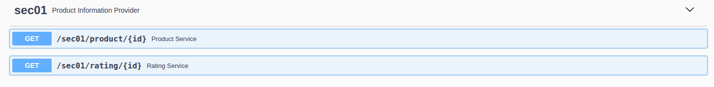

Cada endpoint debe entenderse como un microservicio separado.

### Creating the External Service Client

En nuestro proyecto playground, tenemos que poder enviar peticiones al servicio externo y recibir la respuesta.

Vamos a crear un cliente muy sencillo.

En `src/java/com/jmunoz` creamos los paquetes/clases siguientes:

- `sec07`
  - `externalservice`: Nuevo paquete donde codificaremos nuestro cliente.
    - `Client`: Clase cliente que hace peticiones a los servicios externos y obtiene la respuesta.

### Accessing Responses Using Future

En `src/java/com/jmunoz` creamos los paquetes/clases siguientes:

- `sec07`
  - `Lec03AccessResponseUsingFuture`: Jugamos con el cliente creado anteriormente.
    - Dejamos de utilizar `CommonUtils.sleep()`.
    - Usando `executor.submit()` obtenemos un Future. Un Future es un placeholder (marcador de posición) a partir del cual podemos acceder a la respuesta.

Para probar este ejemplo, tiene que estar ejecutándose `external-services.jar`.

### Concurrency vs Parallelism

Cuando decimos concurrencia versus paralelismo no estamos hablando de dos cosas que compiten.

Concurrencia es un término muy amplio y paralelismo es un término específico de ella.

Concurrencia consiste en tratar con muchas tareas en un periodo de tiempo.

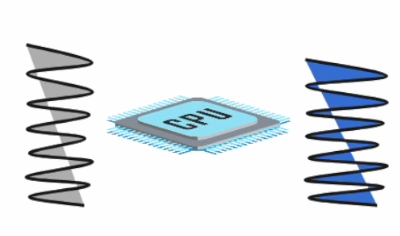

Imaginemos que el thread de la izquierda (en gris) es Chrome y el de la derecha (en azul) es IntelliJ, y tenemos una CPU.

Nuestra CPU ejecutará durante un tiempo Chrome y durante otro tiempo IntelliJ. Trata con muchas tareas en un periodo de tiempo, pero de una en una, cambiando de tarea, dando la ilusión de que ambos procesos se ejecutan a la vez.

Paralelismo consiste en romper tareas en muchas subtareas más pequeñas que puedan procesarse independientemente para conseguir una mejora de rendimiento significativa.

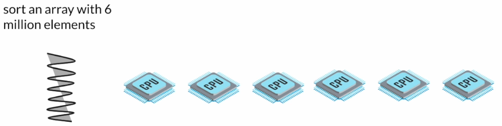

Imaginemos que como parte de una petición, obtenemos un array y tenemos que ordenarlo. Pero el array contiene 6 millones de items.

Si intentamos usar un solo thread, este será planificado (scheduled) en un solo CPU, así que llevará mucho tiempo.

Lo que podemos hacer es dividir ese array en 6 arrays de 1 millón de items cada uno, usando varias CPUs para realizar la ordenación simultaneamente.

### The Future Interface: Useful Methods

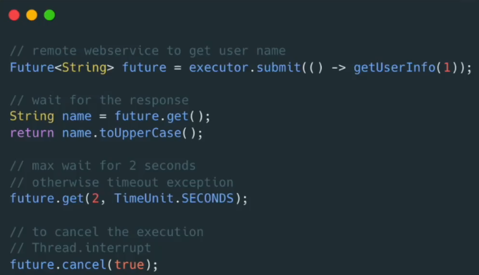

En la imagen pueden verse algunos métodos útiles de `Future`.

Usando Virtual Thread Executor, si tenemos una tarea que consume mucho tiempo, se puede seguir usando `submit()` y, por cada tarea a la que hacemos `submit()`, obtendremos un objeto `Future`.

`Future` es un objeto placeholder, así que sea lo que sea lo que devuelva `Callable`, podemos acceder a él vía el objeto `Future`.

- `future.get()`: Esperamos a que se complete el callable y obtenemos la respuesta. ¿Qué pasa si la respuesta tarda 20sg en llegar?
- `future.get(2, TimeUnit.SECONDS)`: Podemos pasar un tiempo máximo de espera, un timeout. Si pasado ese tiempo no tenemos respuesta, se lanza TimeoutException, y podemos continuar con un valor por defecto (si lo queremos así).
- `future.cancel(true)`: Interrumpe la ejecución del thread, en segundo plano.

Más adelante, en la siguiente sección, vamos a hablar de `CompletableFuture`, done podremos escribir código en una forma declarativa (estilo funcional), y volveremos a hablar de estos métodos.

### Building the Aggregator Service

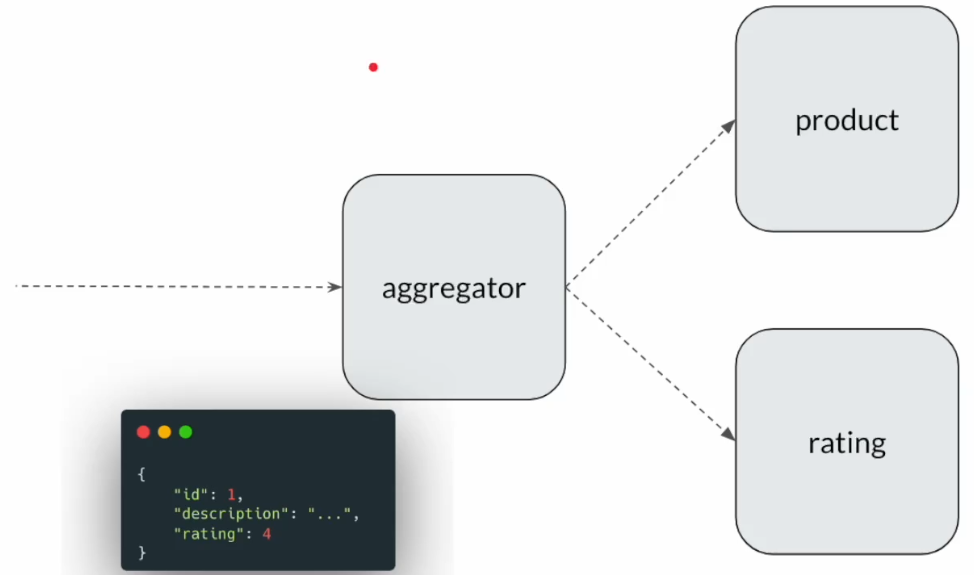

En esta clase vamos a crear una clase agregadora sencilla.

En la vida real tendremos muchos backends como productService, ratingService, pricingService, etc. Los clientes, como los navegadores, no van a querer llamar a esos backends.

Lo que se hace es un servicio agregador. Se le suele llamar `Gateway Aggregator Pattern` o `API Composition Pattern` y llamará a todos los backends para luego combinar la respuesta (el cuadro con el json).

- `sec07`
  - `aggregator`: Nuevo paquete donde codificaremos nuestro cliente.
    - `ProductDto`: Record que representa el producto.
    - `AggregatorService`: La clase agregadora.
  - `Lec04AggregatorDemo`: Clase main para el ejemplo de aggregator.

Para probar este ejemplo, tiene que estar ejecutándose `external-services.jar`.

### Do We Create Extra Thread?

Hablamos sobre una cosa de la clase `AggregatorService` (ver el código)

[Extra Thread?](./src/main/java/com/jmunoz/sec07/Lec04AggregatorDemo.java)

### Clarification: Virtual Thread Executor Behavior

En la clase `Lec01AutoCloseable` estuvimos hablando sobre `AutoCloseable` en el método `withAutoCloseable()` donde añadimos un `try`.

Si ese `try` la aplicación seguirá ejecutándose y tendríamos que indicar un `shutdown()` para parar la aplicación.

Pero en `Lec04AggregatorDemo` no estamos usando ningún `try` pero la aplicación termina tras hacer las llamadas. ¿Por qué no hemos necesitamos llamar a `shutdown()`?

Porque para el virtual thread executor no hay platform threads como parte del executor. Solo tenemos carrier threads y estos son como los daemon threads, así que se ejecutan y terminan.

En el método `toProductDto()` se realiza un bloqueo porque `future.get()` es bloqueante. Debido a eso, nuestro main thread no termina.

Solo termina el main thread cuando se escriba la lista en la terminal.

### Executors with Virtual Thread Factory

Si ejecutamos `Lec04AggregatorDemo`, veremos que no aparece un nombre de carrier thread. Para que aparezca el nombre para el virtual thread, tenemos que configurarlo via el Thread Factory.

Para ello, realizamos la siguiente modificación:

- `Lec04AggregatorDemo`: Cambiamos de `newVirtualThreadPerTaskExecutor` a `newThreadPerTaskExecutor`, que permite configurar un factory. El otro método ya tiene un factory por defecto.

### Challenges with Executors & Virtual Threads

Hasta ahora hemos estado jugando con `ThreadPerTaskExecutor` y todo ha funcionado bien.

- ExecutorService
  - Para `Platform Threads` provee estas implementaciones
    - single / fixed / cached / scheduled / fork-join-pool (este para tareas de CPU)
  - Para `Virtual Threads`, desde Java 21.
    - thread-per-task executor
- Virtual Threads
  - Genial para tareas IO para conseguir ¨beneficios no bloqueantes entre bastidores"

¿Cómo puedo usar Virtual Threads para un escenario single / fixed / cached / scheduled / fork-join-pool, pesando para Platform Threads?

Desafortunadamente, Java no provee una API standard para esto. Entonces ¿cómo lo hacemos?

De esto van las siguientes clases, de ver algunas limitaciones y desafios en torno a ellos.

### The Need For Concurrency Limit

En `src/java/com/jmunoz` creamos los paquetes/clases siguientes:

- `sec07`
  - `Lec05ConcurrencyLimit`: Vemos las limitaciones de Virtual Threads si queremos usar `newFixedThreadPool` por temas de límites de concurrencia.
    - Parece que funciona bien, pero...
    - Una de las características de los Virtual Threads es que se supone que no deben estar en pool.
    - Pero fixed crea un pool de threads que reutiliza, y, aunque permite un factory, no permite un factory de Virtual Threads.  

Para probar este ejemplo, tiene que estar ejecutándose `external-services.jar`.

La documentación de Java de Oracle indica:


Para casos de límite de concurrencia el equipo de Java recomienda usar semáforos.


### Semaphore

Antes de empezar a usarlos, hablemos de los semáforos.

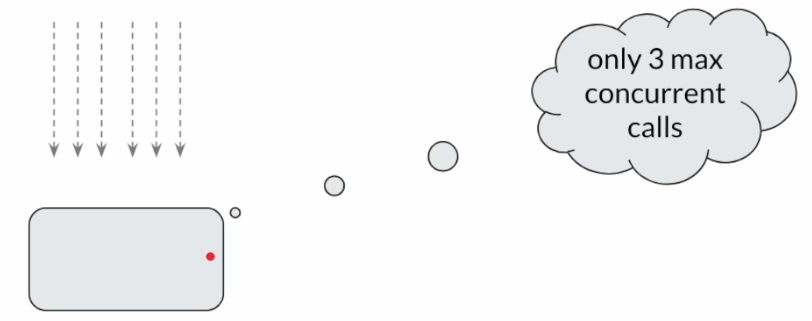

Imaginemos que esta es la pieza crítica de código (o método) que tenemos, y varios threads están intentando ejecutarlo, pero, como parte de nuestro requerimiento, solo se permiten un máximo de 3 llamadas concurrentes.

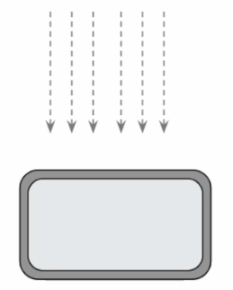

Para proteger nuestro método, podemos usar la suma de nuestro objeto. Explicado a alto nivel, esa suma es algo parecido a `ReentrantLock` o la palabra clave `synchronized`.

En `ReentrantLock` sabemos que solo un thread puede obtener el bloqueo. Cuando entre al método, lo ejecutará, luego se desbloqueará y dejará el método.

Aquí se llaman `permit`, así que crearemos algunos objetos con el número de `permits`, como 3 `permits`, 5 `permits`, etc., dependiendo del requerimiento.

Los threads tendrán que adquirir este `permit`, entrarán a ese bloque de código y lo ejecutarán.

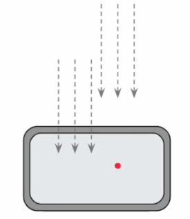

En nuestro ejemplo, solo se permiten que 3 threads puedan entrar al bloque de código. Los demás esperarán, porque no hay más `permits`.

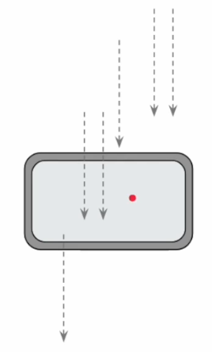

Cuando un thread se va, libera el `permit` y otro thread que estaba esperando puede ahora entrar.

A alto nivel, este es el funcionamiento.

**¿Cómo usarlo en nuestra aplicación?**

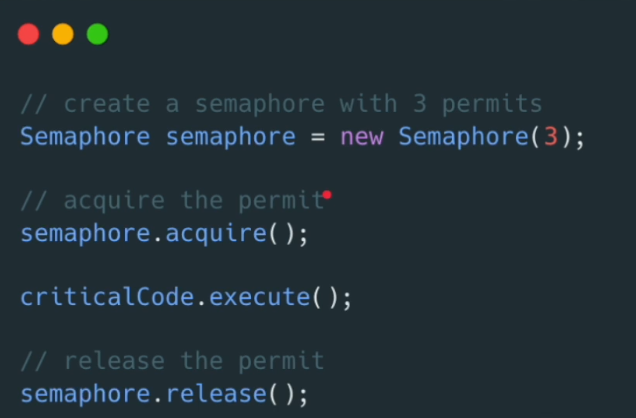

- Creamos un objeto semáforo con el número de `permits`.
- El thread adquiere el permit.
  - Este método es bloqueante, algo parecido a un `lock`.
  - Con Virtual Threads, lo que hace la JVM es hacer el `park` de ese thread durante ese tiempo.
    - Es decir, aunque parezca un bloque de código en estilo bloqueante, por detrás obtenemos los beneficios no bloqueantes.
- Ejecuta el trozo de código crítico.
- Se libera el `permit`.

**Preguntas Típicas**

- ¿Son lo mismo?
  - `Semaphore semaphore = new Semaphore(1);`
  - `Lock lock = new ReentrantLock();`

Si creo un semáforo con 1 `permit`, ¿en qué se diferencia de un `ReentrantLock`? En teoría, ambos trabajarán más o menos de la misma forma, ¿no?

A muy alto nivel, realmente sí, ambos se comportarán más o menos de la misma forma.

Sin embargo, hay algunas diferencias.

- Ambos fueron introducidos en Java 1.5
- Lock
  - ¡Al thread que adquiere el `lock` se le supone que hará el `unlock`!
- Semaphore
  - ¡Cualquier thread puede adquirir el `permit` y cualquier thread puede liberar el `permit`!

Lo de que cualquier thread pueda liberar el `permit` parece muy extraño. Veamos este funcionamiento:

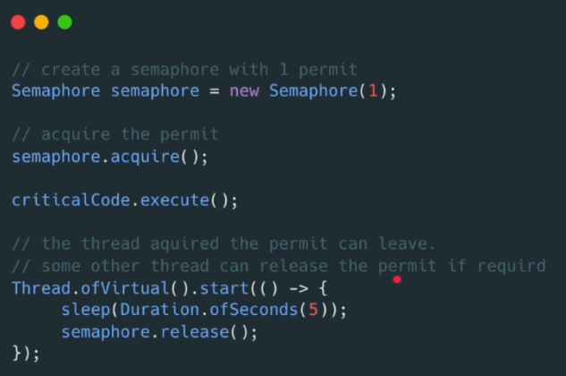

- Creamos un semáforo con 1 `permit`.
- Tendremos 2 threads, A y B (no se ven en el código)
- El thread A adquiere el `permit` y el thread B queda esperando.
- El thread A entra al trozo de código crítico y lo ejecuta.
- Idealmente, el thread A tras ejecutar el código se supone que debe liberar el `permit`.
- Pero, en vez de liberarlo, vemos que crea un virtual thread y le da algunas tareas a este virtual thread.
- En el código vemos que las tareas que tiene el virtual thread son esperar durante 5 segundos y luego liberar el `permit`.
- Por tanto, vemos que se le ha dado al virtual thread la tarea de liberar.
- El thread A se ha ido sin liberar el `permit`.
- El thread B tiene que seguir esperando, aunque el thread A ya se haya ido y nadie esté ejecutando el trozo de código crítico.
- Tras 5 segundos, el virtual thread liberar el `permit` y el thread B ya puede adquirirlo.

Otra cosa rara que podemos hacer con los semáforos es la siguiente:


- De nuevo, este es el trozo de código crítico y tiene 3 `permits`.
- Esto es como compartir una habitación entre 3 personas, puede haber personas que no les gusta compartir.
- Es decir, puede que algunos threads, cuando ejecuten el código digan que no quieren que ningún otro thread les interrumpa. El thread quiere ejecutar el código en exclusiva.

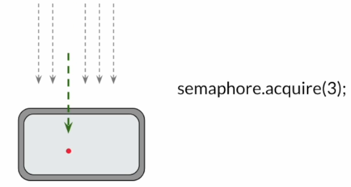

- Lo que podemos hacer es, condicionalmente, es permitir que un thread pueda obtener todos los `permits` disponibles, en nuestro ejemplo, los 3 `permits`.
- Los demás threads tendrán que esperar, ya que no quedan `permits` disponibles que adquirir.
- Cuando el thread que tenga todos los `permits` se vaya, los liberará todos.

### Building The Virtual Thread Concurrency Limiter

En esta clase vamos a corregir el problema que teníamos con el límite de concurrencia y los virtual threads usando semáforos.

En `src/java/com/jmunoz` creamos los paquetes/clases siguientes:

- `sec07`
  - `concurrencylimit`: Nuevo paquete.
    - `ConcurrencyLimiter`: Es una utility class que limita la concurrencia basada en un valor entero que se le pasa. 
  - `Lec06ConcurrencyLimitWithSemaphore`: Corrige el problema que teníamos con el límite de concurrencia y los virtual threads (ver `Lec05ConcurrencyLimit`) usando semáforos.
    - Ahora vemos que se crean virtual threads distintos (no un pool) y no se reutilizan.

Para probar este ejemplo, tiene que estar ejecutándose `external-services.jar`.

### Concurrency Limits: Managing Order

Aunque nuestro limitador de concurrencia parece funcionar bien, hay un pequeño problema.

Para entenderlo mejor, veremos el funcionamiento de `Lec05ConcurrentLimit`.

Si se indica estos códigos en esa clase, vemos que se obtiene:

```java
execute(Executors.newFixedThreadPool(1), 20);
```

- Estamos con platform threads, con un fixed pool de 1.
  - Si ejecutamos veremos que se someten 20 tareas y vamos secuencialmente de 1 en 1. Está ordenado.

```java
execute(Executors.newFixedThreadPool(3), 20);
```

- Estamos con platform threads, con un fixed pool de 3.
  - Si ejecutamos veremos que se someten 20 tareas y vamos con ejecución paralela de 3 en 3.
  - Aunque las tres tareas que se ejecutan en paralelo no tienen orden, si vemos que las 20 tareas se ejecutan en orden.
  - Es decir, va del 1 al 20, pero si toca ejecutar la 7, 8 y 9, a lo mejor se ejecutan como 9, 8 y 7, pero no pierde el orden global, no se ejecuta la 7, 8 y la 1.

Pero en `Lec06ConcurrencyLimitWithSemaphore` con virtual threads, si ejecutamos, veremos que algunos virtual threads se ejecutan completamente desordenados.

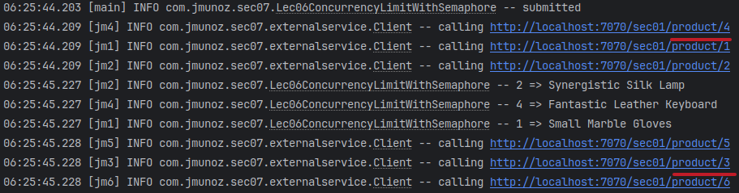

El producto 4 se ha ejecutado el primero, y el producto 3 detrás del 5. No hay orden.

Incluso indicar como límite 1 sigue sin funcionar: 

```java
var limiter = new ConcurrencyLimiter(Executors.newThreadPerTaskExecutor(factory), 1);
```

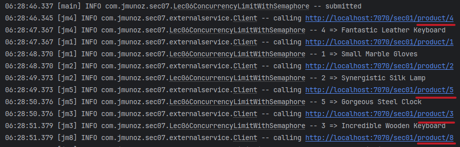

**¿Por qué ocurre esto?**

Todas las implementaciones de ExecutorService para los platform threads (fixed / single / cached / scheduled) tienen una cola interna, una estructura de datos que mantiene todas las tareas, y los threads cogen esas tareas de la cola. Por eso pueden mantener el orden. La primera tarea que se somete (submit()) va a ser la que coja el thread.

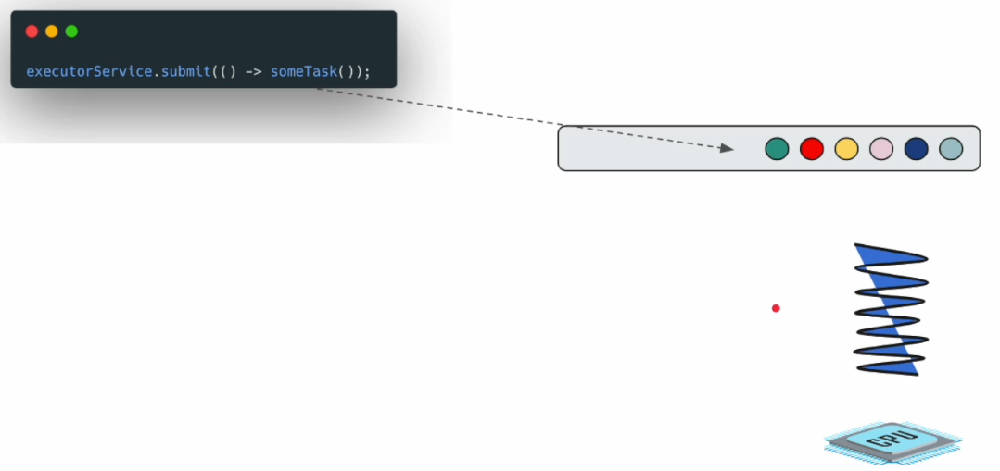

Para los virtual threads, el Thread-Per-Task Executor, **no existe ninguna cola** y cuando se somete (submit()) una tarea, se crea el virtual thread y se comienza. Ahora es el carrier thread el que coge esa tarea y la ejecuta.

Si tenemos 10 CPUs tendremos 10 carrier threads y, si tenemos 20 virtual threads, todas compitiendo a la vez, el orden depende de que virtual thread coge el carrier thread.


Es extremadamente difícil garantizar el orden de ejecución cuando estamos con un Thread-Per-Task Executor.

Vamos a ver como hacerlo.

### Virtual Thread Concurrency Limiter With Order

Para gestionar el orden de ejecución correctamente, tenemos que gestionar nosotros una cola.

En `src/java/com/jmunoz` modificamos los paquetes/clases siguientes:

- `sec07`
  - `concurrencylimit`
    - `ConcurrencyLimiter`: Modificado para proveer una ejecución ordenada (o secuencial) usando una cola.

Para probar este ejemplo, tiene que estar ejecutándose `external-services.jar`.

Con este cambio, ahora la ejecución con virtual threads se ve así, ordenado de forma global:

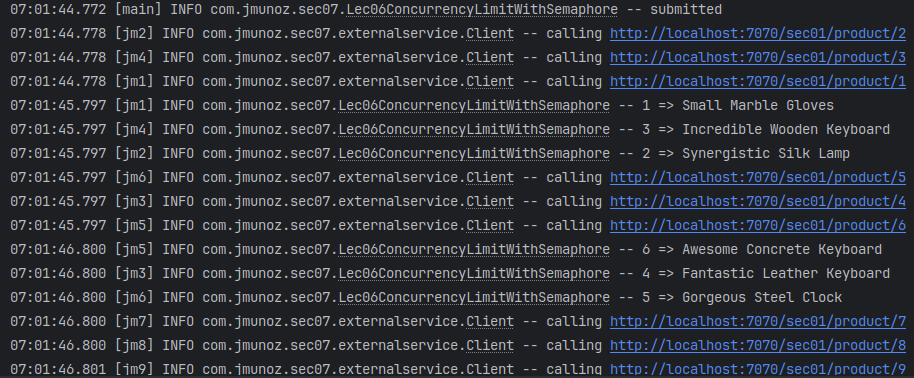

Recordar que nuestro objetivo es un orden global. Usando 3 llamadas concurrentes, puede que el orden sea 2, 3, 1, pero globalmente está ordenado. El thread pool fixed también funciona así.

Notar que el thread `jm4` está ejecutando la tarea del producto 3. Esto es normal, no va a coincidir el número de thread con el número de la tarea. No nos importa el número del thread, sino que la tarea se ejecute en el orden apropiado.

Sin la cola, probablemente `jm4` ejecutará la tarea número 4, y ya no estaría ordenado.

Y si indicamos un limit de 1: `var limiter = new ConcurrencyLimiter(Executors.newThreadPerTaskExecutor(factory), 1);` entonces estaría totalmente ordenado.

### ScheduledExecutorService with Virtual Threads

En esta clase vamos a ver otro problema.

En el fuente `Lec02ExecutorService` discutimos varios tipos de Executor Service, muchos de ellos solo para platform thread.

Para virtual threads hemos creado equivalentes:

- `singleThreadPool`: Usando semáforos con un límite a 1. 
- `fixedThreadPool`: Usando semáforos con un límite mayor a 1.
- `cachedThreadPool`: No tenemos que crear nada equivalente. Es crear tantos threads como queramos basado en el número de tareas. Esto es lo que hace, a alto nivel, nuestro `virtualThreadPerTaskExecutor`, sin reutilizar threads y sin pool.
- `scheduledExecutor`: Si queremos llamar de forma periódica a un servicio web remoto, ¿podemos usar virtual threads? Directamente no, pero podemos hacer que un platform thread delegue la tarea a un virtual thread.

En `src/java/com/jmunoz` creamos los paquetes/clases siguientes:

- `sec07`
  - `Lec07ScheduledExecutorWithVirtualThreads`: Como no se puede usar directamente un schedulecExecutor con virtual threads, hacemos que un platform thread delegue la tarea a un virtual thread.

Para probar este ejemplo, tiene que estar ejecutándose `external-services.jar`.

### Stream Gatherers: Concurrent Mapping

Esto que vamos a ver es para Java 24.

El problema es el siguiente:

Antes de Java 24, Java Stream carecía de extensibilidad. Los streams eran poderosos, pero inflexibles.

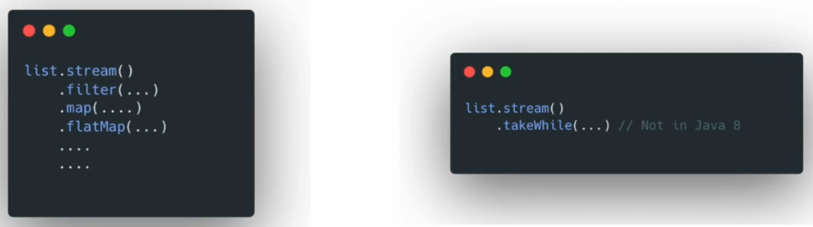

Los Streams, introducidos en Java 8, tienen operadores como `filter()`, `map()`, etc. pero no tenía el operador `takeWhile()`.

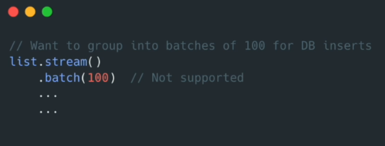

De igual manera, el operador `batch()` tampoco estaba soportado. Sirve cuando tenemos una lista muy grande, digamos de un millón de elementos, y quiero agruparlos en lotes.

Esto ya está soportado en Java 24.

Por eso decimos que los streams de Java eran poderosos, pero no nos daba opciones de extenderlo. Dependíamos del equipo de Java para que creara los operadores.

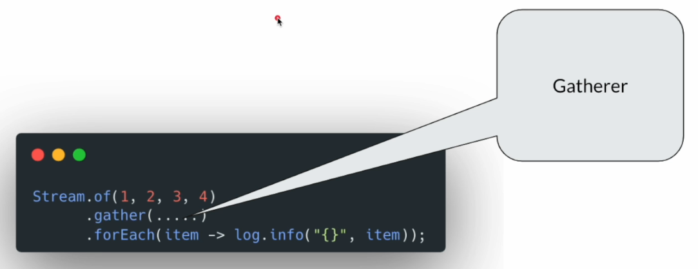

Finalmente, como parte de Java 24, el equipo de Java ha añadido una característica llamada `Stream Gatherer`.

El `Gatherer` es un interface que necesitamos implementar.

También tenemos el operador `gather()` que acepta la implementación del `Gatherer`.

Con esto, podemos crear nuestro propio operador.

**Map Concurrent**

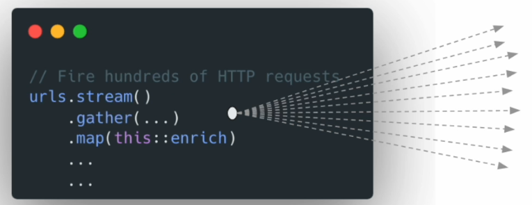

Java 24 ya viene con algunos `gatherers` incorporados. Uno de ellos, `Map Concurrent` es muy interesante porque por debajo usa virtual threads.

Imaginemos que tenemos una lista de URL. No tenemos que mandar la petición HTTP de una en una en el pipeline del Java Stream.

Usando `gather()` y el `gatherer` `Map Concurrent` podemos enviar muchas peticiones concurrentes usando virtual threads.

En `src/java/com/jmunoz` creamos los paquetes/clases siguientes:

- `sec07`
  - `Lec08MapConcurrent`: Ejemplo usando Java Stream Gatherers, gather y Map Concurrent.
    - Solo funciona para Java 24 o superior.

Para probar este ejemplo, tiene que estar ejecutándose `external-services.jar`.

### Stream Gatherers: What About Nested Concurrent

Añadamos al requerimiento anterior lo siguiente: Lo que hicimos en `Lec04AggregatorDemo`, es decir, por cada `productId` tenemos que obtener `productName` y `rating`.

Esto son llamadas concurrentes anidadas, es decir, por cada `productId` tenemos que hacer dos peticiones.

¿Cómo podemos hacer eso usando `Stream Gatherers`? No existe una solución incorporada, pero podemos implementar la interface `Gatherer` para obtener nuestra propia solución.

Esto lo vemos en el curso `Modern Java: Stream Gatherers & Scalable Concurrency` en las secciones `Concurrency Patterns With Virtual Threads & Stream Gatherers` y `Massive I/O With Virtual Threads & Stream Gatherers`.

### Summary

- Virtual Threads
  - Geniales para tareas IO para conseguir beneficios no-bloqueantes en segundo plano.
  - No usar en tareas intensivas de CPU porque no vamos a obtener ningún beneficio.
  - Se usa un **Thread Per Task** porque son baratos de crear.
  - **NUNCA POOL**
- ExecutorService
  - Un framework sencillo para concurrencia de alto nivel y gestión de threads.
  - Sometemos la tarea y obtenemos el resultado via un objeto Future.
  - Para Virtual Thread - Tenemos el executor **Thread-per-task**.
- ExecutorService con Platform Threads
  - single / fixed / cached / scheduled / fork-join-pool
  - Estas implementaciones hacen pool de threads.
  - NO USAR factory de Virtual Thread porque parece que funciona, pero se hace pool de threads y los virtual threads NO DEBEN hacer pool de threads.
- ExecutorService con Virtual Threads
  - Implementaciones disponibles: single / fixed -> usando semáforo + cola
  - cached -> más o menos lo mismo que thread-per-task
  - scheduled -> usar platform thread para planificar y virtual thread para ejecutar
  - fork-join-pool -> No aplica.

## Asynchronous Programming with CompletableFuture

### CompletableFuture: Introduction

- Introducido en Java 8 para tratar con programación asíncrona y concurrente.
  - Provee una forma limpia y expresiva de trabajar con tareas asíncronas, gestión de errores y resultados combinados. 
- Similar a las `promises` de `JavaScript`.
- Programación asíncrona en estilo declarativo.

¿Tiene sentido aprender `CompletableFuture` si tenemos virtual threads? Ya puedo escribir código en estilo síncrono bloqueante y mi virtual thread hará por detrás todo el I/O en estilo no-bloqueante.

Algunas veces no vamos a poder escribir código en estilo síncrono bloqueante.

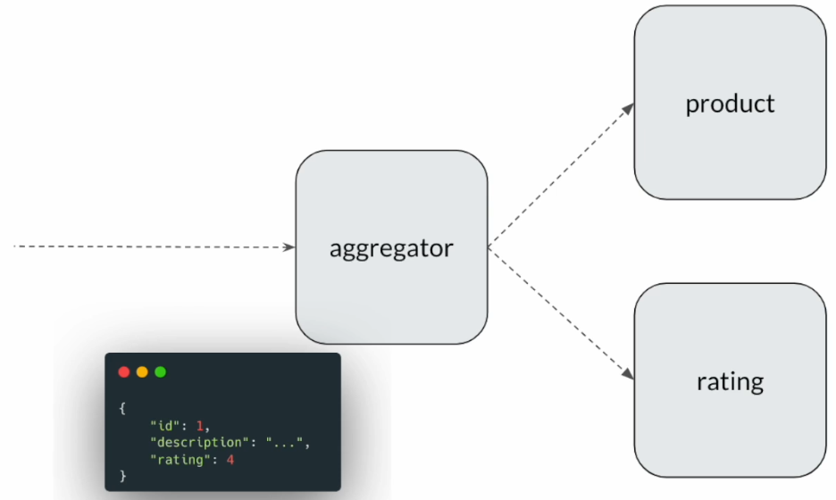

Por ejemplo, ya codificamos antes este ejemplo de `aggregator`. Aquí necesitamos hacer dos llamadas y unir sus resultados en una respuesta combinada.

Esto no lo hicimos secuencialmente uno a uno porque hubiera tomado dos segundos en vez de uno. Lo que hicimos fue dos llamadas en paralelo, pero **sin gestión de errores**. Asumimos el escenario de camino feliz.

¿Qué pasa si el servicio product falla, o el de rating? ¿O si el servicio de rating es muy lento?

Necesitamos hacer nuestro código más robusto y para ello necesitamos mejores herramientas.

Aprender `CompletableFuture` tiene sentido porque provee una buena forma de gestionar errores. Además, como tiene muchos años de existencia, hay mucho código que lo usa.

Así que, en vez de sustituir el código, podemos sencillamente hacer que `CompletableFuture` funcione con virtual threads.

- Tenemos `Future<T>`.
  - Cuando sometemos una tarea al executor service, obtenemos un objeto Future (Future es una interface).
- `CompletableFuture` es una clase que implementa la interface `Future<T>`.
  - Esta clase provee **muchos** métodos para encadenar, gestionar errores, combinar resultados, etc.
  - Podemos **extender** la clase `CompletableFuture` para sobreescribir su comportamiento, o añadir más métodos si queremos.

- Por defecto `CompletableFuture` usa `fork-join-pool`.
  - Para tareas I/O, acepta un Executor. Como parte de Java 21 podemos usar un executor virtual-thread-per-task

**Requerimientos**

Para ver como funciona `CompletableFuture` vamos a tomar este sencillo requerimiento y a implementarlo usando `CompletableFuture`:

- Llamar al servicio remoto para obtener el nombre de usuario.
  - Saludar al usuario con `"HELLO " + name.toUpperCase()`.
  - En caso de cualquier problema/excepción, solo decir `"Hey User...!`.
- El servicio remoto puede ser lento ocasionalmente. No esperar por más de un segundo.
  - Si el servicio es lento, solo indicar `"Oops... the service is slow"`.
- Devolver los mensajes indicados arriba como `"result"`.
- Luego añadir la hora actual en este formato:
  - `result + " - " + LocalTime.now()`.

La codificación de este requerimiento será algo así:

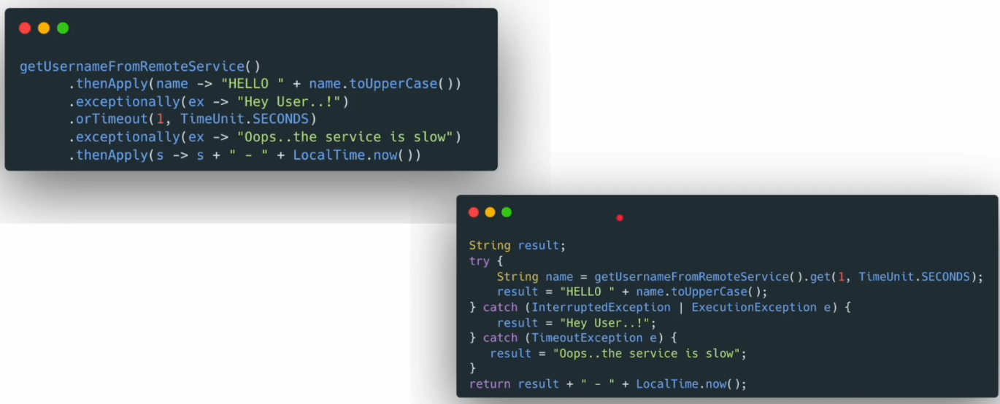

El código indicado en la parte izquierda usa `CompletableFuture` y el código indicado en la parte derecha NO usa `CompletableFuture`.

Parece claro que es mucho más legible el código que usa `CompletableFuture`. Es un estilo declarativo fácil de leer.

El código que no usa `CompletableFuture` es de más bajo nivel mientras que el que lo usa tiene un nivel de abstracción más alto que expresa las reglas de negocio. Expresamos el resultado que queremos en un estilo funcional.

**Familiar vs Readable**

- Familiar
  - Comprendemos y podemos trabajar con ese código porque hemos visto código o patrones similares antes. La familiaridad viene de la experiencia, entrenamiento, etc. Cuando el código es familiar, lo encontramos más fácil de leer, mantener y modificar.
- Readable
  - Cómo de fácil podemos comprender un trozo de código incluso aunque NO estemos familiarizados con el patrón. Un código legible está bien estructurado, autodocumentado.
  - Expresamos el resultado con abstracciones de alto nivel.

**Is CompletableFuture Reactive?**

- ¡NO!
- La programación asíncrona con `CompletableFuture` NO ES LO MISMO que la programación reactiva.

Ahora vamos a centrarnos en ver como usar `CompletableFuture` con virtual threads.

### CompletableFuture: Internal Mechanics

Vamos a ver rápidamente como funciona `CompletableFuture` a alto nivel.


Tenemos dos métodos.

En un estilo de programación síncrono bloqueante tradicional, el método 1 llamará al método 2 y este devolverá el resultado. Es lo que hemos hecho siempre y es fácil de entender.

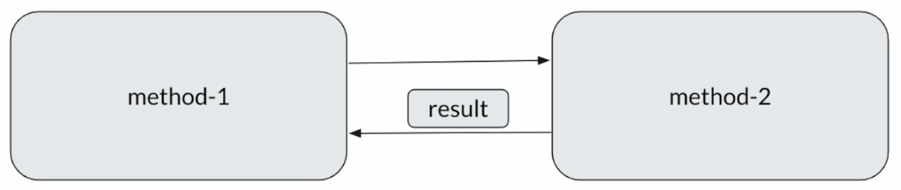

En el mundo de `CompletableFuture`, en vez de enviar el resultado directamente, ponemos el resultado en una caja y devolvemos la caja al método 1.

¿Por qué ponemos el resultado en una caja en vez de sencillamente enviar el resultado directamente?

Si el método 2 puede devolver el resultado casi inmediatamente, tan pronto como se le llame devuelve el resultado, entonces devolverlo inmediatamente tiene todo el sentido del mundo.

Pero imaginemos que el método 2 es una tarea IO que tarda bastante en completarse:

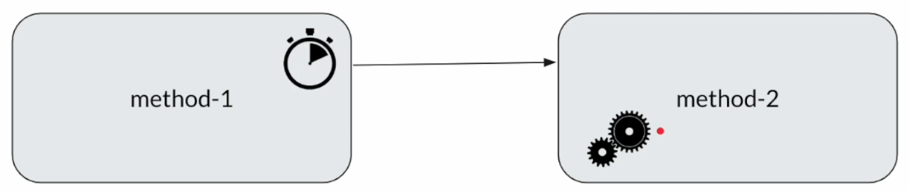

El método 1 llama al método 2. El método 2 NO tiene nada que devolver porque sigue trabajando en la tarea.

El método 1 tiene que esperarse mientras no llegue ninguna respuesta.

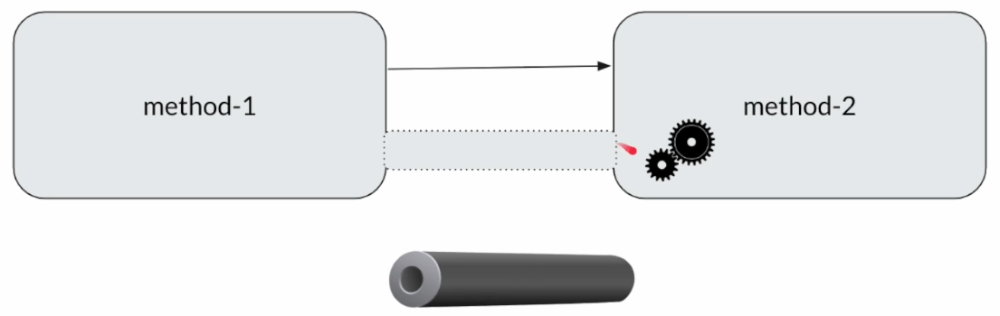

En vez de hacer que el método 1 espere, lo que podemos hacer es que el método 2 devuelva un objeto `CompletableFuture` inmediatamente.

Es decir, tan pronto como el método 1 llama al método 2, este le devuelve algo inmediatamente. Ese algo, tenemos que verlo como un pipe, un tunel a través del cual el método 2, cuando se complete, enviará el resultado.

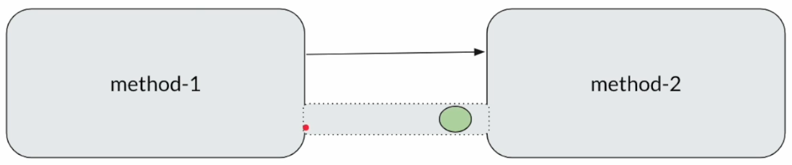

De nuevo, el método 1 llama al método 2 y este, inmediatamente, devuelve un objeto `CompletableFuture` y sigue trabajando en la respuesta. Esa respuesta, cuando la genere, la enviará el método 2 a través del `CompletableFuture` (ese pipe).

Mientras tanto, el método 1 no está bloqueado y puede hacer otras cosas.

### Demo: Basic CompletableFuture

En `src/java/com/jmunoz` creamos los paquetes/clases siguientes:

- `sec08`
  - `Lec01SimpleCompletableFuture`: Ejemplo de uso de un `CompletableFuture`.
    - El objetivo principal de este ejemplo es ser un escaparate de como un método 2 puede enviar el resultado a otro método 1 sin hacer que el método 1 espere para siempre.

### Async Tasks: runAsync()

En esta clase hablamos del método `runAsync()` de `CompletableFuture`.

En `src/java/com/jmunoz` creamos los paquetes/clases siguientes:

- `sec08`
  - `Lec02RunAsync`: Ejemplo de uso del método `runAsync()` de `CompletableFuture`. En concreto vemos:
    - Factory methods, como `runAsync()`, para crear `CompletableFuture` en vez de usar el operador new.
    - El método `runAsync()` ejecuta las tareas de manera asíncrona, devolviendo void, pero es bloqueante.
    - Usamos un `Executor` para utilizar virtual threads, haciendo la ejecución no bloqueante.

### Async Tasks: supplyAsync()

Al igual que con `runAsync()` podemos suministrar valores asíncronamente.

Esto es parecido a lo que se hizo en `Lec01SimpleCompletableFuture` en los métodos `fastTask()` y `slowTask()` donde nosotros creamos los objetos `CompletableFuture` y virtual thread, se hicieron tareas y devolvimos el resultado al thread main.

Con `supplyAsync()` usamos un factory method para simplificar la forma en la que hacemos esto.

En `src/java/com/jmunoz` creamos los paquetes/clases siguientes:

- `sec08`
  - `Lec03SupplyAsync`: Ejemplo de uso del método `supplyAsync()` de `CompletableFuture`. En concreto vemos:
    - Podemos suministrar valores asíncronamente.
    - Factory Method
    - Executor

### Practical Example: Fetching Product Info

En una clase anterior de `sec07`, `Lec03AccessResponseUsingFuture`, intentábamos obtener información de 3 productos usando `ExecutorService`.

Ahora vamos a hacerlo usando `CompletableFuture.supplyAsync()`.

En `src/java/com/jmunoz` creamos los paquetes/clases siguientes:

- `sec08`
  - `externalservice`: Nuevo paquete donde codificaremos nuestro cliente.
    - `Client`: Clase cliente que hace peticiones a los servicios externos y obtiene la respuesta.
  - `Lec04GetProducts`: Es el mismo ejemplo que hicimos en `Lec03AccessResponseUsingFuture`, pero ahora usando `supplyAsync()`.

Para probar este ejemplo, tiene que estar ejecutándose `external-services.jar`.

### CompletableFuture: Error Handling

En una clase anterior de `sec07`, `Lec04AggregatorDemo`, hacíamos llamadas para obtener el producto y luego para obtener su rating, devolviendo `productDto`, usando `ExecutorService`.

Ahora vamos a hacerlo usando `CompletableFuture.supplyAsync()`.

En `src/java/com/jmunoz` creamos los paquetes/clases siguientes:

- `sec08`
  - `aggregator`: Nuevo paquete donde codificaremos nuestro cliente con gestión de errores (devolvemos un valor por defecto en caso de excepción).
    - `ProductDto`: Record que representa el producto.
    - `AggregatorService`: La clase agregadora.
  - `Lec05AggregatorDemo`: Clase main para el ejemplo de aggregator. El objetivo es probar la gestión de errores de `CompletableFuture`.

Para probar este ejemplo, tiene que estar ejecutándose `external-services.jar`.

### CompletableFuture: Handling Timeouts

Usando `CompletableFuture` podemos establecer un timeout para la ejecución asíncrona.

En `src/java/com/jmunoz` creamos los paquetes/clases siguientes:

- `sec08`
  - `aggregator`
    - `AggregatorService`: Lo modificamos para establecer un timeout. 

Para probar este ejemplo, tiene que estar ejecutándose `external-services.jar`.

### Combining Futures: allOf()

En la clase anterior de `sec07`, `Lec04AggregatorDemo`, intentábamos acceder a la vez a 50 productos, haciendo múltiples llamadas en paralelo.

Ahora vamos a hacerlo usando `CompletableFuture.allOf()`.

En `src/java/com/jmunoz` creamos los paquetes/clases siguientes:

- `sec08`
  - `Lec06AllOf`: Ejemplo de uso del método `allOf()` de `CompletableFuture`.

Para probar este ejemplo, tiene que estar ejecutándose `external-services.jar`.

### Combining Futures: anyOf()

En `src/java/com/jmunoz` creamos los paquetes/clases siguientes:

- `sec08`
  - `Lec07AnyOf`: Ejemplo de uso del método `anyOf()` de `CompletableFuture`.

### Combining Futures: thenCombine()

En `src/java/com/jmunoz` creamos los paquetes/clases siguientes:

- `sec08`
  - `Lec08ThenCombine`: Ejemplo de uso de los métodos `thenCombine()` y `thenApply()` de `CompletableFuture`.

### Section Summary and Key Takeaways

- `CompletableFuture`
  - Es una herramienta/clase poderosa que implementa `Future<T>` con muchos métodos útiles para procesar, combinar resultados, gestionar errores en un estilo funcional.
  - Usa fork-join-pool para tareas asíncronas.
  - Desde Java 21, podemos usar el executor virtual-thread-per-task para tareas IO.
  - Limitación
    - Implementa `Future`. Pero el método **cancel** NO interrumpe el thread que está ejecutando la tarea.

## Thread Local & Scoped Values

### ThreadLocal: Introduction & Basics

- ThreadLocal es como un locker / espacio de almacenamiento para cada thread.
- Cada thread puede almacenar y acceder a su valor independientemente de los otros threads.


ThreadLocal trabaja tanto con platform threads como con virtual threads.

**From Thread Local to Scoped Values**

- ThreadLocal (JDK 1.2 - 1998)
  - Una manera inteligente de almacenar data que pertenece solo a ese thread.
- ScopedValue (JDK 25 - 2025)
  - Es la misma idea que ThreadLocal, pero en un formato estructurado y seguro.

Es conveniente aprender tanto ThreadLocal como ScopedValues.

**ThreadLocal**

Vamos a ver qué es un ThreadLocal a alto nivel.

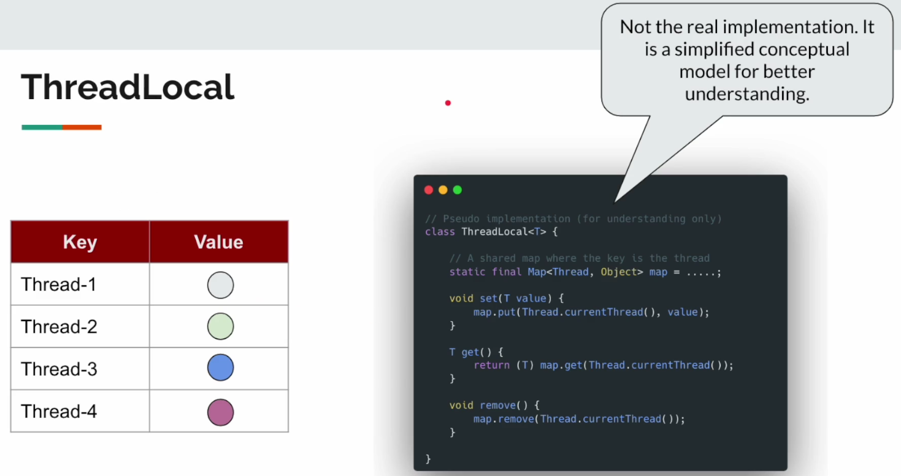

ThreadLocal es como un Map. En un Map se guarda un par clave-valor.

La clave es el current thread y vemos en la parte del código (modelo conceptual simplificado, no la implementación real) que existen algunos métodos importantes como set, get, remove...

Cuando se usa el método set para almacenar algún valor, vemos que la clave es el current thread y se almacena el valor.

Y, cuando se usa el método get, usamos el Map para devolver el valor para el current thread.

Por último, el método remove eliminará el valor almacenado para el current thread.


Usando esta estructura de datos (`sessionStorage`), cuando recibimos en nuestra aplicación muchas peticiones concurrentes, los thread 1 y thread 2 puede almacenar el sessionId.

Como los threads son diferentes, cada thread tendrá su propio espacio y ambos pueden almacenar sus valores sin que se afecten entre ellos.

Al invocar el método get, dependiendo del thread que ejecute el método get, devolverá el valor correspondiente.

**Pros & Cons**

- Ventajas:
  - No hay necesidad de pasar data usando parámetros en la llamada a métodos.
    - La data que pertenece al flujo de ejecución de todo el thread (por ejemplo request ID, contexto de seguridad, contexto de transacción) puede almacenarse en ThreadLocal y accederse desde cualquier lugar de ese thread.

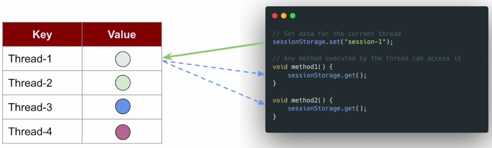

ThreadLocal se usa muchísimo en frameworks como Spring Boot y otras librerías.

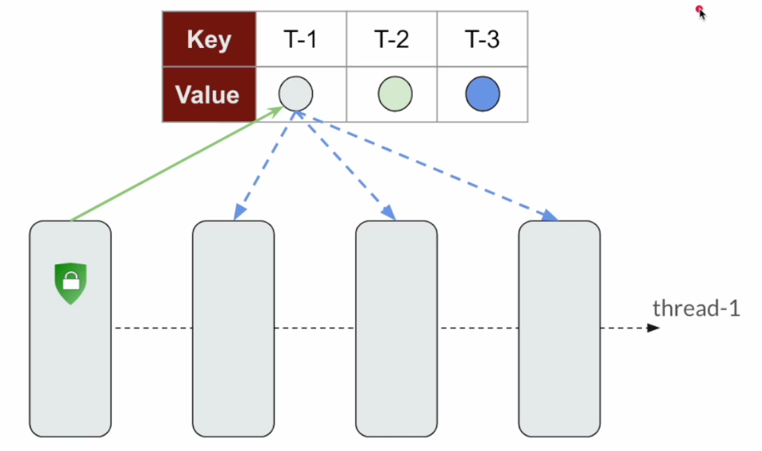

Por ejemplo, imaginemos una aplicación Spring Boot como la de la imagen. El primer rectángulo gris sería un WebFilter, el segundo un Controller, el tercero una clase de servicio, etc.

Cuando recibimos la petición, esta será asignada a un thread. Lo llamamos thread-1.

Como parte del WebFilter, validaremos las credenciales de usuario, generaremos un token y lo almacenaremos en un ThreadLocal (esto por debajo).

Luego, podemos acceder a la información de usuario que ha iniciado sesión en nuestro controller, nuestra clase de servicio, etc.

Spring, por debajo, inyecta esa información usando ThreadLocal.

Este es otro caso de uso típico:

- Algunos objetos NO son thread-safe y a la vez son caros de crear.
  - ObjectMapper (en versiones antiguas)
    - ObjectMapper es la biblioteca Jackson.
  - El uso de `synchronized` para hacerlo thread-safe puede perjudicar el rendimiento porque los threads tienen que esperar para acceder al objeto.

En este caso también puede usarse ThreadLocal. Es decir, cada thread tendrá su propio ObjectMapper. Todos los threads crearán solo una vez el ObjectMapper y reusarán ese objeto en toda la aplicación.

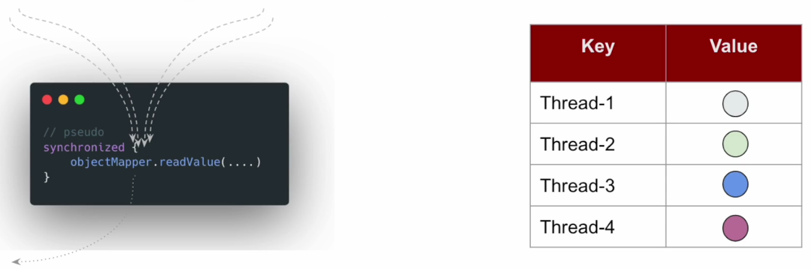

- Desventajas:
    - Defectos de diseño.
      - Es mutable.
        - Usando el método set, el current thread puede sobreescribir el valor y, en algunos casos, llevar a problemas.
      - Un objeto en ThreadLocal puede vivir para siempre incluso aunque no se use (no garbage collector), si no se invoca el método remove o si no muere el thread.
        - Esto es un problema particularmente en thread pools fijos, porque reutilizamos los threads. Si no usamos el método remove, esto puede llevar a fugas de data, fugas de memoria, etc.
        - Por ejemplo: fixed thread pool - 500
      - Un thread puede crear threads hijos para acelerar el procesamiento de la petición, como hicimos en clases anteriores obteniendo tanto información del producto como de su rating. En estos casos, los threads hijos no pueden acceder a los valores del thread padre, porque en ThreadLocal los valores están asociados al objeto thread (threads hijos y padre son distintos objetos)
        - Sí, como parte de los requerimientos, pensamos que un thread hijo necesita acceder a los valores del objeto thread padre desde ThreadLocal, existe una implementación especial. Se llama Inheritable Thread Local.
        - Lo que hace es que, cuando un thread 1 crea threads hijos (por ejemplo, en la imagen, el thread-3 y thread-4), por debajo, intentará copiar y asociar para thread hijos.
        - Esta operación es muy cara.
    - La gente no entiende bien ThreadLocal y lo usan como cualquier otro objeto.
      - Debería usarse como **static final** - pero la gente hace mal uso de ThreadLocal.
      - El código que se ve en la imagen de abajo es erróneo. Los desarrolladores lo crean en un método y lo pasan como parámetro a otro metodo.
      - Ese código compila y se ejecuta correctamente, pero no es así como debe usarse ThreadLocal.

- 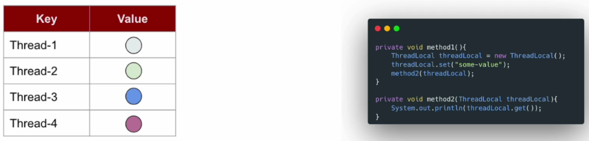

### Demo: ThreadLocal Usage

En esta clase vamos a jugar con ThreadLocal para comprenderlo mejor.


Vamos a simular algo como lo que muestra la imagen.

Cuando recibimos una petición, vamos a autenticarnos, almacenando un token en ThreadLocal.

Luego, intentaremos obtener este token en el controller, una clase de servicio, etc.

En `src/java/com/jmunoz` creamos los paquetes/clases siguientes:

- `sec09`
  - `Lec01ThreadLocal`: Ejemplo de uso de `ThreadLocal` para ver funcionamiento y problemas que pueden surgir.

### Inheritable ThreadLocal: When to Use

En `src/java/com/jmunoz` creamos los paquetes/clases siguientes:

- `sec09`
  - `Lec02InheritableThreadLocal`: Ejemplo de cuando usar `InheritableThreadLocal`.

### ThreadLocal Limitations & Golden Rules

Existen artículos antiguos indicando peligros de usar `ThreadLocal`, y debido a esto muchos desarrolladores creen que usar `ThreadLocal` en su proyecto es una mala idea.

**Is ThreadLocal Bad?**

- NO.
- Los problemas aparecen cuando los **desarrolladores lo usan sin disciplina**.
  - Debemos llamar el método **remove**.
  - El método **set** muta el valor, lo que puede llevar a un comportamiento inesperado si partes diferentes del thread lo sobreescribe.

**Golden Rules**

- No exponer `ThreadLocal` directamente.
  - Envolverlo siempre en una clase helper o holder.
- Mantener privados los métodos de mutación (o package-private).
  - Solo código confiable debe llamar a `set()` o `remove()`.
- `set()` y `remove()` deben aparecer juntos siempre.
  - Nunca ejecutar `set()` sin `remove()`.
  - El método que ejecuta el `set()` del valor debería ejecutar también `remove()` y debería ser un método `private`.
- Usar `ThreadLocal` solo para preocupaciones transversales / datos no funcionales.
  - Por ejemplo, contexto de seguridad, solicitar metadatos, observabilidad, información de rastreo.

### ThreadLocal Workflow: Implementation

Vamos a ver como aplicar `ThreadLocal` en proyectos del mundo real, usando las `Golden Rules` vistas en la clase anterior.

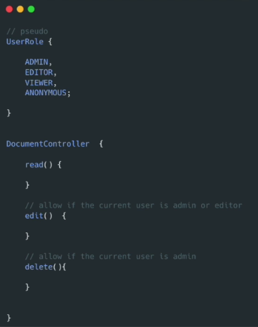

Vamos a tener un `DocumentController` con métodos `read()`, `edit()`, `delete()`.

Vamos a tener `UserRole` como `ADMIN`, `EDITOR`, `VIEWER` y `ANONYMOUS`.

Dependiendo del rol del usuario conectado, daremos acceso a los métodos correspondientes. Por ejemplo, el método `delete()` solo podrá ser invocado por un `ADMIN`.

Pero lo importante es como estructurar `ThredLocal` en proyectos reales.

En `src/java/com/jmunoz` creamos los paquetes/clases siguientes:

- `sec09`
  - `security`: Nuevo paquete.
    - `UserRole`: Es un enum con los posibles roles de un usuario que se conecta a nuestra aplicación.
    - `SecurityContext`: Es un record que contiene el usuario actualmente conectado.
    - `threadlocal`: Nuevo paquete. Lo creamos porque luego vamos a hacer el mismo ejemplo usando `ScopedValues`.
      - `SecurityContextHolder`: Clase que permite obtener la información de un usuario conectado usando `ThreadLocal`.
      - `AuthenticationService`: Clase que sirve para hacer login y establecer el valor de `SecurityContext`.
  - `controller`: Nuevo paquete.
    - `DocumentController`: Simula un Rest Controller al que llegan peticiones de conexiones de usuarios.

### Demo: ThreadLocal Workflow in Action

En `src/java/com/jmunoz` creamos los paquetes/clases siguientes:

- `sec09`
  - `Lec03DocumentAccessWithThreadPool`: Clase que llama a `controller/DocumentController` para validar su funcionamiento.

### Scoped Values: Introduction & Basics

Los `ScopedValues` son una forma infalible de compartir el contexto.

¿Por qué los crearon cuando ya teníamos `ThreadLocal`? Con la introducción de los virtual threads, el equipo Java pide a los desarrolladores que creen un nuevo thread, que se ejecute el runnable y dejar que el thread muera. No hay necesidad de hacer pool de los threads. Por tanto, el modelo de ejecución ha cambiado.

- Introducido en JDK 25.
- Es una forma segura, predecible y eficiente para adjuntar datos con alcance de ejecución (execution-scoped data) sin depender de la disciplina del desarrollador.
  - `ThreadLocal` sigue funcionando, pero la gestión de su ciclo de vida es manual (set/remove).
  - `ScopedValue` gestiona automáticamente su ciclo de vida.
- Es preferible usar `ScopedValues` sobre `ThreadLocal`, especialmente con muchos virtual threads.

**Como usar `ScopedValues` y por qué son ahora los preferidos**

- Paso 1: Generar la key
  - **ScopedValue.newInstance()**
    - Devuelve un objeto key nuevo e inmutable.
    - Key es usado para almacenamiento con ámbito de ejecución (execution-scoped)
  - Puede llamarse a `ScopedValue.newInstance()` varias veces para crear diferentes keys.
    ```java
    // Crea una key inmutable
    static final ScopedValue<String> SESSION_TOKEN = ScopedValue.newInstance();
    ```
- Paso 2: Enlazar un valor
  - **ScopedValue.where(KEY, value)**
    - Enlaza el valor a la ejecución del current thread usando el objeto Key.
    ```java
    ScopedValue.where(SESSION_TOKEN, "session-123")
        .run(runnable);
    ```
- Paso 3: Acceder al valor
  - **KEY.get()**
    - Para leer el valor durante la ejecución del current thread.
  - Trabaja dentro del runnable o de cualquier método llamado desde el runnable.
  - El valor se límpia automáticamente tras `.run()`.
    ```java
    ScopedValue.where(SESSION_TOKEN, "session-123")
        .run(() -> {
            var token = SESSION_TOKEN.get();
            log.info("token: {}", token);    
        });
    ```

**Resumen rápido**
- Los valores están atados al current thread justo antes de que comience el runnable (o callable).
- Los valores dejan de estar atados de forma automática cuando el runnable (o callable) se completa.
  - La gestión del ciclo de vida set y remove son manejados automáticamente dentro del runnable (o callable).
  - **No es necesaria una limpieza manual**
- Esto asegura que no haya fugas, ni reutilizaciones accidentales, ni mutación de la data almacenada.

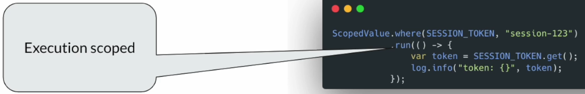

Por eso se le llama `execution-scoped`, porque solo está disponible para ese runnable (o callable), no fuera de él.

Los `ScopedValue` funcionan tanto con platform threads como con virtual threads.

**Reading Scoped Values**

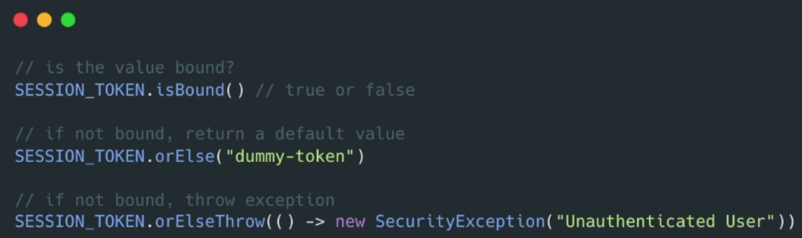

Usando la key, podemos comprobar, usando el método `isBound()`, si hay algún valor adjunto al current thread.

En vez del método `get()`, podemos usar el método `orElse()` si queremos devolver un valor por defecto, en caso de que no haya ningún valor asociado a la key.

Si queremos lanzar una excepción, podemos usar el método `orElseThrow()`. En el ejemplo, `SESSION_TOKEN` debe existir, en caso contrario lanzaremos una excepción.

### Demo: Scoped Value Usage

En `src/java/com/jmunoz` creamos los paquetes/clases siguientes:

- `sec09`
  - `Lec04ScopedValue`: Demo para ver como se usan los `ScopedValues`.

No olvidar que necesitamos JDK 25 o superior.

### Applying Scoped Values

En `src/java/com/jmunoz` creamos los paquetes/clases siguientes:

- `sec09`
  - `Lec05ScopedValueAssignment`: Lo que hicimos en el fuente `Lec01ThreadLocal` modificarlo para que funcione con `ScopedValue`.

### Scoped Values: Rebinding & Immutability

- A los `ScopedValues` se les puede reasignar temporalmente un nuevo valor (rebound) en un ámbito anidado.
  - El valor externo es temporalmente reemplazado durante el tiempo que dure el ámbito interno.
  - Cuando ese ámbito termina, el valor original es restaurado automáticamente.

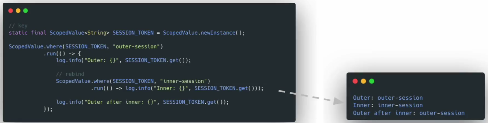

Como parte de `Lec01ThreadLocal`, usando `ThreadLocal`, intentamos hacer lo mismo. Dentro de `orderService()`, si queríamos establecer un token de sesión diferente, ejecutábamos un `set()` de forma que `callProdutService()` utilizara un valor distinto. El problema es que también afectaba a `callInventoryService()`. Esto se puede hacer funcionar con `ThreadLocal`, pero tenemos que restablecer el valor anterior a mano.

Con `ScopedValue` el restablecimiento del valor se hace automáticamente.

En `src/java/com/jmunoz` creamos los paquetes/clases siguientes:

- `sec09`
  - `Lec06ScopedValueRebinding`: Es como `Lec05ScopedValueAssignment` pero además usando rebinding.
    - El objetivo es proveer un token diferente para `productService`, pero sin que afecte a `inventoryService`.

### Scoped Values: How It Works Internally

Vamos a ver como funciona `ScopedValue` internamente. Esto es importante porque puede ser mal utilizado y, en algunos casos raros, si no se diseña apropiadamente, podría afectar al rendimiento.

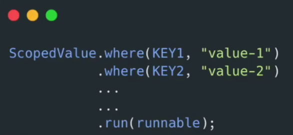

Podemos atar (bind) varios pares key-value en `ScopedValue` tal y como aparece en la imagen, y, dentro del runnable, podemos acceder a sus valores, usando `KEY1.get()`, `KEY2.get()`, etc.

Pero, ¿cómo funciona esto internamente?

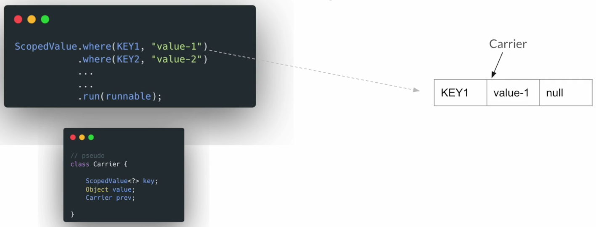

Existe una clase llamada `Carrier` cuyo fuente es más o menos como se indica en la imagen. Almacena una key, su valor correspondiente y mantiene la referencia al objeto carrier previo.

Al usar `.where(KEY1, "value-1")` se crea una nueva instancia de `Carrier`, que podemos ver a la derecha de la imagen. En este caso, la referencia al carrier previo es null porque es el primer objeto carrier que se crea.

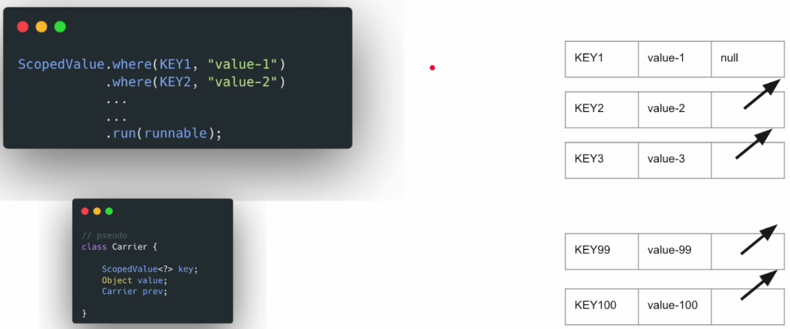

Cuando encadenamos varios pares key-value (hasta 100 en la imagen), por debajo se crea una lista enlazada.

Cuando se ejecuta `.run(runnable)`, en ese momento, el objeto carrier más reciente, en nuestro ejemplo `KEY100` se vinculará con el current thread, durante la ejecución de ese runnable.

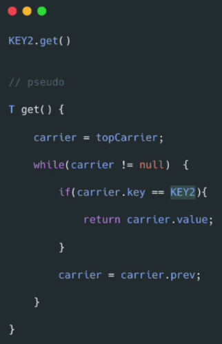

Ahora, dentro del runnable, cuando indicamos `KEY2.get()`, tiene que iterar uno a uno hasta que encuentra esa `KEY2`.

Mirar el pseudocódigo del método get(), donde `topCarrier` es `KEY100`. Si no es null y la key no es `KEY2` coge el objeto carrier previo.

Volverá a comprobar hasta que el objeto carrier sea null o la key del carrier sea `KEY2`, devolviendo entonces su valor.

Como podemos ver, a más keys añadidas, más tarda la búsqueda. No va a ser algo común añadir miles o millones de keys, pero `ScopedValue` se puede usar mal si no se comprende como funciona internamente.

El equipo de Java nos permite encadenar varias keys, pero no debemos pasarnos.

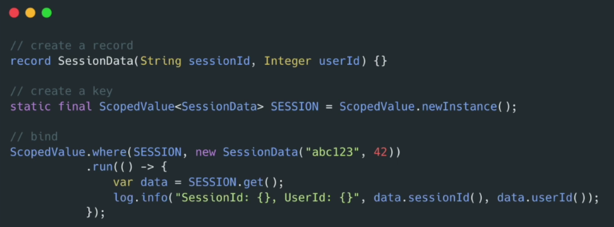

El consejo aquí es no encadenar varias keys si no es realmente necesario.

- Crear un record como el de la imagen.
- Crear una key para ese record.
- Atar (bind) la instancia de `SessionData`.
- Dentro del runnable, usar la key para obtener la instancia.
- Y ya podemos acceder al sessionId, userId, lo que sea que se almacene.

### Scoped Values Workflow: Implementation

En una clase anterior, usando `ThreadLocal`, creamos `Lec03DocumentAccessWithThreadPool`. Como parte de ese proyecto, creamos los paquetes `controller` y `security`, y dentro de `security` creamos un paquete `threadlocal`.

Vamos a rehacer ese proyecto usando `ScopedValue` en vez de `ThreadLocal`.

En `src/java/com/jmunoz` creamos los paquetes/clases siguientes:

- `sec09`
  - `security`
    - `scopedvalue`: Nuevo paquete
      - `SecurityContextHolder`: Clase que permite obtener la información de un usuario conectado usando `ScopedValue`.
      - `AuthenticationService`: Clase que sirve para hacer login y establecer el valor de `SecurityContext`.
  - `Lec07DocumentAccessWithScopedValue`: Clase que llama a `controller/DocumentController` para validar su funcionamiento.
    - Como `Lec03DocumentAccessWithThreadPool`, pero usando el paquete `scopedvalue`. No hay que cambiar nada más.

### Scoped Values In Action: Run As Administrator

Hasta ahora, hemos visto como funcionan conceptualmente los `ScopedValue`, como atar (bind), acceder y desatar (unbind) valores.

Ahora vamos a aplicarlo a un escenario práctico.

Imaginar que un usuario se conecta con un role normal, pero para una operación específica queremos que temporalmente se eleven sus privilegios a administrador. Luego, automáticamente se revierten los privilegios al estado anterior.

Algo parecido a esto ocurre en los sistemas operativos. Por ejemplo, en Windows existe `Run ad administrator` y en MacOS y Linux tenemos `sudo`.

Es en estos tipos de requerimientos donde brilla `ScopedValue`.

En `src/java/com/jmunoz` modificamos los paquetes/clases siguientes:

- `sec09`
  - `security`
    - `scopedvalue`: Nuevo paquete
      - `AuthenticationService`: Modificado para, temporalmente, elevar los privilegios del rol de usuario.
  - `Lec07DocumentAccessWithScopedValue`: Modificado para, temporalmente, elevar los privilegios del rol de usuario.

### ThreadLocal vs Scoped Values

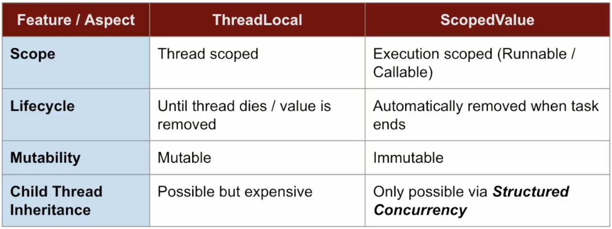

- Thread scoped significa que los valores viven solo en el thread que establece dichos valores.
- Execution scoped significa que los valores viven solo para el runnable (o callable) con el que se les asocia.
- Por último, no olvidar que si estamos usando JDK 25 o superior, el equipo de Java recomienda usar `ScopedValue`.

