# Application Development: Spring Boot & Virtual Threads

## Spring Boot Project

### Project Introduction & Goals

En esta sección vamos a desarrollar una aplicación sencilla de Spring usando virtual threads y, en la siguiente sección, haremos un test de escalabilidad usando JMeter para ver como escala nuestra aplicación.

Desde la versión Spring Boot 3.2 hay soporte para virtual threads, indicando esta property:

`spring.threads.virtual.enabled=true`

Vamos a desarrollar una aplicación que provee una funcionalidad similar a la API de `Tripadvisor`.

La idea es que provea toda la información posible (hoteles, restaurantes, tiempo, etc.) para que nos ayude a planificar mejor nuestro viaje.

Toda esta información no viene de una fuente de datos única, sino de varias fuentes de datos.

**Trip Advisor**


Nuestra aplicación tendrá dos funcionalidades importantes: `Trip planning` y `Trip/Flight reservation`.

Cada caja dentro del rectángulo verde representa un microservicio que nos provee información (más de una fuente de datos) para Trip planning.

Cada caja dentro del rectángulo azul representa un microservicio que nos provee información (más de una fuente de datos) para Trip/Flight reservation.

Estas cajas están ya hechas como parte de `external-services.jar`.

Nosotros vamos a desarrollar la pieza gris, cuya función es doble:

- Obtener todos los datos necesarios de la caja verde y devolver una respuesta unificada al usuario.
- Obtener data de la caja azúl, que nos devolverá una lista de vuelos, y en nuestro microservicio encontraremos el mejor precio para ese vuelo y lo reservaremos.

Como podemos ver en la imagen, para `Trip planning` haremos llamadas en paralelo, mientras que para `Trip/Flight reservation` haremos llamadas secuenciales.

- Objetivo
    - Desarrollar una aplicación de Spring sencilla para comprender como puede escalar el rendimiento de una aplicación con virtual threads.
- No es Objetivo
    - Aprender características de Spring Boot Web.
    - Validaciones de entrada.
    - Como desarrollar una aplicación CRUD con BD.
    - Spring Security.
    - Kafka.
    - ...

### Defining External Services

Para este proyecto tenemos que ejecutar los servicios externos, ya que llamaremos a estas APIs para recuperar información que luego agregaremos a una respuesta.

- Acceder a la carpeta `02-external-services` y ejecutar `java -jar external-services.jar`
  - Por defecto se ejecuta en el puerto 7070, pero se puede cambiar a otro puerto, por ejemplo: `java -jar external-services-v2.jar --server.port=6060`
- Acceder con el navegador a Swagger: http://localhost:7070/swagger-ui/

En concreto, vamos a usar `sec02` y `sec03`.


Tenemos que ver cada endpoint como microservicios separados.

### Setting Up the Spring Project


Renombramos la carpeta a `03-trip-advisor`, abrimos el proyecto en IntelliJ y creamos los siguientes paquetes:

- `client`: Paquete donde realizamos llamadas a los servicios externos usando RestClient.
- `config`: Paquete donde tendremos la creación de beans y la configuración de nuestra aplicación.
- `controller`: Paquete donde exponemos los endpoints.
- `dtos`: Paquete donde creamos DTOs usando records.
- `service`: Paquete de servicios.

### Data Transfer Objects (DTOs)

Vamos a hacer la parte de los DTOs. Los modelos con los que vamos a jugar son los que aparecen en el Swagger de los servicios externos:


Tenemos que abrir cada uno de estos modelos y construir los records en nuestra aplicación.

En `src/java/com/jmunoz/trip_advisor` creamos las clases siguientes:

- `client`:
  - Objetos relacionados con los servicios externos.
    - Para el servicio externo `sec02`
      - `Accommodation`
      - `Event`
      - `LocalRecommendations`
      - `CarRental`
      - `PublicTransportation`
      - `Transportation`
      - `Weather`
      - `Flight`
    - Para el servicio externo `sec03`
      - `FlightReservationRequest`
      - `FlightReservationResponse`
  - DTOs de nuestra aplicación
    - `TripPlan`: DTO para el API `sec02 - Trip Planning Service Providers`.
    - `TripReservationRequest`: DTO para el API `sec03 - Flight Search Reservation Service Providers`.

### RestClient: Quick Start

Documentación sobre RestClient: https://docs.spring.io/spring-framework/reference/integration/rest-clients.html

En esta clase, paramos un momento el desarrollo de nuestro proyecto para jugar con RestClient.

RestClient es inmutable y thread safe.

Lo que hacemos es crear RestClient una sola vez para un servicio externo y lo reutilizaremos en toda la aplicación para esa aplicación.

RestClient mantendrá muchos pool de conexión, por lo que no debemos crearlos una y otra vez, ya que perderíamos todos los pools de conexión si volvemos a configurar una nueva conexión HTTP.

En `src/test/java/com/jmunoz/trip_advisor` creamos la clase siguiente:

- `RestClientTests`: Clase que realmente no es de tests, sino para jugar con RestClient y saber como usarlo.

### Building the Service Client

Volvemos a nuestro proyecto.

Vamos a crear un service client en nuestra aplicación. Como tenemos 7 endpoints, vamos a crear 7 service clients.

En `src/java/com/jmunoz/trip_advisor` creamos las clases siguientes:

- `client`
  - `AccommodationServiceClient`
  - `EventServiceClient`
  - `LocalRecommendationServiceClient`
  - `TransportationServiceClient`
  - `WeatherServiceClient`
  - `FlightSearchServiceClient`
  - `FlightReservationServiceClient`

### Implementing Trip Plan Service

En `src/java/com/jmunoz/trip_advisor` creamos las clases siguientes:

- `service`
  - `TripPlanService`: En este servicio inyectamos los service clients correspondientes a Trip Planning Service Providers (sec02)
    - Usamos un ExecutorService para ejecutar en paralelo las llamadas a esos service client.

### Implementing Trip Reservation Service

En `src/java/com/jmunoz/trip_advisor` creamos las clases siguientes:

- `service`
  - `TripReservationService`: En este servicio inyectamos los service clients correspondientes a Flight Search Reservation Service Providers (sec03)

### Implementing Trip Controller

En `src/java/com/jmunoz/trip_advisor` creamos las clases siguientes:

- `controller`
  - `TripController`

### Configuring Application Properties

Añadimos a `application.properties`:

```
# upstream service properties
# planning services
accommodation.service.url=http://localhost:7070/sec02/accommodations/
event.service.url=http://localhost:7070/sec02/events/
local-recommendation.service.url=http://localhost:7070/sec02/local-recommendations/
transportation.service.url=http://localhost:7070/sec02/transportation/
weather.service.url=http://localhost:7070/sec02/weather/

# search and reservation services
flight-search.service.url=http://localhost:7070/sec03/flight/search/
flight-reservation.service.url=http://localhost:7070/sec03/flight/reserve/

# virtual thread enabled/disabled
spring.threads.virtual.enabled=true
```

Notar como habilitamos el uso de virtual threads en esta aplicación usando la property `spring.threads.virtual.enabled=true`.

### Spring Beans: Service Clients

En `src/java/com/jmunoz/trip_advisor` creamos las clases siguientes:

- `config`
  - `ServiceClientsConfig`: Clase de configuración donde creamos los beans necesarios para los clientes.

### Spring Beans: ExecutorService Configuration

En `src/java/com/jmunoz/trip_advisor` creamos las clases siguientes:

- `config`
  - `ExecutorServiceConfig`: Clase de configuración donde creamos los beans necesarios para ExecutorService.

### Final Application Demo & Testing

Ya podemos ejecutar la aplicación y hacer pruebas.

No olvidar ejecutar el servicio externo. Para ello, acceder a la carpeta `02-external-services` y ejecutar `java -jar external-services.jar`.

Ejecutar Postman e importar el archivo existente en la carpeta `postman`.

Probar primero con esta property `spring.threads.virtual.enabled` a false y luego a true, y medir los tiempos en Postman.

Debe haber cierta mejora en `trip-plan`, que se ejecuta en paralelo. `trip-reservation` que se ejecuta secuencial, debe tardar el mismo tiempo.

## Performance Testing With JMeter

En esta sección vamos a hablar de pruebas de escalabilidad con JMeter.

### Introduction

Las pruebas de rendimiento son una categoría muy amplia para probar el rendimiento total de un sistema. Existen muchos tipos de tests como tests de stress, soak tests, tests de escalabilidad, tests de volumen, etc.

Estamos particularmente interesados en probar la escalabilidad de nuestra aplicación.

Entonces, ¿cuál es el objetivo?

- ¿Ayudan los virtual threads a escalar mi aplicación?
- Enfoque:
  - Ejecutar la aplicación `trip-advisor` con Platform Threads.
  - Ejecutar un test de JMeter.
  - Ejecutar la aplicación `trip-advisor` con Virtual Threads.
  - Ejecutan un test de JMeter.
  - Comparar los resultados.

Ya que estamos interesados en probar la escalabilidad, ¿qué es la escalabilidad?

- Es la habilidad de una aplicación de manejar un aumento de carga de trabajo **concurrente utilizando de forma eficiente los recursos disponibles**.
  - Sin sacrificar el tiempo de respuesta de la aplicación.

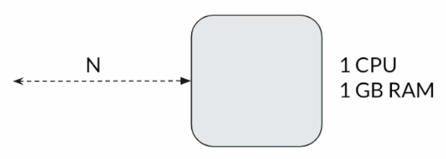

Imaginemos que tenemos una aplicación. Los recursos disponibles en el servidor son una CPU y 1 GB de RAM.

¿Cuántas peticiones puede manejar el servidor? Es una respuesta bastante difícil de responder, ya que depende de la aplicación.

Añadamos más información:

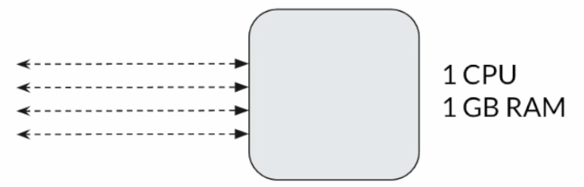

- La app tiene un endpoint y procesar una petición tarda 1 segundo debido a llamadas I/O.
- La app tiene 4 platform threads.

Olvidemos por ahora los virtual threads y consideremos solo platform threads. ¿Cuántas peticiones puede manejar la aplicación? Como la aplicación solo tiene 4 threads, debería ser capaz de manejar solo 4 peticiones a la vez.

¿Qué ocurre si hay 5 usuarios tratando de acceder a la aplicación a la vez?

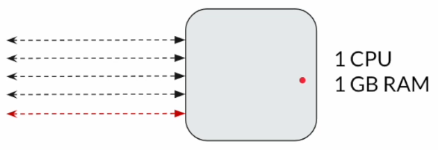

- Cuatro peticiones tardarán en ejecutarse 1 segundo.
- La quinta petición tardará en ejecutarse 2 segundos.
  - 1 segundo de espera en una cola esperando que quede disponible un thread.
  - 1 segundo de procesamiento.

¿Y qué ocurre si hay 9 usuarios intentando acceder a la aplicación al mismo tiempo?

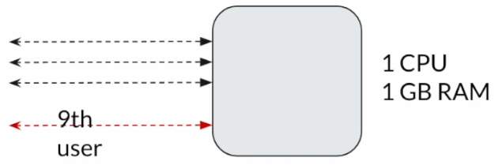

- Peticiones 1 - 4: 1 segundo
- Peticiones 5 - 8: 2 segundos
- Petición 9: 3 segundos

- Por último, ¿cómo puedo procesar 1000 peticiones concurrentes en una aplicación de servidor?
  - Incrementando el número de threads (platform) a 1000.
    - **¡Necesita asignación de memoria por adelantado!**
    - **Tendremos el problema de cambios de contexto**
- Si asumimos que existen muchas llamadas I/O, la CPU podría NO utilizarse. Pero incrementar threads consumirá memoria rápidamente.
  - CPU 10%
  - Memoria 1 GB

- Factores que pueden afectar la escalabilidad de una aplicación.
  - Recursos físicos:
    - CPU
    - Memoria
    - Red
    - Disco
    - ...
  - Diseño / Arquitectura de la aplicación.
    - Algoritmo / Estructura de datos que elegimos.
      - Elegir List en vez de Set puede afectar a la escalabilidad.
    - consultas a Bases de Datos.
    - ...

Entonces, si tantas cosas pueden afectar a la escalabilidad de una aplicación, ¿cuál es la métrica que puedo usar para saber si mi aplicación escala bien?

- Existen 2 métricas muy relacionadas entre sí que podemos usar para medir la escalabilidad de una aplicación:
  - Rendimiento (throughput)
  - Tiempo de respuesta

### Throughput vs Response Time

- Rendimiento (Throughput)
  - Número de peticiones que puede procesar un servidor por unidad de tiempo. (N req / sec, N req / min).
  - Si un servidor puede procesar 5 peticiones en un segundo, entonces el throughput es 5 req / sec.
  - La unidad de tiempo realmente no importa, pero en esa duración será capaz de procesar esa cantidad de peticiones.
- Tiempo de respuesta
  - El tiempo que lleva procesar una petición.
  - La unidad de tiempo pueden ser milisegundos, segundos... realmente no importa.

El rendimiento y el tiempo de respuesta tienen una especie de **relación inversa**.


Si volvemos a esta aplicación que tiene 4 threads y cada petición toma 1 segundo en procesarse debido a llamadas I/O:

- ¿Cuál es su tiempo de respuesta?
  - 1 segundo
- ¿Cuál es su rendimiento?
  - 4 req / sec.

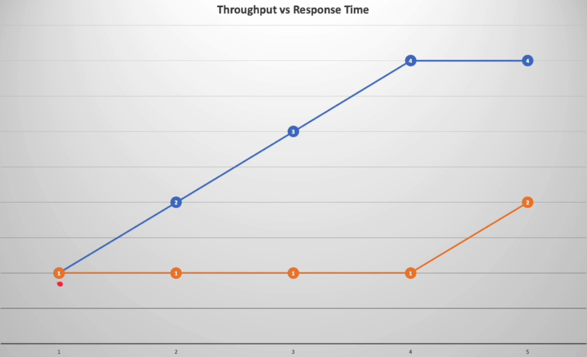

La línea de color naranja representa el tiempo de respuesta y la línea de color azul representa el rendimiento.

El eje X representa el número de usuarios que tenemos.

- Si solo tenemos 1 usuario
  - Response Time: 1 segundo
  - Rendimiento: 1 req / sec.
- Si tenemos 2 usuarios
  - Response Time: 1 segundo
  - Rendimiento: 2 req / sec.
- Si tenemos 3 usuarios
  - Response Time: 1 segundo
  - Rendimiento: 3 req / sec.
- Si tenemos 4 usuarios
  - Response Time: 1 segundo
  - Rendimiento: 4 req / sec.

Vemos que el rendimiento va creciendo basado en el número de usuarios concurrentes que tenemos, y, mientras tanto, vemos que la gráfica del tiempo de respuesta es plana. 

Pero la gráfica del rendimiento no puede ir creciendo para siempre. Cualquier sistema alcanzará en algún momento un punto de saturación.

Nuestra aplicación alcanza su límite de saturación a las 4 req / sec. Más allá de este punto, no puede escalar.

- Si tenemos 5 usuarios
  - Response Time: 2 segundos
  - Rendimiento: 4 req / sec.

Vemos que con 5 usuarios el rendimiento ya no sube, decimos que ha alcanzado su punto de saturación, y su gráfica es plana.

Pero, en ese momento cuando la gráfica del rendimiento es plana, es cuando comienza a afectar a la gráfica del tiempo de respuesta, que empieza a incrementarse.

Por tanto, en un sistema escalable, el rendimiento se irá incrementando mientras el tiempo de respuesta es plano. Este es el mejor escenario.

Cuando se alcanza el punto de saturación, es cuando decimos que más allá de ese punto el sistema ya no escala, y es cuando tenemos que analizar qué lo bloquea.

Puede que tengamos que añadir más CPU o más memoria, o que sea un problema de threads o de alguna consulta a BD, etc.

### Setting Up JMeter

- JMeter es una herramienta open source para pruebas de rendimiento.
- Está desarrollado en Java.
- Simula carga de usuario concurrente enviando peticiones concurrentes a nuestra aplicación y rastreando el tiempo de respuesta.
- Seremos capaces de obtener métricas básicas como el rendimiento, el tiempo de respuesta, etc.

Vamos a configurar JMeter en nuestra máquina y a aprender a usarlo.

**IMPORTANTE:** Este curso no nos va a hacer un experto en JMeter, solo vamos a aprender lo necesario para probar nuestra aplicación.

Para configurar JMeter ir a esta web: https://jmeter.apache.org/

Hay que descargarlo e instalarlo: https://jmeter.apache.org/download_jmeter.cgi

Luego vamos a esta web para gestionar plugins de JMeter: https://jmeter-plugins.org/wiki/PluginsManager/

Esto es porque por defecto JMeter no ofrece buenos informes, y este plugin nos ayuda a mejorarlos.

Nos descargamos el archivo `.jar` y lo situamos en el directorio `lib/ext` de JMeter. Una vez hecho esto, cerramos JMeter y lo abrimos de nuevo.

Seleccionamos `Options` y ahora podremos ver `Plugins Manager`. Si lo pulsamos, podremos ver los plugins instalados.

Seleccionamos de esa ventana `Available Plugins` y el plugin `jpgc`, que nos dará unos buenos informes.


Una vez aplicados los cambios, cuando JMeter se ha rearrancado, podremos seleccionar estos informes pulsando botón derecho sobre `Test Plan` y seleccionando:

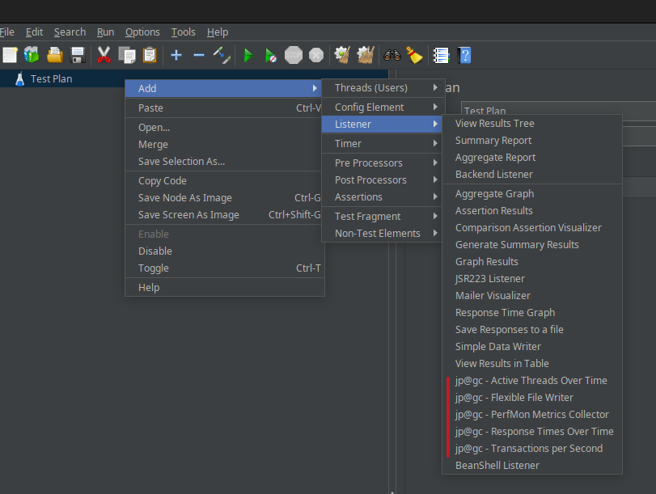

Nos interesan sobre todo los dos últimos.

### Creating Test Script

Vamos a crear un test JMeter sencillo.

Tiene que estar ejecutándose tanto los servicios externos como nuestra aplicación `trip-plan`.

- Pulsamos el botón derecho del ratón sobre `Test Plan`, seleccionamos `Add`, `Threads (Users)` y luego `Thread Group`. JMeter creará threads por debajo para simular la carga.
- Aparece `Thread Group` bajo `Test Plan`.
  - Su misión es enviar las peticiones.
- Pulsamos el botón derecho del ratón sobre `Thread Group`, seleccionamos `Add`, `Sampler` y `HTTP Request`. Indicamos así el tipo de petición que estamos planeando enviar como parte del test.
- Aparece `HTTP Request` bajo `Thread Group`.
- Indicamos la información necesaria de la petición GET para la prueba.
  - Al cambiar Name a `trip-plan`, si pulsamos sobre `Thread Group` el nombre `HTTP Request` cambia a `trip-plan`.
- Ahora guardaremos nuestro test pulsando sobre el disco.
- Este test lo guardamos en la carpeta `jmeter`, en la raiz del proyecto, con nombre `trip-plan.jmx`.
- Y ejecutamos, pulsando sobre el icono `play`. 

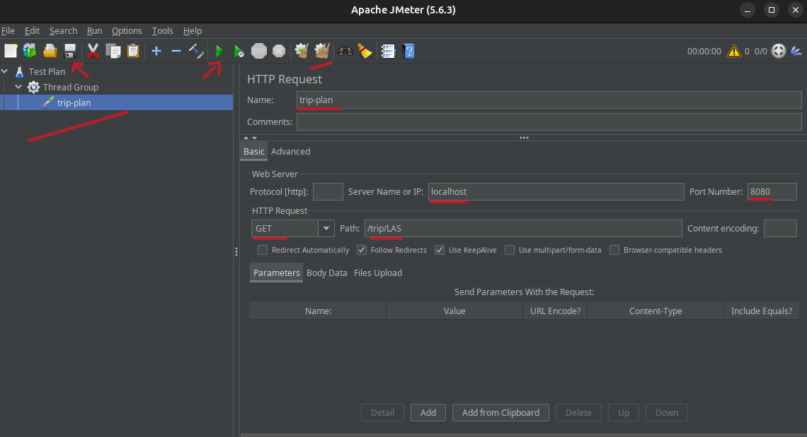

- Para ver el resultado de la ejecución, pulsamos el botón derecho del ratón sobre `Test Plan`, seleccionamos `Add`, `Listener` y luego `View Results Tree`.
  - La misión de los listener es observar lo que ocurre como parte de la petición. ¿Cuál es el tiempo de respuesta? ¿Qué resultado he recibido? Lo intentan monitorizar todo.
- Aparece `View Results Tree` debajo de `trip-plan`.
  - `View Results Tree` nos da las peticiones enviadas y las respuestas que hemos recibido.
  - Se usa sobre todo para propósitos de debug, para saber si el resultado de la petición es correcto o no.
  - En la vida real, no se usa cuando estamos ejecutando un test, ya que usa mucha memoria y puede dar error de `OutOfMemoryError`. De nuevo, solo para debug.
  - Se puede deshabilitar pulsando botón derecho sobre `View Results Tree` y pulsando sobre `Disabled`. 
- Volvemos a pulsar el icono `play` para ejecutar los tests.
- Si todo va bien, veremos en Text `trip-plan` con un icono verde a su izquierda que indica que ha ido bien.
- Lo pulsamos y veremos a la derecha distinta información.
- 
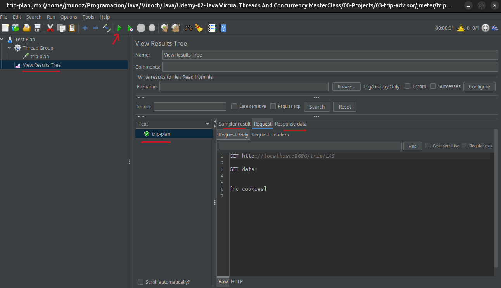

- Volvemos a `Thread Group` e indicamos que queremos 10 usuarios concurrentes.


- Volvemos a `View Results Tree` y pulsamos el botón para limpiar `Text` (icono de la escoba doble).
- Volvemos a pulsar sobre el icono `play` para ejecutar los tests.
- Veremos en Text `trip-plan` 10 veces, con un icono verde a su izquierda que indica que ha ido bien.

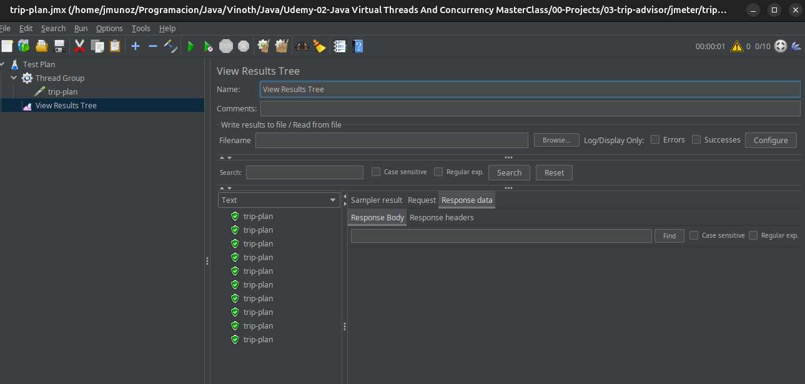

- Volvemos a limpiar `Text` usando el icono de la escoba doble.
- Vamos a añadir un nuevo Listener.
- Para ello, pulsamos el botón derecho del ratón sobre `Test Plan`, seleccionamos `Add`, `Listener` y luego `Aggregate Report`.
- Aparece `Aggregate Report` bajo `View Results Tree`.
  - `Aggregate Report` nos da las métricas de tiempo de respuesta y de rendimiento.
- Volvemos a pulsar sobre el icono `play` para ejecutar los tests.
- La pantalla nos indica que se han enviado 10 peticiones, el tiempo de respuesta medio, la mediana, el rendimiento (throughput), etc.

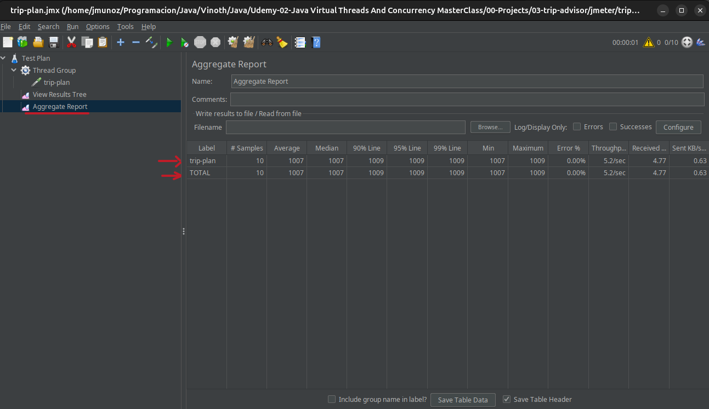

- Volvemos a `Thread Group` e indicamos que queremos lanzar 10 usuarios lentamente, a usuario por segundo.
  - `Ramp-up period (seconds)` indica como de rápido queremos crear/lanzar esos 10 usuarios.
  - Si indicamos 1 queremos decir que en 1 segundo intentará lanzar 10 usuarios.
  - Si indicamos 10 queremos decir que intentará lanzar lentamente 10 usuarios, a usuario por segundo.
    - Gradualmente añadirá más usuarios a la aplicación.
  - `Loop Count` indica cuántas peticiones, cada uno de los usuarios se supone que van a enviar.
    - Si indicamos 1, significa que cada usuario enviará una sola petición.
    - Seleccionamos `Infinite`, que indica que el usuario está interaccionando continuamente con la aplicación.
  - Seleccionamos `Delay Thread creation until needed`, que indica que si seleccionamos `Number of Threads (users)` a 10, que se creen solo cuando es necesario.
  - Como hemos seleccionado `Infinite`, ¿cuándo termina el test? Para eso especificamos una duración, seleccionando `Specify Thread lifetime` e indicando `Duration (seconds)` a 15.
- Pulsamos sobre el icono de doble escoba para limpiar todo.

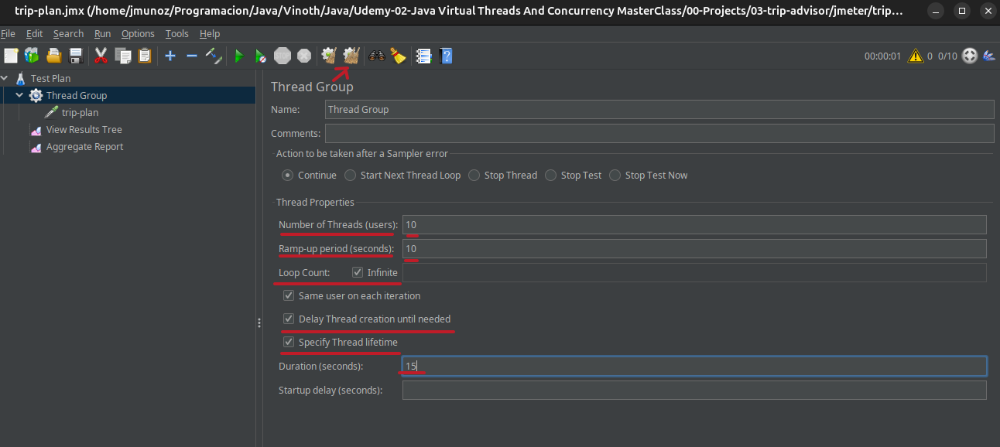

- Pulsamos en `Aggregate Report` y sobre el icono `play` para ejecutar los tests.

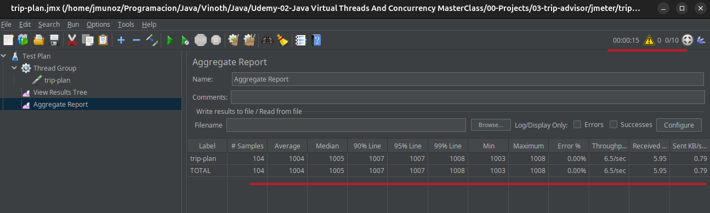

- En general, todos los listener, tanto `View Results Tree` como `Aggregate Report` deben deshabilitarse para una prueba real.
- Si ejecutamos el test, ¿dónde queda el resultado? En un fichero de disco que podemos cargar y cuyos resultados podemos comprobar.
- Para aprender, sin embargo, volveremos a poner `Enabled` los dos listeners que tenemos.

### Throughput vs Response Time - Demo

- Volvemos a limpiar `Text` usando el icono de la escoba doble.
- Vamos a añadir dos nuevos Listener.
- Listener 1: Pulsamos el botón derecho del ratón sobre `Test Plan`, seleccionamos `Add`, `Listener` y luego `jp@gc - Transactions per Second`.
- Aparece `jp@gc - Transactions per Second` bajo `Aggregate Report`. Este es el chart de rendimiento.
- Listener 2: Pulsamos el botón derecho del ratón sobre `Test Plan`, seleccionamos `Add`, `Listener` y luego `jp@gc - Response Times Over Time`.
- Aparece `jp@gc - Response Times Over Time` bajo `jp@gc - Transactions per Second`.
- Pulsamos sobre el icono `play` para ejecutar los tests. Este es el chart de tiempo de respuesta.

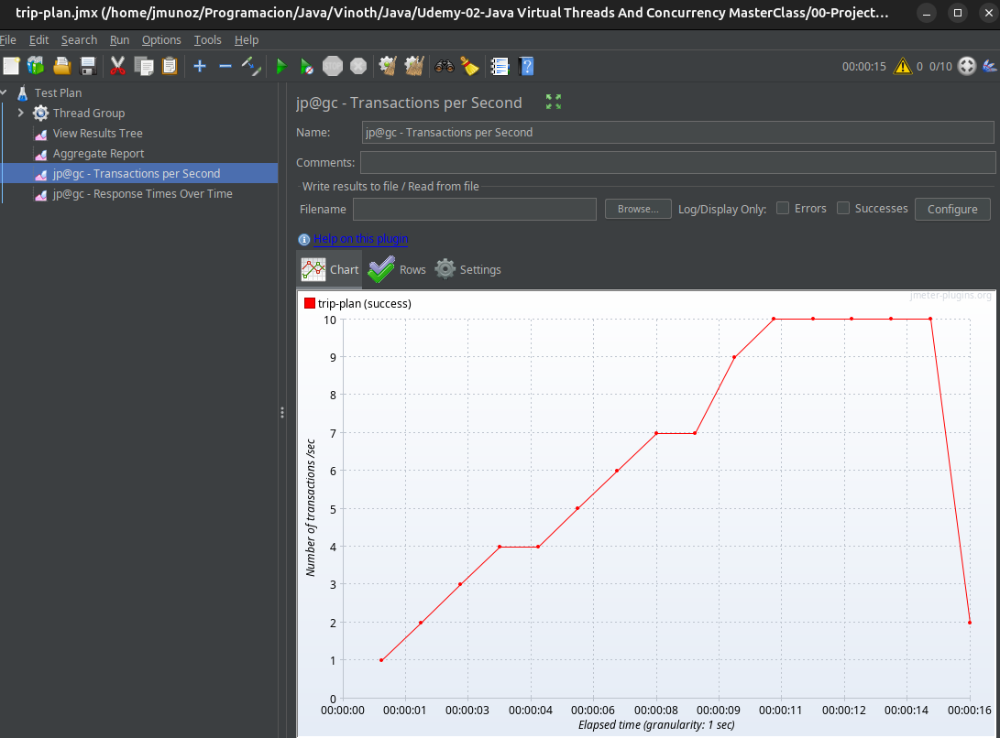

Aquí vemos el chart de rendimiento.

Vemos como se incrementan los usuarios gradualmente, uno por segundo.

Vemos como, conforme va pasando el tiempo, el rendimiento va incrementándose lentamente desde 1 req /sec hasta alcanzar en un punto 10 req / sec.

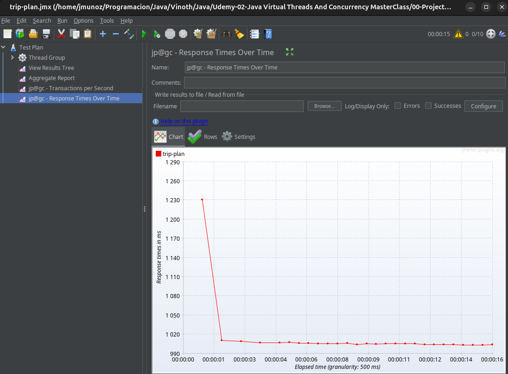

Aquí vemos el chart de tiempo de respuesta.

Vemos como, conforme va incrementándose el rendimiento, en este chart el tiempo de respuesta queda plano.

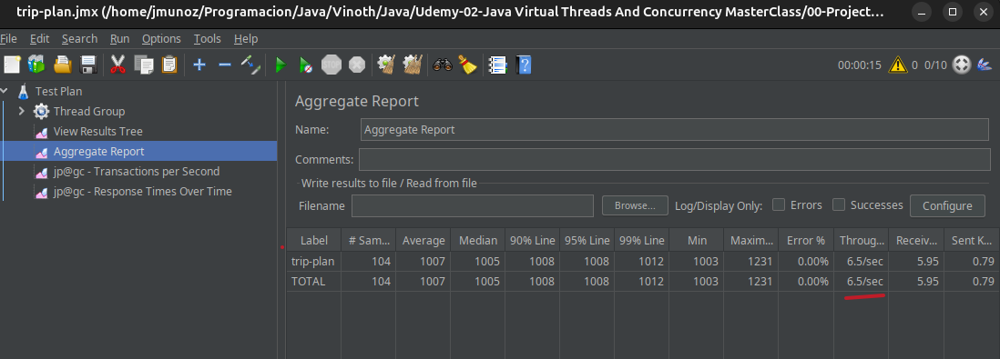

Si en `Aggregate Report` vemos el rendimiento, veremos que es 6.5 req / sec. Entonces, ¿está mal? No, ya que `Aggregate Report` no nos da el rendimiento ocurrido en el tiempo, sino una especie de media.

Es por esto que necesitamos instalar el plugin `jpgc` que nos da los tipos de reporte con los charts, en los que vemos información ocurrida en el tiempo, información detallada.

### JConsole

Para esta prueba, cambiamos `Thread Group`, en concreto los valores:

- `Number of Threads (users)` a 20.
- `Ramp-up period(seconds)` a 20.
- `Duration (seconds)` a 300, es decir 5 minutos.

Y ejecutamos los tests. Realmente no estamos interesados en los resultados y por eso deshabilitamos todos los listeners.

A la vez que se ejecuta el test, ejecutamos en una terminal el comando `jconsole`.

Veremos la consola de gestión y monitorización Java.

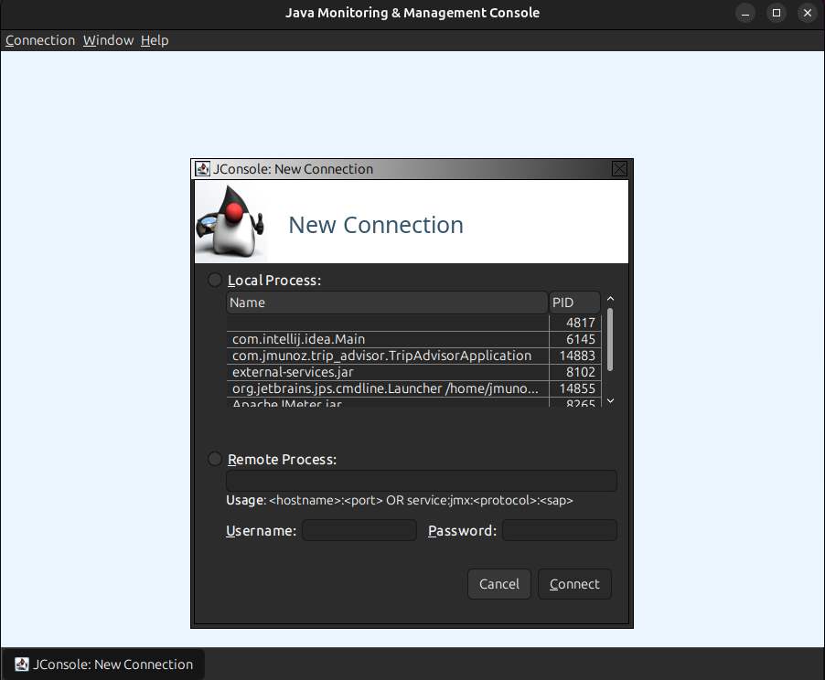

De la ventana de procesos locales seleccionamos nuestra aplicación `TripAdvisorApplication` y pulsamos `Connect`.

Nos aparecerá una ventana y pulsamos `Insecure connection`.

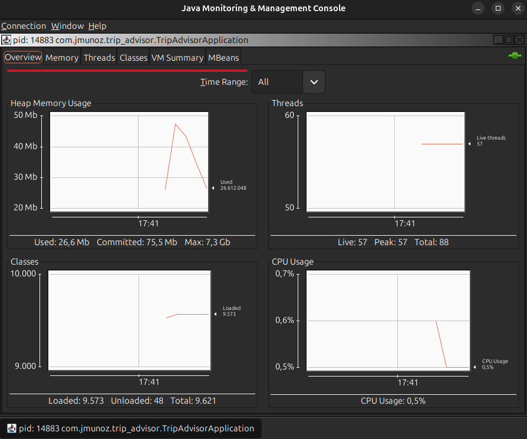

Veremos esta pantalla que indica la cantidad de memoria que la aplicación está consumiendo y el número de threads que tenemos.

Indica 57 threads (pero varía) incluso aunque hemos habilitado en nuestra aplicación la property para usar virtual threads.

Podemos ver información en las pestañas `Memory`, `Threads`, etc.

En la pestaña threads vemos que aunque usamos virtual threads, se generan muchos platform threads.

### VisualVM

Acceder a la web: https://visualvm.github.io/

Al igual que  `JConsole`, existe otra herramienta llamada `VisualVM` que es gratis y tiene una mejor interfaz de usuario.

La idea es instalarlo y hacer la misma prueba de `JConsole`, pero con `VisualVM`.

### HttpClient Executor

Volvemos a IntelliJ para corregir un par de cosas. Lo primero, parar la ejecución de nuestra aplicación.

En `src/java/com/jmunoz/trip_advisor` modificamos las clases siguientes:

- `config`
  - `ServiceClientsConfig`: RestClient, por debajo, usa HttpClient y este crea muchos platform threads. Lo corregimos usando `requestFactory()` para que no los cree.

Ahora podemos hacer de nuevo la prueba de `JMeter` con `JConsole` explicada más arriba. Veremos que crea una cantidad concreta de platform threads y no sube (es normal que cree platform threads, es la cantidad de estos lo que no cuadraba con el hecho de usar virtual threads).

### Best Practices

Las mejores prácticas usando JMeter incluyen:

- Ejecutar los tests usando el CLI (command line interface). Nunca usar la GUI (graphical user interface).
  - Lo hemos usado en clases anteriores para aprender.
- Deshabilitar todos los listeners, ya que consumen memoria.
  - `View Results Tree` es el peor de todos los listener cuando hablamos de consumo de memoria.
- Recuerda - JVM hará optimización al comienzo.
  - JIT / carga de clases, etc.
  - Tras arrancar el servidor, las primeras iteraciones serán lentas.
  - Asi que hay que ejecutar un test de **calentamiento** de algunos minutos e ignorar esos resultados.

- JMeter necesita CPU / Memoria, porque crea muchos threads.
- No debemos ejecutar tests de JMeter donde también se está ejecutando la aplicación.
  - Pero no vamos a seguir esta regla porque estamos aprendiendo JMeter, así que usaremos nuestra máquina.

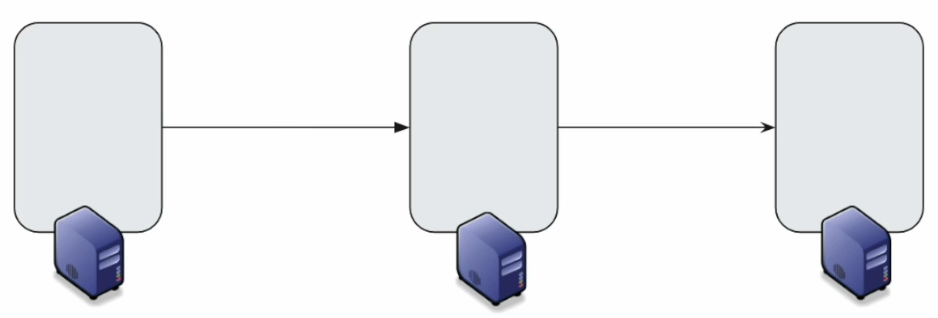

Imaginemos que el servidor del centro es donde se está ejecutando la aplicación. Si ejecutamos los tests de JMeter en ese mismo servidor, este tendrá que asignar memoria tanto a la aplicación como a los tests de JMeter, haciendo que ambos compitan por los mismos recursos, y esto estropeará los resultados.

Idealmente, de la forma en la que está hecha nuestra aplicación, deberíamos usar tres máquinas, una para los servidos externos, otra para nuestra aplicación y otra para los tests de JMeter.

Pero como estamos aprendiendo, no vamos a seguir esta regla.

### Resource - Test Scripts

De la web del curso: https://github.com/vinsguru/java-virtual-thread-course/tree/master/04-jmeter-test-scripts he bajado los scripts de JMeter.

Los podemos encontrar en la carpeta de este proyecto `jmeter`.

### Trip Reservation Test Script Creation

Vamos a crear un test sencillo para nuestra aplicación, empezando por el flujo de trabajo de reserva de un vuelo, que era un flujo secuencial, para ver como funcionan los platform threads y los virtual threads.

En nuestro caso, en clases anteriores ya aprendimos a crear un test, y en la clase anterior ya bajamos los dos tests, así que lo que hay que hacer es abrir la interfaz gráfica de JMeter y abrir, para ver como está hecho, el test `trip-reserve.jmx`.

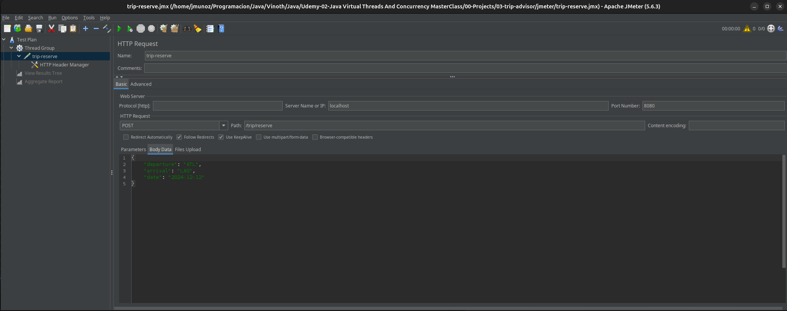

Solo indicar que, cuando hacemos esta prueba en Postman, este nos añade algunos header automáticamente. Esto en JMeter tenemos que añadirlo manualmente.

- Pulsamos el botón derecho del ratón sobre `trip-reserve`, seleccionamos `Add`, `Config Element` y luego `HTTP Header Manager`.
  - Aquí podemos añadir información del header, en concreto `Content-Type` con valor `application/json`, ya que mandamos un body al ser una petición POST.
- Aparece `HTTP Header Manager` bajo `trip-reserve`.

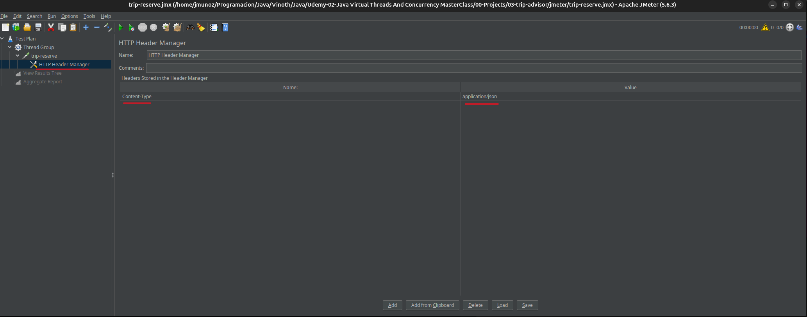

### Trip Reservation Test With Platform Threads

En `application.properties` indicar:

`spring.threads.virtual.enabled=false`

Para ejecutar la aplicación y los tests de JMeter usando primero platform threads.

No olvidar ejecutar los servicios externos y nuestra aplicación.

En JMeter, primero hacemos el calentamiento, indicando en `Thread Group`:

- `Number of Threads (users)` a 20.
- `Ramp-up period(seconds)` a 20.
- `Loop Count` con `Infinite` seleccionado.
- `Same user on each iteration` seleccionado.
- `Delay Thread creation until needed` seleccionado.
- `Specify Thread lifetime` seleccionado con `Duration (seconds)` a 60.

- Deshabilitamos todos los listeners.
- Como es un test de calentamiento, usaremos la GUI para ejecutar el test.
  - Luego usaremos el CLI.
- Pulsamos sobre el icono `play` para ejecutar los tests.

Una vez ejecutado el test de calentamiento, vamos a ejecutar el test de verdad. Para ello en `Thread Group`:

- `Number of Threads (users)` a 300.
- `Ramp-up period(seconds)` a 300.
- `Loop Count` con `Infinite` seleccionado.
- `Same user on each iteration` seleccionado.
- `Delay Thread creation until needed` seleccionado.
- `Specify Thread lifetime` seleccionado con `Duration (seconds)` a 360.
- Guardamos y cerramos JMeter.
- Abrimos una terminal y vamos a la ruta del proyecto donde tenemos los tests de JMeter (en la carpeta `jmeter`).
- JMeter debe estar en el path para poder ejecutarlo en cualquier sitio.
- Ejecutamos el comando `jmeter`. Se abrirá JMeter, pero lo importante es que en la terminal indicará como hay que ejecutarlo en el CLI.
- Cerramos JMeter de nuevo.
- Ahora sí, ejecutamos `jmeter -n -t trip-reserve.jmx -l platform-trip-reserve.jtl`
  - Con `-n` no se lanza la GUI.
  - Con `-t` se indica test plan y tenemos que indicar el archivo `.jmx` que queremos probar.
  - Con `-l` se indica donde guardar el resultado, y tenemos que indicar dicho archivo con extensión `.jtl`.
- Mientras se ejecute el test, no ver videos ni ejecutar nada que consuma mucha memoria.

### Platform Threads Result Analysis

Una vez terminado el test, volvemos a abrir la GUI de JMeter y cargamos nuestro test `trip-reserve.jmx`.

- Habilitamos el listener `View Results Tree`.
- Pulsamos sobre `Browse...` y cargamos el archivo `.jtl` creado.
  - Veremos que se carga la parte `Text` pero no podremos ver la data de la petición ni de la respuesta. Esto es porque en el fichero no es factible poner millones de peticiones y de respuestas. Recordar que es para pruebas muy grandes y que se usa para debug.
- Añadimos los listener `jp@gc - Response Times Over Time` y `jp@gc - Transactions per Second`.
- En `jp@gc - Transactions per Second` pulsamos el botón `Browse...` y seleccionamos el archivo `platform-trip-reserve.jtl` creado.
  - Cuando aparezca el chart pulsamos sobre `Settings` e indicamos:
    - `Limit number of points in row to` lo seleccionamos con valor 30 points.
      - Esto es para que se vea mejor.
- El chart de rendimiento es este:

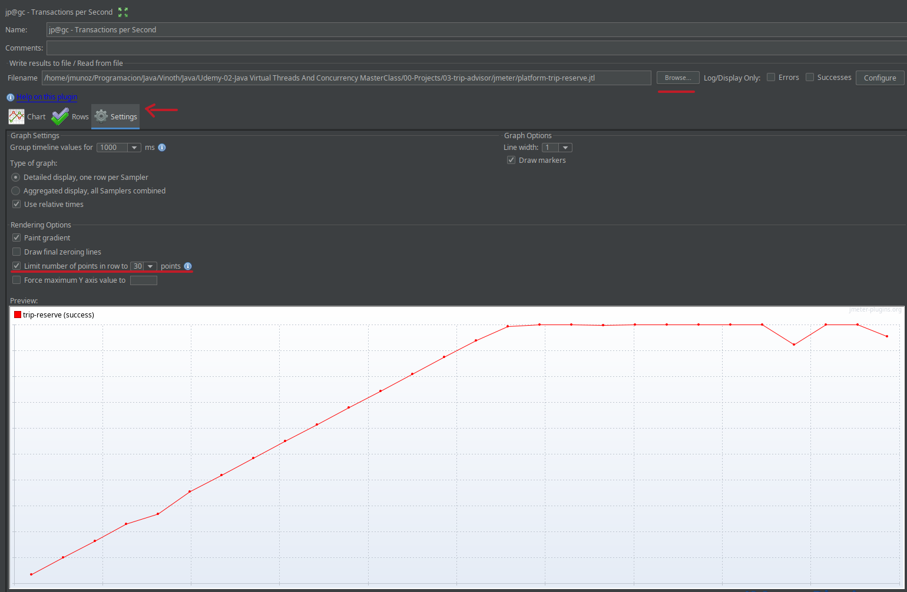

- Y si volvemos a `Chart` vemos:

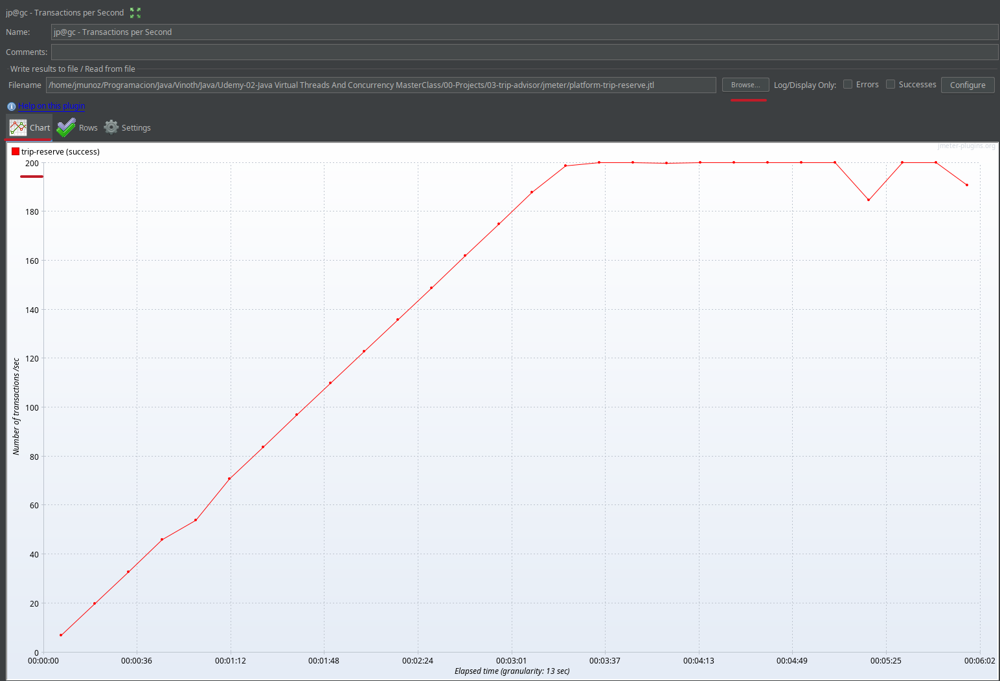

Vemos como el rendimiento crece lentamente y luego queda plano, ya no crece más. Queda plano sobre 200 porque el módulo de Spring Web, su Tomcat, solo viene con 200 platform threads, así que puede manejar hasta 200 peticiones concurrentes.

Como tenemos 300 usuarios, no puede manejarlos, y por eso queda plano en 200.

- En `jp@gc - Response Times Over Time` pulsamos el botón `Browse...` y seleccionamos el archivo `platform-trip-reserve.jtl` creado.
  - Cuando aparezca el chart pulsamos sobre `Settings` e indicamos:
    - `Limit number of points in row to` lo seleccionamos con valor 30 points.
      - Esto es para que se vea mejor.
- El chart de tiempo de respuesta es este:

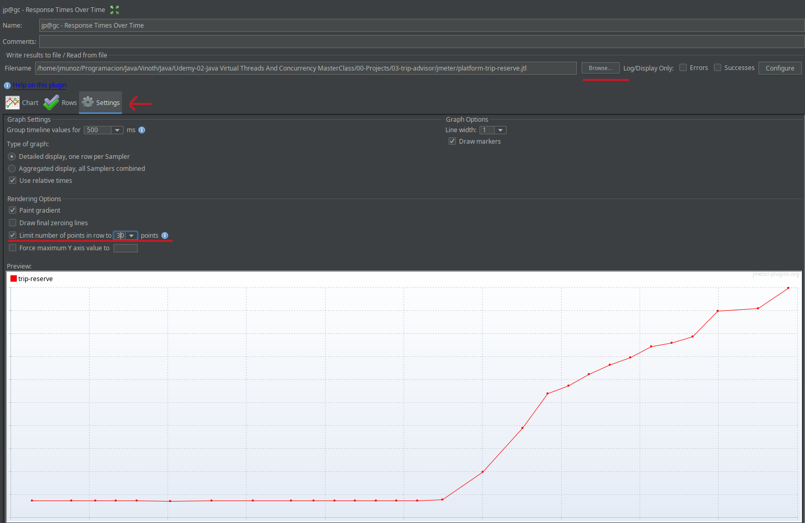

- Y si volvemos a `Chart` vemos:

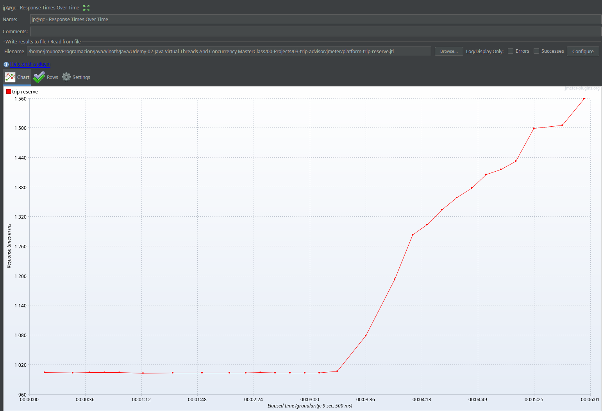

Si comparamos ambos charts, vemos como mientras el rendimiento sube, el tiempo de respuesta es plano.

Sobre los 3 minutos el rendimiento se vuelve plano y el tiempo de respuesta empieza a incrementarse.

Idealmente, se supone que el endpoint de `trip-reserve` se completa en 1 segundo. Es decir, para 200 usuarios los endpoints se completan en 1 segundo, pero pasados esos 200 usuarios, el tiempo de respuesta llega a 1,56 segundos.

Y esto es lo que queremos ver, cuál es la habilidad del sistema de manejar flujos de trabajo concurrente que se va incrementando sin tener que sacrificar el tiempo de respuesta.

Y, por tanto, sobre el minuto 3:15 es cuando vemos que ya no empieza a escalar muy bien. Para mejorar esto, o incrementamos el número de servidores, o el de threads, o la cantidad de memoria... 

### Virtual Threads Result Analysis

Ahora vamos a ejecutar los tests usando virtual threads.

En `application.properties` indicar:

`spring.threads.virtual.enabled=true`

No olvidar ejecutar los servicios externos y nuestra aplicación.

En JMeter, primero hacemos el calentamiento, indicando en `Thread Group`:

- `Number of Threads (users)` a 20.
- `Ramp-up period(seconds)` a 20.
- `Loop Count` con `Infinite` seleccionado.
- `Same user on each iteration` seleccionado.
- `Delay Thread creation until needed` seleccionado.
- `Specify Thread lifetime` seleccionado con `Duration (seconds)` a 60.

- Deshabilitamos todos los listeners.
- Como es un test de calentamiento, usaremos la GUI para ejecutar el test.
  - Luego usaremos el CLI.
- Pulsamos sobre el icono `play` para ejecutar los tests.

Una vez ejecutado el test de calentamiento, vamos a ejecutar el test de verdad. Para ello en `Thread Group`:

- `Number of Threads (users)` a 300.
- `Ramp-up period(seconds)` a 300.
- `Loop Count` con `Infinite` seleccionado.
- `Same user on each iteration` seleccionado.
- `Delay Thread creation until needed` seleccionado.
- `Specify Thread lifetime` seleccionado con `Duration (seconds)` a 360.
- Guardamos y cerramos JMeter.
- Abrimos una terminal y vamos a la ruta del proyecto donde tenemos los tests de JMeter (en la carpeta `jmeter`).
- JMeter debe estar en el path para poder ejecutarlo en cualquier sitio.
- Ejecutamos el comando `jmeter`. Se abrirá JMeter, pero lo importante es que en la terminal indicará como hay que ejecutarlo en el CLI.
- Cerramos JMeter de nuevo.
- Ahora sí, ejecutamos `jmeter -n -t trip-reserve.jmx -l virtual-trip-reserve.jtl`
  - Con `-n` no se lanza la GUI.
  - Con `-t` se indica test plan y tenemos que indicar el archivo `.jmx` que queremos probar.
  - Con `-l` se indica donde guardar el resultado, y tenemos que indicar dicho archivo con extensión `.jtl`.
- Mientras se ejecute el test, no ver videos ni ejecutar nada que consuma mucha memoria.

Una vez terminado el test, volvemos a abrir la GUI de JMeter y cargamos nuestro test `trip-reserve.jmx`.

- Añadimos de nuevo los listener `jp@gc - Response Times Over Time` y `jp@gc - Transactions per Second` para poder comparar con los que tenemos de platform threads.
- En `jp@gc - Transactions per Second` pulsamos el botón `Browse...` y seleccionamos el archivo `virtual-trip-reserve.jtl` creado.
  - Cuando aparezca el chart pulsamos sobre `Settings` e indicamos:
    - `Limit number of points in row to` lo seleccionamos con valor 30 points.
      - Esto es para que se vea mejor.
- Y si volvemos a `Chart` vemos:

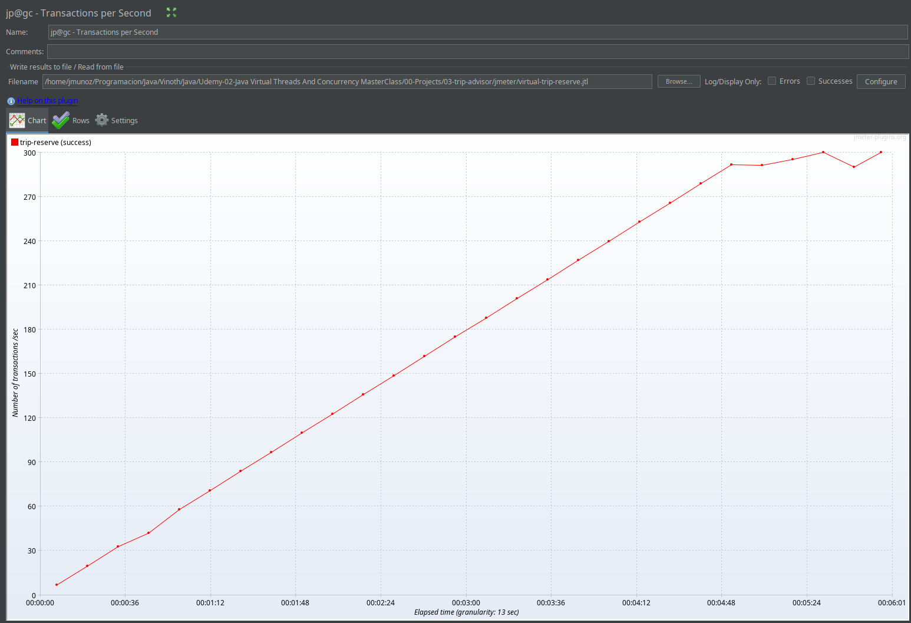

Vemos como el rendimiento se mantiene creciendo y queda plano solo porque más allá de este punto (los 5 minutos) no se incrementa el número de usuarios.

Pasa de los 200, que era donde quedaba con platform threads.

- En `jp@gc - Response Times Over Time` pulsamos el botón `Browse...` y seleccionamos el archivo `virtual-trip-reserve.jtl` creado.
  - Cuando aparezca el chart pulsamos sobre `Settings` e indicamos:
    - `Limit number of points in row to` lo seleccionamos con valor 30 points.
      - Esto es para que se vea mejor.
    - `Force maximum Y axis value to` lo seleccionamos con valor 1560.
      - Indicamos este valor porque en el chart de platform threads vemos como llega hasta 1560, y tenemos que hacerlo igual para que la competición sea con los mismos términos. 
- Y si volvemos a `Chart` vemos:

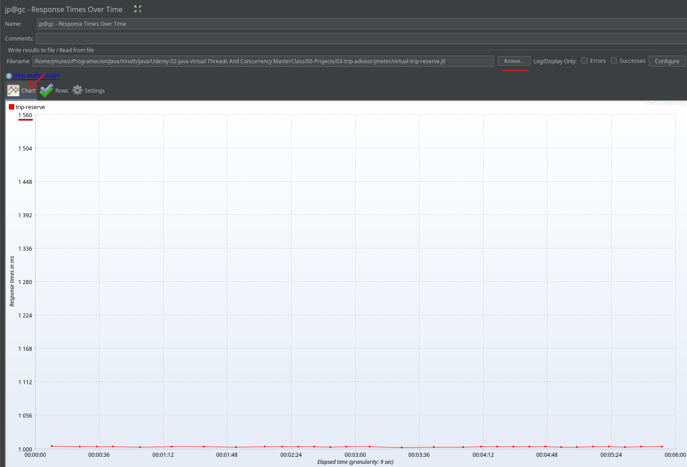

Vemos como el rendimiento es más o menos plano. Los 300 usuarios puede manejarlos y tarda un poquitín más de 1 segundo.

Mucho mejor que con platform threads.

### Rerunning Test With More Concurrent User Load

Basado en los resultados que hemos obtenido, podemos ver claramente que los platform threads no escalan muy bien, mientras que los virtual threads si parecen escalar muy bien.

Recordar que hemos hecho los tests para el endpoint que realiza tareas de forma secuencial.

- Ahora, incrementamos los usuarios a 600 y el tiempo a 10 minutos.


- No hace falta hacer un calentamiento si hemos terminado de hacer el test y no hemos parado la ejecución de nuestro programa ni de los servicios externos.
- Grabamos y salimos de JMeter.
- Eliminamos `virtual-trip-reserve.jtl` porque lo vamos a sustituir con la siguiente ejecución.
- Ejecutamos en la terminal: `jmeter -n -t trip-reserve.jmx -l virtual-trip-reserve.jtl`

Los resultados indican que los virtual threads escalan realmente bien con un consumo de memoria muy bajo.

### Trip Plan Test With Platform Threads

Vamos a ejecutar otro test para `trip-plan`, donde hacemos muchas llamadas en paralelo para platform threads.

En `application.properties` indicar:

`spring.threads.virtual.enabled=false`

No olvidar ejecutar los servicios externos y nuestra aplicación.

- Platform Threads vs Virtual Threads.
  - Siempre ejecutar con los listeners deshabilitados.
  - Primero un calentamiento de 20 usuarios, 60 segundos usando la GUI.
  - Después la prueba real de 300 usuarios, 360 segundos usando el CLI.
    - `jmeter -n -t trip-plan.jmx -l platform-trip-plan.jtl`
  - Podemos ejecutar `JConsole` o `VisualVM` para ver como se van comportando los threads, la memoria...

Vemos unos 1500 threads y un uso de memoria de un 20% en `VisualVM`.

### Trip Plan Test With Virtual Threads

Vamos a ejecutar otro test para `trip-plan`, donde hacemos muchas llamadas en paralelo para virtual threads.

En `application.properties` indicar:

`spring.threads.virtual.enabled=true`

No olvidar ejecutar los servicios externos y nuestra aplicación.

- Platform Threads vs Virtual Threads.
  - Siempre ejecutar con los listeners deshabilitados.
  - Primero un calentamiento de 20 usuarios, 60 segundos usando la GUI.
  - Después la prueba real de 300 usuarios, 360 segundos usando el CLI.
    - `jmeter -n -t trip-plan.jmx -l virtual-trip-plan.jtl`
  - Podemos ejecutar `JConsole` o `VisualVM` para ver como se van comportando los threads, la memoria...

Vemos solo unos 36 platform threads (ya sabemos que los virtual threads acaban ejecutándose en platform threads) y un uso de memoria de un 5% en `VisualVM`.

### Results Comparison

Mirando el listener `Aggregate Report` tanto para los resultados de platform thread como de virtual thread, vemos que las medias de virtual thread son mucho mejores.

Además, se han procesado como 11.000 peticiones más usando virtual threads que usando platform threads en el mismo tiempo.

Viendo los listeners `jp@gc - Response Times Over Time` y `jp@gc - Transactions per Second` se comportan como en el endpoint `trip-reserve`.

Básicamente, platform thread llega a un rendimiento de 200 threads debido a Tomcat, aunque se crean 1500 threads en `VisualVM`.

Usando virtual threads, el rendimiento llega hasta los 300 usuarios y en el último minuto baja debido a que no hay más usuarios.

Con los tiempos de respuesta, con platform threads es plano y luego crece. Esto es debido a que solo puede manejar 200 usuarios a la vez.

Usando virtual threads el tiempo de respuesta es plano porque es capaz de manejar los 300 usuarios.

### Summary

- ¿Ayudan los virtual threads con la escalabilidad?
  - Hemos demostrado usando varios tests que los Virtual Threads escalan muy bien utilizando los recursos más eficientemente.
  - 1500+ Platform threads ~ 35 Platform Threads (como parte del test de virtual threads)