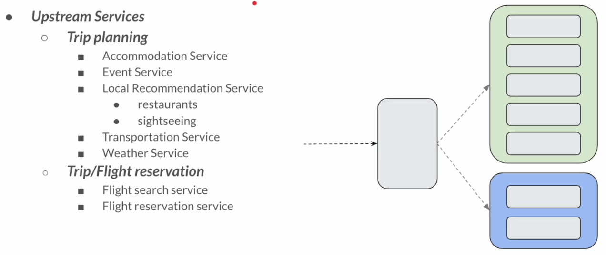
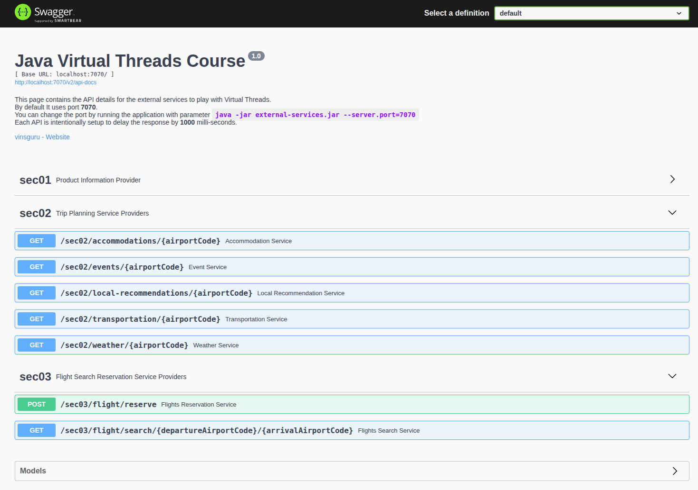
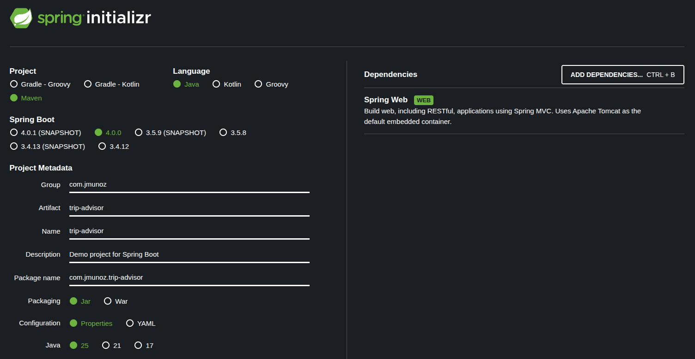
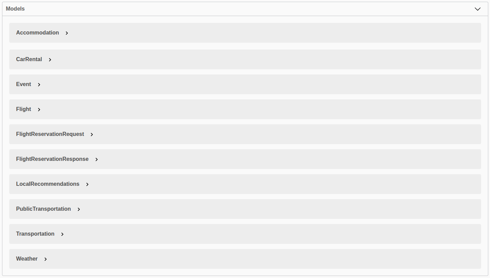

# Application Development: Spring Boot & Virtual Threads

## Project Introduction & Goals

En esta sección vamos a desarrollar una aplicación sencilla de Spring usando virtual threads y, en la siguiente sección, haremos un test de escalabilidad usando JMeter para ver como escala nuestra aplicación.

Desde la versión Spring Boot 3.2 hay soporte para virtual threads, indicando esta property:

`spring.threads.virtual.enabled=true`

Vamos a desarrollar una aplicación que provee una funcionalidad similar a la API de `Tripadvisor`.

La idea es que provea toda la información posible (hoteles, restaurantes, tiempo, etc.) para que nos ayude a planificar mejor nuestro viaje.

Toda esta información no viene de una fuente de datos única, sino de varias fuentes de datos.

**Trip Advisor**



Nuestra aplicación tendrá dos funcionalidades importantes: `Trip planning` y `Trip/Flight reservation`.

Cada caja dentro del rectángulo verde representa un microservicio que nos provee información (más de una fuente de datos) para Trip planning.

Cada caja dentro del rectángulo azul representa un microservicio que nos provee información (más de una fuente de datos) para Trip/Flight reservation.

Estas cajas están ya hechas como parte de `external-services.jar`.

Nosotros vamos a desarrollar la pieza gris, cuya función es doble:

- Obtener todos los datos necesarios de la caja verde y devolver una respuesta unificada al usuario.
- Obtener data de la caja azúl, que nos devolverá una lista de vuelos, y en nuestro microservicio encontraremos el mejor precio para ese vuelo y lo reservaremos.

Como podemos ver en la imagen, para `Trip planning` haremos llamadas en paralelo, mientras que para `Trip/Flight reservation` haremos llamadas secuenciales.

- Objetivo
    - Desarrollar una aplicación de Spring sencilla para comprender como puede escalar el rendimiento de una aplicación con virtual threads.
- No es Objetivo
    - Aprender características de Spring Boot Web.
    - Validaciones de entrada.
    - Como desarrollar una aplicación CRUD con BD.
    - Spring Security.
    - Kafka.
    - ...

## Defining External Services

Para este proyecto tenemos que ejecutar los servicios externos, ya que llamaremos a estas APIs para recuperar información que luego agregaremos a una respuesta.

- Acceder a la carpeta `02-external-services` y ejecutar `java -jar external-services.jar`
  - Por defecto se ejecuta en el puerto 7070, pero se puede cambiar a otro puerto, por ejemplo: `java -jar external-services-v2.jar --server.port=6060`
- Acceder con el navegador a Swagger: http://localhost:7070/swagger-ui/

En concreto, vamos a usar `sec02` y `sec03`.



Tenemos que ver cada endpoint como microservicios separados.

## Setting Up the Spring Project



Renombramos la carpeta a `03-trip-advisor`, abrimos el proyecto en IntelliJ y creamos los siguientes paquetes:

- `client`: Paquete donde realizamos llamadas a los servicios externos usando RestClient.
- `config`: Paquete donde tendremos la creación de beans y la configuración de nuestra aplicación.
- `controller`: Paquete donde exponemos los endpoints.
- `dtos`: Paquete donde creamos DTOs usando records.
- `service`: Paquete de servicios.

## Data Transfer Objects (DTOs)

Vamos a hacer la parte de los DTOs. Los modelos con los que vamos a jugar son los que aparecen en el Swagger de los servicios externos:



Tenemos que abrir cada uno de estos modelos y construir los records en nuestra aplicación.

En `src/java/com/jmunoz/trip_advisor` creamos las clases siguientes:

- `client`:
  - Objetos relacionados con los servicios externos.
    - Para el servicio externo `sec02`
      - `Accommodation`
      - `Event`
      - `LocalRecommendations`
      - `CarRental`
      - `PublicTransportation`
      - `Transportation`
      - `Weather`
      - `Flight`
    - Para el servicio externo `sec03`
      - `FlightReservationRequest`
      - `FlightReservationResponse`
  - DTOs de nuestra aplicación
    - `TripPlan`: DTO para el API `sec02 - Trip Planning Service Providers`.
    - `TripReservationRequest`: DTO para el API `sec03 - Flight Search Reservation Service Providers`.

## RestClient: Quick Start

Documentación sobre RestClient: https://docs.spring.io/spring-framework/reference/integration/rest-clients.html

En esta clase, paramos un momento el desarrollo de nuestro proyecto para jugar con RestClient.

RestClient es inmutable y thread safe.

Lo que hacemos es crear RestClient una sola vez para un servicio externo y lo reutilizaremos en toda la aplicación para esa aplicación.

RestClient mantendrá muchos pool de conexión, por lo que no debemos crearlos una y otra vez, ya que perderíamos todos los pools de conexión si volvemos a configurar una nueva conexión HTTP.

En `src/test/java/com/jmunoz/trip_advisor` creamos la clase siguiente:

- `RestClientTests`: Clase que realmente no es de tests, sino para jugar con RestClient y saber como usarlo.

## Building the Service Client

Volvemos a nuestro proyecto.

Vamos a crear un service client en nuestra aplicación. Como tenemos 7 endpoints, vamos a crear 7 service clients.

En `src/java/com/jmunoz/trip_advisor` creamos las clases siguientes:

- `client`
  - `AccommodationServiceClient`
  - `EventServiceClient`
  - `LocalRecommendationServiceClient`
  - `TransportationServiceClient`
  - `WeatherServiceClient`
  - `FlightSearchServiceClient`
  - `FlightReservationServiceClient`

## Implementing Trip Plan Service

En `src/java/com/jmunoz/trip_advisor` creamos las clases siguientes:

- `service`
  - `TripPlanService`: En este servicio inyectamos los service clients correspondientes a Trip Planning Service Providers (sec02)
    - Usamos un ExecutorService para ejecutar en paralelo las llamadas a esos service client.

## Implementing Trip Reservation Service

En `src/java/com/jmunoz/trip_advisor` creamos las clases siguientes:

- `service`
  - `TripReservationService`: En este servicio inyectamos los service clients correspondientes a Flight Search Reservation Service Providers (sec03)

## Implementing Trip Controller

En `src/java/com/jmunoz/trip_advisor` creamos las clases siguientes:

- `controller`
  - `TripController`

## Configuring Application Properties

Añadimos a `application.properties`:

```
# upstream service properties
# planning services
accommodation.service.url=http://localhost:7070/sec02/accommodations/
event.service.url=http://localhost:7070/sec02/events/
local-recommendation.service.url=http://localhost:7070/sec02/local-recommendations/
transportation.service.url=http://localhost:7070/sec02/transportation/
weather.service.url=http://localhost:7070/sec02/weather/

# search and reservation services
flight-search.service.url=http://localhost:7070/sec03/flight/search/
flight-reservation.service.url=http://localhost:7070/sec03/flight/reserve/

# virtual thread enabled/disabled
spring.threads.virtual.enabled=true
```

Notar como habilitamos el uso de virtual threads en esta aplicación usando la property `spring.threads.virtual.enabled=true`.

## Spring Beans: Service Clients

En `src/java/com/jmunoz/trip_advisor` creamos las clases siguientes:

- `config`
  - `ServiceClientsConfig`: Clase de configuración donde creamos los beans necesarios para los clientes.

## Spring Beans: ExecutorService Configuration

En `src/java/com/jmunoz/trip_advisor` creamos las clases siguientes:

- `config`
  - `ExecutorServiceConfig`: Clase de configuración donde creamos los beans necesarios para ExecutorService.

## Final Application Demo & Testing

Ya podemos ejecutar la aplicación y hacer pruebas.

No olvidar ejecutar el servicio externo. Para ello, acceder a la carpeta `02-external-services` y ejecutar `java -jar external-services.jar`.

Ejecutar Postman e importar el archivo existente en la carpeta `postman`.

Probar primero con esta property `spring.threads.virtual.enabled` a false y luego a true, y medir los tiempos en Postman.

Debe haber cierta mejora en `trip-plan`, que se ejecuta en paralelo. `trip-reservation` que se ejecuta secuencial, debe tardar el mismo tiempo.