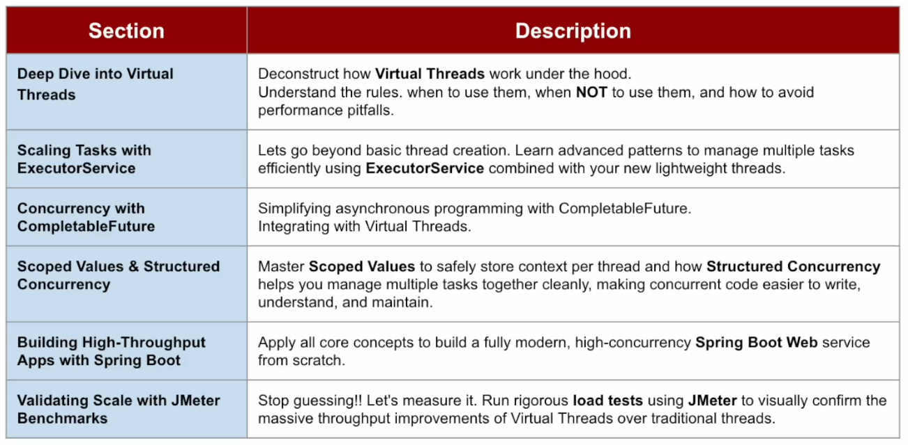
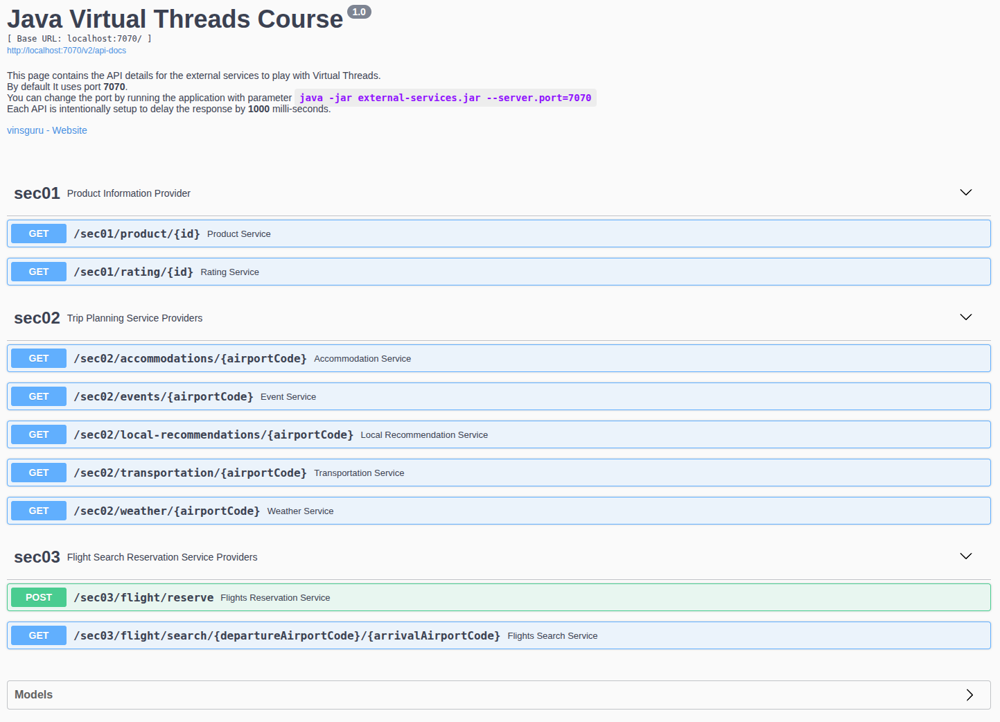

# Java Virtual Threads & Concurrency MasterClass

Del curso Udemy: https://www.udemy.com/course/java-virtual-thread

## Introduction

**Threads: La columna vertebral de la concurrencia**

- Cada línea de código se ejecuta en un thread.
- Fundamentos del modelo de concurrencia de Java.

**Como Java maneja las peticiones**

Digamos que construimos la aplicación con el módulo Spring Web.

- Cada request de entrada -> asignado a un thread.
- Threads ejecuta la petición concurrentemente.
  - Si esperamos más peticiones concurrentes, entonces el servidor necesita suficientes threads para manejarlos.
  - Por defecto, Spring Web con Tomcat provee 200 threads, es decir, pueden manejarse a la vez 200 peticiones concurrentes.

**¿Qué ocurre cuando se hacen muchas peticiones?**

- Si se envían más de 200 peticiones a la vez, por ejemplo 210, 10 peticiones esperan en una cola hasta que un thread queda disponible para procesar la petición.
- Se incrementa la latencia.
- Los usuarios experimentan respuestas más lentas.

**¿Por qué no podemos sencillamente añadir más threads?**

¿Por qué no añadimos un millón de threads y nos olvidamos de problemas? Realmente esto no funciona.

Tenemos un problema con los Platform Threads:

- Platform Threads = OS Threads.
  - `Thread thread = new Thread();` Cada sentencia de estas genera un OS Thread.
- Cada Thread necesita su propio memory stack, normalmente en MB. No es práctico crear miles de ellos.
- Pesado y caro de crear.
- El Sistema Operativo limita cuántos threads pueden ejecutarse.
- No está contruido para concurrencia a gran escala.

Los Platform Threads consumen demasiada memoria y no pueden escalarse para gestionar una concurrencia masiva.

Esta limitación ha constituido desde siempre un desafio al modelo de concurrencia de Java.

**Virtual Threads**

En Java 21, se han añadido `Virtual Threads`:

- Ligeros y eficientes en memoria.
- Permiten concurrencia masiva.
  - Podemos crear miles o millones de ellos sin agotar nuestro sistema.
- Pero...**¡¡hay truco!!**
  - Los Virtual Threads no son siempre un interruptor mágico para un mejor rendimiento.

Los Virtual threads se usan para "escalabilidad". Escalabilidad es la habilidad de procesar más peticiones concurrentes en un punto donde los platform threads ya no pueden.

Los `Virtual Threads` brillan en ciertas situaciones. Aprenderemos cuando son de ayuda y cuando no deberíamos utilizarlos.

**Estructura del curso - Paso a paso**



## External Services

[README - External Services](./02-external-services/README.md)

Para ejecutarlo:

- Acceder a la carpeta `02-external-services` y ejecutar `java -jar external-services.jar`
    - Por defecto se ejecuta en el puerto 7070, pero se puede cambiar a otro puerto, por ejemplo: `java -jar external-services-v2.jar --server.port=6060`
- Acceder con el navegador a Swagger: http://localhost:7070/swagger-ui/

Veremos esta pantalla:



Es la información sobre los servicios externos con los que tendremos que interaccionar en algunas partes de este curso.

## Deep Dive Intro Virtual Threads

[README](./01-virtual-thread-playground/README.md#deep-dive-into-virtual-threads)

Ver proyecto `01-virtual-thread-playground`:

- `sec01`
    - `Task`: Creamos un método que simula una llamada de red lenta.
    - `InboundOutboundTaskDemo`: Creamos un bucle de Threads originales de Java (Platform Threads) que llaman a `Task`, para ver como de costoso es crear Threads.
        - Si indicamos que queremos crear 50_000 platform threads, dará un error `out of memory` o `process/resource limits reached`. Esto indica que hay restricciones a la cantidad de platform threads que se pueden crear.
        - Añadimos un método para mostrar como se crean threads actualmente, usando `factory methods`. Siguen siendo platform threads, no virtual threads, y el hilo principal de la app espera a que se completen los threads para terminar el programa.
        - Añadimos otro método cuyos threads se ejecutan en segundo plano, de forma que la app termina aunque el thread siga ejecutándose.
        - Añadimos otro método usando `CountDownLatch` para que, aunque sean `daemon threads` la aplicación espere a que todos los threads hayan hecho su trabajo para terminar.
        - Añadimos un método donde creamos `virtual threads` usando el builder (no se puede con new).
- `sec02`
    - `Task`: Creamos métodos que llaman a otros métodos de forma encadenada, y que pueden lanzar excepciones.
        - Vemos que, tanto usando Platform Threads como Virtual Threads, vemos la stack trace, para propósitos de debug, sin problemas.
    - `StackTraceDemo`: Clase main.
- `sec03`
    - `Task`: Demo con tarea de CPU intensiva para ver como se comportan los Platform Threads vs VirtualThreads.
    - `CPUTaskDemo`: Clase main.
- `sec04`
    - `CooperativeSchedulingDemo`: Una demo para comprender la planificación cooperative. NO tendremos que usarlo en aplicaciones reales.
- `sec05`
    - `Lec01RaceCondition`: Una demo de condiciones de carrera que provocan corrupción de la data.
    - `Lec02Synchronization`: Una demo usando sincronización para evitar la condición de carrera que hemos visto en`Lec01RaceCondition`.
    - `Lec03SynchronizationWithIO`: Una demo del problema de escalabilidad que se daba en Java 21, 22 y 23, llamado Thread Pinning. Compilar usando Java 21, 22 o 23.
        - Se añade una traza para saber si tenemos problemas de `pinning`.
    - `Lec04ReentrantLock`: Es la demo `Lec02Synchronization` pero hecha usando `ReentrantLock`.
    - `Lec05ReentrantLockWithIO`: Es la demo `Lec03SynchronizationWithIO` pero hecha usando `ReentrantLock`.
       - Vemos en el resultado que no obtenemos la traza de que haya `pinning`.
- `sec06`
    - `Lec01ThreadFactory`: Ejemplo de uso de `ThreadFactory`.
    - `Lec02ThreadMethodsDemo`: Ejemplos mostrando algunos métodos útiles de thread.
- `util`
    - `CommonUtils`:
        - Método `sleep()`: Vamos a usar mucho Thread.sleep() y no quiero tener que hacer el catch de InterruptedException cada vez.
        - Método `timer()`: Cuanto tarda en ejecutarse un runnable.

## Executors and Virtual Threads

[README](./01-virtual-thread-playground/README.md#executors-and-virtual-threads)

Ver proyecto `01-virtual-thread-playground`:

- `sec07`
    - `Lec01AutoCloseable`: Creamos una implementación de ExecutorService.
        - Al ejecutar el ejemplo vemos que el main thread somete la tarea y el thread pool-1-thread-1 ejecuta la tarea.
    - `Lec02ExecutorService`: Se discuten varios tipos de ExecutorService, incluyendo el nuevo Thread Per Task Executor.
    - `externalservice`: Nuevo paquete donde codificaremos nuestro cliente.
        - `Client`: Clase cliente que hace peticiones a los servicios externos y obtiene la respuesta.
    - `aggregator`: Nuevo paquete donde codificaremos nuestro cliente.
        - `ProductDto`: Record que representa el producto.
        - `AggregatorService`: La clase agregadora.
    - `Lec04AggregatorDemo`: Clase main para el ejemplo de aggregator.
    - `Lec05ConcurrencyLimit`: Vemos las limitaciones de Virtual Threads si queremos usar `newFixedThreadPool` por temas de límites de concurrencia.
        - Parece que funciona bien, pero...
        - Una de las características de los Virtual Threads es que se supone que no deben estar en pool.
        - Pero fixed crea un pool de threads que reutiliza, y, aunque permite un factory, no permite un factory de Virtual Threads.
    - `concurrencylimit`: Nuevo paquete.
        - `ConcurrencyLimiter`: Es una utility class que limita la concurrencia basada en un valor entero que se le pasa.
          - Modificado para proveer una ejecución ordenada (o secuencial) usando una cola.
    - `Lec06ConcurrencyLimitWithSemaphore`: Corrige el problema que teníamos con el límite de concurrencia y los virtual threads (ver `Lec05ConcurrencyLimit`) usando semáforos.
        - Ahora vemos que se crean virtual threads distintos (no un pool) y no se reutilizan.
    - `Lec07ScheduledExecutorWithVirtualThreads`: Como no se puede usar directamente un schedulecExecutor con virtual threads, hacemos que un platform thread delegue la tarea a un virtual thread.
    - `Lec08MapConcurrent`: Ejemplo usando Java Stream Gatherers, gather y Map Concurrent.
        - Solo funciona para Java 24 o superior.

## Asynchronous Programming with CompletableFuture

[README](./01-virtual-thread-playground/README.md#asynchronous-programming-with-completablefuture)

Ver proyecto `01-virtual-thread-playground`:

- `sec08`
    - `Lec01SimpleCompletableFuture`: Ejemplo de uso de un `CompletableFuture`.
        - El objetivo principal de este ejemplo es ser un escaparate de como un método 2 puede enviar el resultado a otro método 1 sin hacer que el método 1 espere para siempre.
    - `Lec02RunAsync`: Ejemplo de uso del método `runAsync()` de `CompletableFuture`.
        - Factory methods, como `runAsync()`, para crear `CompletableFuture` en vez de usar el operador new.
        - El método `runAsync()` ejecuta las tareas de manera asíncrona, devolviendo void, pero es bloqueante.
        - Usamos un `Executor` para utilizar virtual threads, haciendo la ejecución no bloqueante.
    - `Lec03SupplyAsync`: Ejemplo de uso del método `supplyAsync()` de `CompletableFuture`. En concreto vemos:
        - Podemos suministrar valores asíncronamente.
        - Factory Method
        - Executor
    - `externalservice`: Nuevo paquete donde codificaremos nuestro cliente.
        - `Client`: Clase cliente que hace peticiones a los servicios externos y obtiene la respuesta.
    - `Lec04GetProducts`: Es el mismo ejemplo que hicimos en `Lec03AccessResponseUsingFuture`, pero ahora usando `supplyAsync()`.
    - `aggregator`: Nuevo paquete donde codificaremos nuestro cliente con gestión de errores (devolvemos un valor por defecto en caso de excepción) y timeout.
        - `ProductDto`: Record que representa el producto.
        - `AggregatorService`: La clase agregadora.
    - `Lec05AggregatorDemo`: Clase main para el ejemplo de aggregator. El objetivo es probar la gestión de errores de `CompletableFuture`.
    - `Lec06AllOf`: Ejemplo de uso del método `allOf()` de `CompletableFuture`.
    - `Lec07AnyOf`: Ejemplo de uso del método `anyOf()` de `CompletableFuture`.
    - `Lec08ThenCombine`: Ejemplo de uso de los métodos `thenCombine()` y `thenApply()` de `CompletableFuture`.

## Thread Local & Scoped Values

[README](./01-virtual-thread-playground/README.md#thread-local--scoped-values)

Ver proyecto `01-virtual-thread-playground`:

- `sec09`
    - `Lec01ThreadLocal`: Ejemplo de uso de `ThreadLocal` para ver funcionamiento y problemas que pueden surgir.
    - `Lec02InheritableThreadLocal`: Ejemplo de cuando usar `InheritableThreadLocal`.
    - `security`: Nuevo paquete.
        - `UserRole`: Es un enum con los posibles roles de un usuario que se conecta a nuestra aplicación.
        - `SecurityContext`: Es un record que contiene el usuario actualmente conectado.
        - `threadlocal`: Nuevo paquete. Lo creamos porque luego vamos a hacer el mismo ejemplo usando `ScopedValues`.
            - `SecurityContextHolder`: Clase que permite obtener la información de un usuario conectado usando `ThreadLocal`.
            - `AuthenticationService`: Clase que sirve para hacer login y establecer el valor de `SecurityContext`.
        - `scopedvalue`: Nuevo paquete
            - `SecurityContextHolder`: Clase que permite obtener la información de un usuario conectado usando `ScopedValue`.
            - `AuthenticationService`: Clase que sirve para hacer login y establecer el valor de `SecurityContext`.
                - Modificado para, temporalmente, elevar los privilegios del rol de usuario.
    - `controller`: Nuevo paquete.
        - `DocumentController`: Simula un Rest Controller al que llegan peticiones de conexiones de usuarios.
    - `Lec03DocumentAccessWithThreadPool`: Clase que llama a `controller/DocumentController` para validar su funcionamiento.
    - `Lec04ScopedValue`: Demo para ver como se usan los `ScopedValues`.
    - `Lec05ScopedValueAssignment`: Lo que hicimos en el fuente `Lec01ThreadLocal` modificarlo para que funcione con `ScopedValue`.
    - `Lec06ScopedValueRebinding`: Es como `Lec05ScopedValueAssignment` pero además usando rebinding.
        - El objetivo es proveer un token diferente para `productService`, pero sin que afecte a `inventoryService`.
    - `Lec07DocumentAccessWithScopedValue`: Clase que llama a `controller/DocumentController` para validar su funcionamiento.
        - Como `Lec03DocumentAccessWithThreadPool`, pero usando el paquete `scopedvalue`. No hay que cambiar nada más.
        - Modificado para, temporalmente, elevar los privilegios del rol de usuario.

## Structured Concurrency (JEP 55)

Sigue estando en pruebas y prefiero no verlo porque puede cambiar en las siguientes versiones de Java.

Cuando sea algo estable que pueda usarse en Producción lo estudiaré.

## Application Development: Spring Boot & Virtual Threads

En esta sección vamos a desarrollar una aplicación sencilla de Spring usando virtual threads y, en la siguiente sección, haremos un test de escalabilidad usando JMeter para ver como escala nuestra aplicación.

[README](./03-trip-advisor/README.md)

Ver proyecto `03-trip-advisor`:

- `client`: Paquete donde realizamos llamadas a los servicios externos usando RestClient.
    - `AccommodationServiceClient`
    - `EventServiceClient`
    - `LocalRecommendationServiceClient`
    - `TransportationServiceClient`
    - `WeatherServiceClient`
    - `FlightSearchServiceClient`
    - `FlightReservationServiceClient`
- `config`: Paquete donde tendremos la creación de beans y la configuración de nuestra aplicación.
    - `ServiceClientsConfig`: Clase de configuración donde creamos los beans necesarios para los clientes.
    - `ExecutorServiceConfig`: Clase de configuración donde creamos los beans necesarios para ExecutorService.
- `controller`: Paquete donde exponemos los endpoints.
    - `TripController`
- `dtos`: Paquete con DTOs.
    - Objetos relacionados con los servicios externos.
        - Para el servicio externo `sec02`
            - `Accommodation`
            - `Event`
            - `LocalRecommendations`
            - `CarRental`
            - `PublicTransportation`
            - `Transportation`
            - `Weather`
            - `Flight`
        - Para el servicio externo `sec03`
            - `FlightReservationRequest`
            - `FlightReservationResponse`
    - DTOs de nuestra aplicación
        - `TripPlan`: DTO para el API `sec02 - Trip Planning Service Providers`.
        - `TripReservationRequest`: DTO para el API `sec03 - Flight Search Reservation Service Providers`.
- `service`: Paquete de servicios.
    - `TripPlanService`: En este servicio inyectamos los service clients correspondientes a Trip Planning Service Providers (sec02)
        - Usamos un ExecutorService para ejecutar en paralelo las llamadas a esos service client.
    - `TripReservationService`: En este servicio inyectamos los service clients correspondientes a Flight Search Reservation Service Providers (sec03)

Añadimos a `application.properties`:

```
# upstream service properties
# planning services
accommodation.service.url=http://localhost:7070/sec02/accommodations/
event.service.url=http://localhost:7070/sec02/events/
local-recommendation.service.url=http://localhost:7070/sec02/local-recommendations/
transportation.service.url=http://localhost:7070/sec02/transportation/
weather.service.url=http://localhost:7070/sec02/weather/

# search and reservation services
flight-search.service.url=http://localhost:7070/sec03/flight/search/
flight-reservation.service.url=http://localhost:7070/sec03/flight/reserve/

# virtual thread enabled/disabled
spring.threads.virtual.enabled=true
```

En `src/test/java/com/jmunoz/trip_advisor` creamos la clase siguiente:

- `RestClientTests`: Clase que realmente no es de tests, sino para jugar con RestClient y saber como usarlo.
